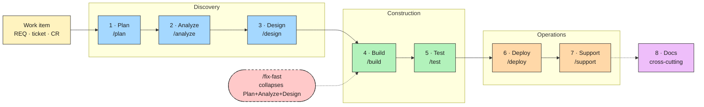
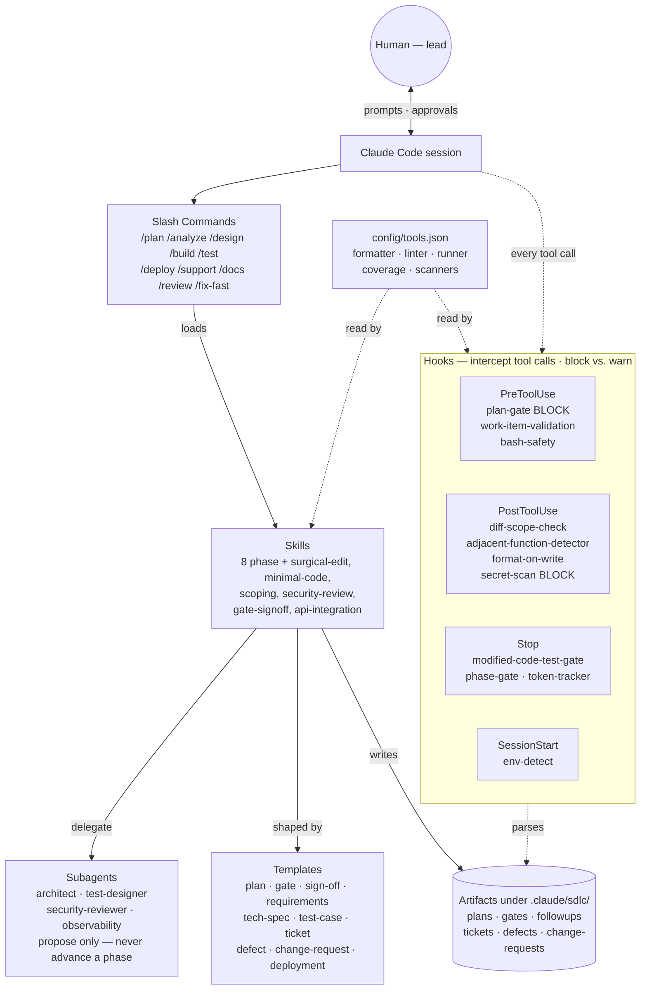

# SDLC Plugin for Claude Code
A governance layer for AI-assisted software delivery. Plan, scope, approve, build, test, release — with human sign-off at every gate.

## Why this exists

claude-sdlc is a **governance layer for AI-assisted software delivery**. It wraps the coding agent and gates every phase of the SDLC: plan, scope, approve, build, test, release.

Claude Code is fast. Sometimes too fast. This plugin trades a little velocity for a lot of discipline:

- No code written before a plan exists.
- No file touched that is not listed in the plan.
- No phase advanced without a human signature.
- No build merged without a traceable work item (REQ ID, ticket, or signed CR).

It serves teams that need to answer:

- Was there an approved plan before code changed?
- Was the change within scope?
- Which requirement does this code satisfy?
- Who signed off, and against what?
- What changed after approval?

Most AI coding tools help write code, or review it after. claude-sdlc controls the work *before* code is written, and traces it to release. **Who it's for:** teams shipping software under audit, regulation, or formal change control — financial services, healthcare, government, telecommunications, regulated SaaS, internal enterprise platforms, and consulting delivery.

If any of that adds friction you would rather avoid, this plugin is not for you. Specifically, **do not use this plugin for**:

- Spikes, prototypes, or exploratory work you plan to throw away
- Solo-developer or early-stage-startup work optimizing for speed over traceability
- Research and prototyping where iteration speed is the primary goal
- Tasks where no clear requirements exist yet (Phase 2 will halt repeatedly)

See [docs/when-not-to-use.md](docs/when-not-to-use.md) for the full list.

For how this fits an enterprise engineering organization — role shifts, cost mechanics, audit evidence, and what stays human-in-the-lead — see [docs/claude-sdlc-enterprise-adoption.md](docs/claude-sdlc-enterprise-adoption.md).

## Core principles

Each principle below is essential. The plugin is built around them; changes that violate them usually feel like simplifications but aren't.

1. **Human in the lead, always.** Subagents and hooks never advance a phase on their own.
2. **Reduce cognitive load.** Artifacts, prompts, and gate summaries surface the essential signal, not everything knowable. Every new field, hook output, or subagent must justify itself by shrinking what the human must hold in their head.
3. **Plan before code.** `plan-gate.sh` blocks `Edit`/`Write` when no plan exists for the task.
4. **Surgical edits.** Only plan-listed files and functions are modified. Adjacent functions are never touched. "While I'm here" cleanups are a known failure mode.
5. **Work-item traceability.** Every build references a REQ ID (new work), a ticket (bug), or a signed change request (scope change).
6. **Graceful degradation.** No Git? No ticket system? No observability platform? The plugin writes local markdown/JSON artifacts and surfaces the gap. It never silently skips a check.
7. **Stack-agnostic.** Formatter, linter, test runner, scanners — all live in `config/tools.json`. Nothing is hardcoded.

## At a glance

The 8-phase workflow:



How the pieces connect:



Commands load skills, skills delegate to bounded subagents and write artifacts shaped by templates. Hooks intercept every tool call — blocking on severe issues, warning otherwise — and parse the artifacts back on later calls. `config/tools.json` keeps the plugin stack-agnostic.

## Prerequisites

This plugin runs inside Claude Code — it has no standalone runtime.

| Requirement | Notes |
|---|---|
| **Claude Code** | Required. [Install Claude Code](https://docs.anthropic.com/en/docs/claude-code). All commands, skills, and hooks run inside a Claude Code session. |
| **Bash** | macOS and Linux: built-in. **Windows:** [Git Bash](https://git-scm.com/downloads) (included with Git for Windows) or WSL2 — all hooks are bash scripts and will not run in cmd or PowerShell. |
| **Git** _(recommended)_ | Required for scope-check and diff hooks. The plugin degrades gracefully without it, but file-scope and function-scope enforcement is skipped. |

## Install

Clone the repo and install as a local plugin:

```bash
# pin to the latest stable release (recommended)
git clone --branch v1.0.0 https://github.com/lantisprime/claude-sdlc.git

# or clone main for the latest unreleased changes
git clone https://github.com/lantisprime/claude-sdlc.git
# then, from your project repo, load it via Claude Code's /plugin command
```

See [Claude Code's plugin docs](https://docs.claude.com/en/docs/claude-code/plugins) for the current install flow — plugin distribution is still evolving.

## Quick start

> For a detailed walkthrough with scenarios, prerequisites, and exact user inputs at each step, see [docs/USER-MANUAL.md](docs/USER-MANUAL.md).

From inside a repo that has this plugin installed:

**New users — start here:**
```bash
/start
# auto-detects stack · creates .enabled · drafts scope + plan · hands off to /plan
```

**Experienced users — skip straight to plan:**
```bash
/plan "Add rate-limit headers to the public API"
# writes .claude/sdlc/plans/<slug>.md — classification, scope, estimate, tech stack
# human reviews + signs; plan-gate.sh now permits edits

/analyze    # requirements with stable REQ IDs
/design     # architecture + tech specs
/build      # code + unit tests — scoped strictly to plan
/test       # execution report, defects
/deploy     # deployment record
/support    # observability wiring
/docs       # docs, traceability matrix, changelog
```

Each command refuses to run until the prior phase's gate file exists and is signed.

## Configure for your stack

**First time?** Run `/start` — it auto-detects your repo, CI, stack, and tracker, then writes `config/tools.json` for you as part of opt-in activation. You don't need to run `/configure` separately unless you want to customise beyond what auto-detection provides.

**Already activated and need to adjust settings:**

```bash
/configure
```

`/configure` walks you through each tool slot and rewrites `config/tools.json`. It's also auto-invoked when a skill detects a missing required key (Layer 2).

Alternatively, copy the example config and fill it in by hand:

```bash
cp config/tools.example.json config/tools.json
```

Every hook and skill reads from `config/tools.json`. Leave a value as `null` to skip that check. Tunable knobs include:

- `formatter`, `linter`, `test_runner`, `security_scanner`, `secret_scanner`
- `coverage.threshold_percent`
- `artifact_format_fallback` — `markdown` or `json` when rich integrations are missing
- `adjacent_function_detection` — `git-hunk-headers` (default) or `tree-sitter`
- `token_tracking.enabled` — when `true`, the `Stop` hook writes per-phase raw token counts to `.claude/sdlc/token-log.json` and `token-history.jsonl` for optimizing skill/prompt cost (default `false`)

## External connectivity

The plugin talks to outside systems through four channels. Availability is auto-detected by [`env-detect.sh`](hooks/env-detect.sh) on `SessionStart` and written to `.claude/sdlc/env.json`; the `integrations` block in [`config/tools.json`](config/tools.example.json) lets you override the choices.

| Category | System | Transport |
|---|---|---|
| **VCS** | Git | Local `git` CLI |
| | GitHub, GitLab, Bitbucket | Detected via `git remote`; operations use the host's CLI (e.g. `gh`) or native APIs |
| **Issue tracker** | GitHub / GitLab / Bitbucket Issues | Same transport as VCS |
| | Jira, Linear | **MCP** (user-provided server) |
| **CI** | GitHub Actions, GitLab CI, CircleCI, Jenkins | Filesystem sniffing only; the plugin never triggers pipelines |
| **Observability** | Grafana, Datadog | **MCP** (user-provided server) |
| | CloudWatch | Infrastructure-as-code proposals — no direct API calls |
| **UX tooling** | Figma | **MCP** (user-provided server) |
| **Development-time APIs** | OpenAPI / GraphQL / gRPC endpoints under integration | Direct HTTP probe via the tool configured in `config/tools.json` (see [`api-integration`](skills/api-integration/SKILL.md)) |

**Is MCP required?** No. MCP is used selectively for SaaS platforms without a ubiquitous CLI — Jira/Linear, Grafana/Datadog, Figma. The plugin references these connectors but does not ship or configure MCP servers; you wire those up externally in your Claude Code install. Every MCP-mediated state change is **propose-only** — no MCP tool can advance a phase or auto-apply a production change.

### What happens without it

Per the *graceful degradation* principle, the plugin never silently skips a check when a system is absent — it falls back to local artifacts and surfaces the gap in the phase summary.

| Category | Fallback when nothing is configured or reachable |
|---|---|
| **VCS** | Plugin still runs. `env.json` records `vcs: null`; artifacts land locally under `.claude/sdlc/`. Work-item traceability falls back to REQ IDs or local CR files. |
| **Issue tracker** | Local markdown ticket under `.claude/sdlc/tickets/`. Gate sign-off accepts `no ticket REQ-<n>` as the degraded form. |
| **CI** | Zero impact — the plugin never triggers pipelines, only sniffs which ones exist. `ci: null` just means no reference links in artifacts. |
| **Observability** | Platform-neutral markdown/JSON under `.claude/sdlc/monitoring/` — logging deltas, alert configs, dashboard stubs, runbook. |
| **UX tooling** | **Halts frontend tasks until *some* UX artifact exists** at `.claude/sdlc/architecture/ux/<task-slug>.md`. Any form works: Figma link, PDF mockups, screenshots, hand-drawn wireframes, or a written description in the markdown file itself. Backend-only tasks are unaffected. |
| **Development-time APIs** | `api-integration` warns and offers to scaffold a mock (MSW / Prism / WireMock / typed fixture) — never silently stubs. |
| **MCP servers (none wired)** | Each MCP-routed system falls to its next tier — Jira → local ticket, Grafana → local markdown, Figma → human-provided link or local UX artifact. |

> **One hard rule:** Frontend tasks halt until a UX artifact exists — but any form works (Figma, PDF, screenshots, wireframes, or a written description). This is the only place the plugin blocks on missing external inputs. Everything else degrades to local files. **Backend-only tasks skip the UX track entirely** — no halt in Phase 2, no UX conformance in Phase 5.

## Scope setup

Before the first `/plan` in a new project, the plugin needs a scope statement. On first run, it will ask you to point at source material:

```
/plan "Add rate-limit headers to the public API"
# → No scope.md found. Point me at source material:
#   - a file path (README.md, docs/brief.txt, PRD.pdf…)
#   - paste text directly in chat
#   - or type 'skip' to write a one-paragraph statement by hand
```

The [`scope-ingest`](agents/scope-ingest.md) agent parses the source, extracts fields (in-scope, out-of-scope, success criteria, constraints, stakeholders, assumptions), and writes a provenance-traced draft to `.claude/sdlc/scope-drafts/<timestamp>.md`. You review the draft, fill any gaps marked `⚠️`, then copy it to `.claude/sdlc/scope.md` and sign the scope gate. Subsequent `/plan` runs read `scope.md` automatically.

**Accepted source formats (v1):** `.md`, `.txt`, pasted text, or an existing `scope.md` in re-validate mode. PDF, DOCX, PPTX, and Jira/Linear ticket ingest are on the roadmap.

## Adding domain files

Domain files give the `plan` skill specialized knowledge about a business domain — gap questions, NFRs, regulatory flags, security hotspots. The plugin ships seeds for `payments` and `auth`. You add your own for any other domain (insurance, healthcare, real-time bidding, etc.).

**Trigger:** when `/plan` runs and no matching domain is found, it offers once per session:

```
No domain file found for this area. Create one?
A — Source-driven: paste a URL (spec, compliance guide, wiki page)
B — Guided Q&A: answer 6 questions
skip — don't ask again this session
```

**Project-level files take precedence.** Put your domain files in `domains/` at the repo root. They are merged with the plugin's built-in seeds; any file with the same slug as a plugin seed overrides it entirely.

See [`skills/domain-expert/AUTHORING.md`](skills/domain-expert/AUTHORING.md) for the full authoring flow.

## What the plugin generates

What Claude actually produces as you move through the phases — **this plugin generates code and tests, not just documentation**:

| Artifact | Phase | Produced by | Where it lands |
|---|---|---|---|
| **Plan** (classification, scope, estimate, tech stack) | 1 Plan | [`plan`](skills/plan/SKILL.md) skill | `.claude/sdlc/plans/<slug>.md` |
| **Requirements** with stable REQ IDs | 2 Analyze | [`analyze`](skills/analyze/SKILL.md) skill | `.claude/sdlc/requirements/<slug>.md` |
| **Architecture** (app / data / platform / infra / security / test) | 3 Design | [`design`](skills/design/SKILL.md) skill (+ [`architect`](agents/architect.md) agent) | `.claude/sdlc/architecture/` |
| **Tech specs** (API contracts, module responsibilities) | 3 Design | [`design`](skills/design/SKILL.md) skill | `.claude/sdlc/tech-specs/` |
| **Test cases** (preconditions, steps, expected outcome, test type — tied to REQ IDs) | 3 Design | [`test-designer`](agents/test-designer.md) agent | `.claude/sdlc/test-cases/` |
| **Production code** (the actual feature / fix implementation) | 4 Build | [`build`](skills/build/SKILL.md) skill | The repo's source tree (surgically scoped to plan-listed files) |
| **Unit test scripts** (executable, for functions actually modified) | 4 Build | [`build`](skills/build/SKILL.md) skill | `.claude/sdlc/test-scripts/` (mirrors source tree) |
| **Functional / integration / e2e scripts** (when design calls for them) | 4 Build | [`build`](skills/build/SKILL.md) skill | `.claude/sdlc/test-scripts/` |
| **Test execution report** (pass/fail, coverage, defects) | 5 Test | [`test`](skills/test/SKILL.md) skill | `.claude/sdlc/test/<slug>-report.md` |
| **Defect records** | 5 Test | [`test`](skills/test/SKILL.md) skill | Git Issues if available, else `.claude/sdlc/defects/` |
| **Deployment record** | 6 Deploy | [`deploy`](skills/deploy/SKILL.md) skill | Ticket system or `.claude/sdlc/deployments/` |
| **Observability config** (alerts, dashboards, runbooks) | 7 Support | [`observability`](agents/observability.md) agent | `.claude/sdlc/monitoring/` |
| **Docs + traceability matrix + changelog** | 8 Docs | [`docs`](skills/docs/SKILL.md) skill | `.claude/sdlc/docs/`, `CHANGELOG.md` |

**Key guarantees Claude follows when generating:**

- **Production code is surgically scoped** — only files and functions listed in the plan are touched. Adjacent-function edits are flagged.
- **Unit tests cover modified code only** — no coverage-padding by testing untouched code. The `modified-code-test-gate.sh` hook enforces this.
- **Every test case traces to a REQ ID.** Every defect traces to a test case and a REQ ID.
- **Coverage threshold** is configurable (`config/tools.json` → `coverage.threshold_percent`, default 80%) and checked in Phase 5.
- **The plugin never deploys on its own.** `/deploy` produces a proposal; the human triggers execution.

**What's not auto-generated** (still human-authored or plugin-scaffolded on request):

- Load / performance test scripts beyond what the test architecture explicitly calls for
- Test fixtures and synthetic test data (design-phase decision)
- Richer framework scaffolding (Playwright / Cypress / k6 via a dedicated skill) — a future addition

## Providing input

You can supply plans, requirements, tech specs, and other artifacts in whichever way fits your workflow. All four routes funnel into the same template shape so downstream hooks can parse them consistently.

### 1. Slash-command prompt

```bash
/plan "Add rate-limit headers to the public API"
```

The phase skill drafts the artifact at `.claude/sdlc/<folder>/<slug>.md` from your prompt. You open the file, edit in place, and sign the gate at the bottom. Fastest path for well-understood work.

### 2. Conversation, then artifact

Describe the work in chat — "we need to add rate-limit headers, probably on the gateway layer, concerned about cache poisoning." Claude runs the skill, drafts the artifact, and shows it back. You redirect ("scope should exclude the admin API") until it's right, then Claude writes the file. Best when the shape of the work isn't obvious yet.

### 3. Pre-written artifact

Drop your own artifact into the target folder before running the command:

```
.claude/sdlc/plans/rate-limit-headers.md
.claude/sdlc/requirements/rate-limit-headers.md
.claude/sdlc/tech-specs/rate-limit-headers.md
```

Use the shape defined in [`templates/`](templates/). The skill detects the existing file, validates its required fields, and asks about gaps rather than starting fresh. Good when your team already authors plans or RFCs in Confluence/Notion/Google Docs and wants to paste them in.

### 4. Reference an external source

Point Claude at a file, URL, or ticket as input:

```
/plan "use the RFC at docs/rfcs/rate-limits.md as the design input"
/analyze "pull requirements from JIRA PROJ-123"
```

The skill reads the source, then writes the artifact in the plugin's template shape. Preserves traceability back to the original document.

### The irrevocable step

In every route, a **fresh human sign-off** is what advances the phase. Claude drafts; only you sign. There are two sign-off modes:

**Chat sign-off** — the default for `/plan`, `/analyze`, `/design`, `/build`, `/test`, `/support`. At the end of the phase, Claude invokes the [`gate-signoff`](skills/gate-signoff/SKILL.md) skill, which prompts:

```
Phase artifact: .claude/sdlc/plans/rate-limit-headers.md — please review.
Paste the URL of the REQ / ticket / CR you're approving against, or
type `no ticket REQ-<n>, …` for degraded mode.
```

You paste e.g. `https://linear.app/acme/issue/PROJ-1234`. Claude writes the gate file with your raw acknowledgment quoted verbatim, plus an ISO-8601 timestamp. A bare `yes` / `ok` / `lgtm` is rejected — the URL (or REQ-ID list) is the substantive acknowledgment that makes the signature auditable.

**Manual sign-off** — required for `/deploy` and `/fix-fast`. Deploy has blast radius; fix-fast bundles three phases into one mini-gate. Both cases force you to open the gate file and edit it yourself — Claude will not capture the signature via chat.

No sign-off, no next phase.

## The 8 phases

| # | Phase   | Command    | Gate file                             | Produces |
|---|---------|------------|---------------------------------------|----------|
| 1 | Plan    | `/plan`    | `gates/plan-<slug>.md`                | Plan, classification, estimate, tech stack |
| 2 | Analyze | `/analyze` | `gates/analyze-<slug>.md`             | Requirements with stable REQ IDs, UX ask (if frontend) |
| 3 | Design  | `/design`  | `gates/design-<slug>.md`              | Architecture bundle, test architecture, tech specs |
| 4 | Build   | `/build`   | `gates/build-<slug>.md`               | Code + unit tests for modified code only |
| 5 | Test    | `/test`    | `gates/test-<slug>.md`                | Test execution report, defects, UX conformance (if frontend) |
| 6 | Deploy  | `/deploy`  | `gates/deploy-<slug>.md`              | Deployment record (ticket or artifact file) |
| 7 | Support | `/support` | `gates/support-<slug>.md`             | Observability scripts, alerts, dashboards |
| 8 | Docs    | `/docs`    | (cross-cutting, no dedicated gate)    | Updated SDLC docs, traceability matrix, changelog |

See [`docs/SDLC.md`](docs/SDLC.md) for the authoritative phase reference, and [`docs/USER-MANUAL.md`](docs/USER-MANUAL.md) for scenario-based walkthroughs.

### `/fix-fast` — the only shortcut

A compressed path for **small bug fixes only**. Collapses Plan + Analyze + Design into one mini-gate; Build through Docs run normally.

Eligibility is strict and will not be widened:

- Bug fix only (no new features, no refactors)
- ≤ 2 files changed
- ≤ 50 LOC changed
- No schema, API, security, or UX changes

If a task doesn't fit, run the full phases. There is no second shortcut.

## Hook strictness: block vs. warn

The plugin distinguishes two severities:

- **Block (exit 2)** — refuses the tool call. Used only when the consequence is severe: no plan at all, unsigned CR, confirmed secret found.
- **Warn (stderr, exit 0)** — surfaces the signal; lets the human decide. Scope drift, adjacent-function edits, test-scope mismatches.

Warnings are *warnings*. They're not auto-blockers-in-waiting. The adjacent-function detector in particular uses git hunk headers, which are imperfect — an aggressive block there would halt legitimate work.

## Multi-team sign-offs

When a gate requires sign-off from more than one team (e.g. security + product, backend + frontend, compliance + dev), add a `## Required sign-offs` block to the gate file listing one role per line. The `approval-reconcile.sh` hook checks at the end of every session turn that a sign-off file exists for each listed role in `.claude/sdlc/sign-offs/<REQ-ID>-<role>.md`, warns on any missing, and warns if gate content has changed since a sign-off was captured (hash drift). Use [`templates/sign-off-multi.md`](templates/sign-off-multi.md) as the starting point for each sign-off file. The hook regenerates `APPROVALS.md` at the git root as an at-a-glance summary and can sync sign-offs via network share, central git repo, or MCP connector depending on which transport key is set in `config/tools.json` (`approvals.share_path`, `approvals.git_repo`, or `approvals.mcp.connector`).

Multi-team sign-offs are **opt-in per gate** — removing the `## Required sign-offs` block returns a gate to single-signer behavior.

## Review processes

Three artifacts have dedicated review processes: **code**, **test cases**, and **test scripts**. All three share the same shape — scoped to the `git diff`, traced to a REQ ID, and human-signed at a gate.

| Artifact | When reviewed | Primary checks | Blocks on |
|---|---|---|---|
| **Code** | PostToolUse (format), `/review`, Build Step 3, Build gate | Formatting, in-scope files/functions, work-item traceability, secrets, quality (naming, complexity, error handling), spec conformance (API signatures, error modes, NFRs), security (10 categories) | Missing plan, missing work item, confirmed secret, critical / high security finding |
| **Test cases** | Phase 3 Design | Every REQ has ≥1 test case; every test case traces to a REQ ID; required fields (type, priority, preconditions, steps, expected outcome, data needs) | Orphan test cases (no REQ ID) |
| **Test scripts** | Phase 4 Build (authoring), Phase 5 Test (execution) | Tests added only for *modified* functions; tests reference test cases → REQ IDs; coverage on modified code vs. configured threshold; defects logged with REQ + TC refs; UX conformance for frontend | Coverage below threshold (unless human-signed waiver) |

**Logic concerns (retry, timeout, idempotency):** there is no dedicated logic linter. Resilience behavior is specified in the [tech spec](templates/tech-spec.md) `Error modes` / `NFRs` sections and enforced by Build's Step 3 spec-conformance pass. `security-review` 8 adds the only hard rule: retries must be bounded with backoff.

**Architecture conformance:** architecture is never compared directly to code. The [tech spec](templates/tech-spec.md) is the intermediary contract — architecture decisions are captured per-module in Design (Phase 3), and Build Step 3 validates the code against that spec (API signatures, error modes, side effects, NFRs, security controls). The [`architect`](agents/architect.md) agent produces a drift report during Design when existing architecture has fallen out of sync with the requirements.

Full process detail in [`docs/review-processes.md`](docs/review-processes.md).

## Artifact tree (in the consuming repo)

The plugin writes to `.claude/sdlc/` in the repo that *uses* the plugin — not in this one:

```
.claude/sdlc/
├── env.json                # detected integrations
├── scope.md                # signed project scope statement
├── scope-drafts/           # raw scope-ingest output — reviewed before promoting to scope.md
├── plans/                  # one file per task
├── requirements/
├── architecture/
├── tech-specs/
├── test-cases/
├── test-scripts/
├── tickets/
├── change-requests/
├── sign-offs/              # one file per signer per role (<REQ-ID>-<role>.md)
├── approval-packets/       # compiled reviewer summaries produced at multi-team sign-off time
├── gates/                  # phase-gate sign-offs (includes scope-<project>.md)
├── defects/
├── deployments/
├── monitoring/
├── docs/
├── token-log.json          # last-run token snapshot (when token_tracking enabled)
└── token-history.jsonl     # rolling per-session token log
```

## Validation metrics

When iterating on the plugin (or your own tuning of it), measure against these targets:

| Metric                                             | Target    |
|----------------------------------------------------|-----------|
| Plan-first compliance                              | 100%      |
| Work-item validation (REQ / ticket / signed CR)    | 100%      |
| Scope discipline (files touched ÷ files in scope)  | 1.0       |
| Adjacent-function modifications per task           | 0         |
| Test scope ratio (tests modified ÷ code modified)  | ≈ 1.0     |

Details in [`docs/SDLC.md`](docs/SDLC.md).

## Capabilities reference

### Skills (20)

Phase skills — one per checkpoint:

| Skill | What it does |
|---|---|
| [plan](skills/plan/SKILL.md) | Classifies the task, validates scope, estimates effort, locks tech stack |
| [analyze](skills/analyze/SKILL.md) | Turns the plan into requirements with stable REQ IDs; captures UX ask for frontend work |
| [design](skills/design/SKILL.md) | Produces architecture bundle, test architecture, and per-component tech specs |
| [build](skills/build/SKILL.md) | Writes code + unit tests for modified code only; coordinates surgical-edit, minimal-code, security-review |
| [test](skills/test/SKILL.md) | Runs tests, records defects, checks UX conformance |
| [deploy](skills/deploy/SKILL.md) | Produces a deployment record; hands off to the configured deploy mechanism |
| [support](skills/support/SKILL.md) | Wires observability — monitoring, logging, alerts, dashboards, runbooks |
| [docs](skills/docs/SKILL.md) | Updates SDLC docs, traceability matrix, and changelog |

Cross-cutting skills — triggered by context across phases:

| Skill | What it does |
|---|---|
| [scoping](skills/scoping/SKILL.md) | Validates scope boundaries on plans and change requests |
| [surgical-edit](skills/surgical-edit/SKILL.md) | Enforces "only touch what the plan lists"; no adjacent-function edits |
| [minimal-code](skills/minimal-code/SKILL.md) | Discourages speculative abstractions, unused branches, and feature creep |
| [security-review](skills/security-review/SKILL.md) | Reviews the current diff for OWASP-class issues; runs as part of `/review` |
| [api-integration](skills/api-integration/SKILL.md) | Verifies API spec + endpoint reachability; offers a mock if unreachable |
| [gate-signoff](skills/gate-signoff/SKILL.md) | Captures phase sign-off via chat with a work-item URL as substantive acknowledgment |
| [domain-expert](skills/domain-expert/SKILL.md) | Injects domain-specific gap questions, NFRs, and regulatory flags into the plan (payments, auth, and user-defined domains) |

Utility / navigation skills:

| Skill | What it does |
|---|---|
| [configure](skills/configure/SKILL.md) | Guided setup wizard — walks through each tool slot, auto-detects available tools, writes `config/tools.json` |
| [start](skills/start/SKILL.md) | Front-door intake — six guided questions, fix-fast eligibility check, hands off to plan |
| [status](skills/status/SKILL.md) | Read-only task state — renders in-flight work and pending sign-offs |
| [help](skills/help/SKILL.md) | Command reference; `/help <command>` for detail on a specific command |
| [suspend](skills/suspend/SKILL.md) | Pauses enforcement — snapshots governance artifacts, logs the reason, switches `.enabled` → `.suspended` |

### Commands (16)

| Command | Purpose |
|---|---|
| [/configure](commands/configure.md) | Guided config setup — replaces manual tools.json editing; auto-invoked on fresh install and when config is missing |
| [/start](commands/start.md) | Front door — guided intake, fix-fast eligibility check, hands off to /plan |
| [/plan](commands/plan.md) | Phase 1 — scope, classify, estimate |
| [/analyze](commands/analyze.md) | Phase 2 — requirements with REQ IDs |
| [/design](commands/design.md) | Phase 3 — architecture + tech specs |
| [/build](commands/build.md) | Phase 4 — code + unit tests (scoped) |
| [/test](commands/test.md) | Phase 5 — test execution + defects |
| [/deploy](commands/deploy.md) | Phase 6 — deployment record |
| [/support](commands/support.md) | Phase 7 — observability wiring |
| [/docs](commands/docs.md) | Phase 8 — SDLC docs + traceability |
| [/status](commands/status.md) | Show in-flight task state and pending sign-offs (read-only) |
| [/help](commands/help.md) | Plugin command reference; `/help <command>` for detail on a specific command |
| [/review](commands/review.md) | Cross-cutting diff review (correctness + security) |
| [/fix-fast](commands/fix-fast.md) | Compressed path for small bug fixes only (≤2 files, ≤50 LOC) |
| [/suspend](commands/suspend.md) | Pause SDLC enforcement — snapshot governance state, log reason, switch to suspended mode |
| [/token-review](commands/token-review.md) | Analyze per-phase token usage from the tracking log; surface optimization candidates |

### Agents (5)

Bounded subagents with narrow write scope — they propose; humans approve.

| Agent | Role | Write scope |
|---|---|---|
| [architect](agents/architect.md) | Validates architecture against requirements; proposes updates | `.claude/sdlc/architecture/` only |
| [test-designer](agents/test-designer.md) | Generates test cases from approved REQs | `.claude/sdlc/test-cases/` only |
| [security-reviewer](agents/security-reviewer.md) | Audits the diff against the security checklist | Read-only (proposes remediations) |
| [observability](agents/observability.md) | Produces monitoring / alerts / runbooks | `.claude/sdlc/monitoring/` only |
| [scope-ingest](agents/scope-ingest.md) | Parses source material into a provenance-traced scope draft | `.claude/sdlc/scope-drafts/` only |

### Hooks (13)

Registered in [hooks/hooks.json](hooks/hooks.json). Block vs. warn philosophy documented above.

| Hook | Event | Severity | What it does |
|---|---|---|---|
| [plan-gate.sh](hooks/plan-gate.sh) | PreToolUse (Edit/Write) | **Block** / Warn | No-op until `.enabled` exists; then blocks edits when no plan exists; warns when `scope.md` or the scope gate is absent |
| [work-item-validation.sh](hooks/work-item-validation.sh) | PreToolUse | **Block** | Requires a valid REQ ID, ticket, or signed CR |
| [secret-scan.sh](hooks/secret-scan.sh) | PreToolUse | **Block** | Blocks writes containing confirmed secrets |
| [phase-gate.sh](hooks/phase-gate.sh) | PreToolUse (commands) | **Block** | Refuses a phase command until the prior gate is signed |
| [diff-scope-check.sh](hooks/diff-scope-check.sh) | PostToolUse | Warn | Flags edits to files outside the plan |
| [adjacent-function-detector.sh](hooks/adjacent-function-detector.sh) | PostToolUse | Warn | Flags edits to functions adjacent to in-scope ones |
| [modified-code-test-gate.sh](hooks/modified-code-test-gate.sh) | Stop | Warn | Flags modified code without corresponding tests |
| [bash-safety.sh](hooks/bash-safety.sh) | PreToolUse (Bash) | Warn | Flags risky shell patterns |
| [format-on-write.sh](hooks/format-on-write.sh) | PostToolUse | — | Runs the configured formatter on written files |
| [env-detect.sh](hooks/env-detect.sh) | SessionStart | — | Writes `.claude/sdlc/env.json` with detected integrations; sets Layer 0/3 flags for the configure skill |
| [session-plan-check.sh](hooks/session-plan-check.sh) | SessionStart | — | Shows in-flight task state and personalized sign-off hints at the start of each session |
| [token-tracker.sh](hooks/token-tracker.sh) | Stop | — | Parses the session transcript; writes raw per-phase token counts to `token-log.json` / `token-history.jsonl`. Off by default; enabled via `config/tools.json` |
| [approval-reconcile.sh](hooks/approval-reconcile.sh) | Stop | Warn | For every gate with a `## Required sign-offs` block, warns on missing per-role sign-off files and on hash mismatches (gate content changed since signing); regenerates `APPROVALS.md` at the git root; syncs sign-offs via network share (`approvals.share_path`), central git repo (`approvals.git_repo`), or MCP connector (`approvals.mcp.connector`) when configured in `config/tools.json` |

### Templates (13)

Shape of the artifacts the plugin produces. Headings and fields are parsed by hooks — don't rename them without checking downstream consumers.

| Template | Artifact |
|---|---|
| [plan.md](templates/plan.md) | Plan file under `.claude/sdlc/plans/` |
| [requirements.md](templates/requirements.md) | Requirements with stable REQ IDs |
| [tech-spec.md](templates/tech-spec.md) | Per-component tech spec |
| [test-case.md](templates/test-case.md) | Test case traced to REQ IDs |
| [ticket.md](templates/ticket.md) | Issue ticket (fallback when no ticket system detected) |
| [change-request.md](templates/change-request.md) | Scope change with sign-off |
| [sign-off.md](templates/sign-off.md) | Reusable sign-off block |
| [gate.md](templates/gate.md) | Phase gate file |
| [scope-gate.md](templates/scope-gate.md) | Scope sign-off gate (`gates/scope-<project>.md`) |
| [approval-packet.md](templates/approval-packet.md) | Compiled reviewer summary produced at multi-team sign-off time |
| [deployment.md](templates/deployment.md) | Deployment record |
| [defect.md](templates/defect.md) | Defect report |
| [sign-off-multi.md](templates/sign-off-multi.md) | Per-signer, per-role sign-off file for multi-team gates — saved to `.claude/sdlc/sign-offs/<REQ-ID>-<role>.md` |

## Repo layout

```
.
├── .claude-plugin/plugin.json   # manifest
├── config/tools.example.json    # copy to tools.json and fill in
├── docs/SDLC.md                 # full phase reference
├── domains/                     # built-in domain knowledge seeds (payments, auth)
├── skills/          (20)        # 8 phase + 7 cross-cutting (incl. domain-expert) + 5 utility (configure, start, status, help, suspend)
├── commands/        (16)        # one per checkpoint + /status + /help + /review + /fix-fast + /token-review + /suspend
├── agents/          (5)         # bounded subagents (incl. scope-ingest)
├── hooks/                       # hooks.json + 14 shell scripts (incl. suspend-snapshot.sh, skill-invoked)
└── templates/       (13)        # artifact templates (incl. scope-gate, approval-packet, sign-off-multi)
```

## Related reading

- [docs/SDLC.md](docs/SDLC.md) — authoritative phase reference
- [docs/GLOSSARY.md](docs/GLOSSARY.md) — plugin-specific terms (scope draft, domain context, gap questions, scope gate, two-source lookup, and more)
- [docs/USER-MANUAL.md](docs/USER-MANUAL.md) — scenario walkthroughs
- [docs/when-not-to-use.md](docs/when-not-to-use.md) — anti-patterns; who this plugin is *not* for
- [docs/claude-sdlc-enterprise-adoption.md](docs/claude-sdlc-enterprise-adoption.md) — enterprise role/cost/audit story
- [docs/rfcs/pending-analysis.md](docs/rfcs/pending-analysis.md) — open design questions under analysis

## Running the tests

### Prerequisites

- **bats-core** for hook tests: `brew install bats-core` or `npm install -g bats`
- `python3` or `node` for the manifest JSON validator

### Commands

```bash
# From the repo root — unit tests only (skips @integration-tagged bats tests)
tests/run.sh

# Include integration tests
tests/run.sh --integration

# Run a single hook test file
bats tests/hooks/plan_gate.bats
```

Exit code is the number of failed suites (0 = all pass).

### What's covered

| Layer | Files | What it checks |
|---|---|---|
| **Plugin manifest** | `tests/plugin/validate_manifest.sh` | `plugin.json` is valid JSON; has `name`, `version`, `description`; version is semver |
| **Skill & agent frontmatter** | `tests/skills/validate_frontmatter.sh` | Every `SKILL.md` and agent `.md` has `name:` and `description:` |
| **Template structure** | `tests/templates/validate_structure.sh` | Every template has at least one markdown heading |
| **Hook behaviour (bats)** | `tests/hooks/*.bats` | `plan-gate`, `diff-scope-check`, `adjacent-function-detector`, `secret-scan`, `bash-safety`, `env-detect`, `work-item-validation`, `session-plan-check`, `approval-reconcile` |

Skills, commands, and templates beyond frontmatter/structure checks require manual end-to-end testing — see [`CLAUDE.md`](CLAUDE.md) for the validation checklist.

## Contributing

Full guide: [`docs/CONTRIBUTING.md`](docs/CONTRIBUTING.md). Short version below.

### Prerequisites

| Tool | Purpose | Install |
|---|---|---|
| `bats-core` | Hook and script tests | `brew install bats-core` |
| `jq` | `scripts/package.sh` JSON parsing | `brew install jq` |
| `python3` or `node` | Plugin manifest JSON validation | Usually pre-installed |

### Run the tests

```bash
tests/run.sh               # unit tests only
tests/run.sh --integration # full suite (what CI runs)
```

### Key rules

- **Plugin artifacts** (skills, hooks, commands, templates, agents): follow `AGENT-RULES.md`. One artifact per commit; skill descriptions must list concrete trigger phrases; hooks default to warn (exit 0); new hooks go in `hooks/hooks.json`; new commands need a README entry.
- **RFCs**: draft → second opinion → accepted → implement → archived. Don't implement before status is `accepted`.
- **Counts sync**: after adding/removing an artifact, update the `validate-counts` block in `docs/references/_repo-context.md`.
- **Dog food**: plan before code, surgical edits, one concern per commit. Read [`CLAUDE.md`](CLAUDE.md) for design intent and anti-patterns.

## License

MIT
