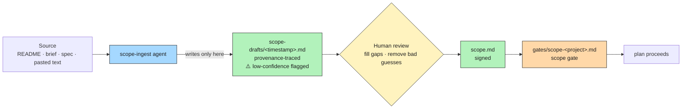

# SDLC Plugin — User Manual

A walkthrough of how to use the plugin in practice: what you need before you start, what the plugin asks you for at each step, and how it behaves across real scenarios.

For the concise overview, read [README.md](../README.md). For the authoritative phase definitions, read [docs/SDLC.md](SDLC.md). This document sits between them — long enough to show you exactly what a session looks like, short enough to keep near you while you work.

---

## Table of contents

1. [Prerequisites](#1-prerequisites)
2. [First-time setup (one-off)](#2-first-time-setup-one-off)
3. [Per-task prerequisites](#3-per-task-prerequisites)
4. [The four input routes (how to feed the plugin)](#4-the-four-input-routes)
5. [Sign-off: the irrevocable step](#5-sign-off-the-irrevocable-step)
6. [Gate file anatomy](#6-gate-file-anatomy)
7. [Scenarios](#7-scenarios)
    - [7.1 Greenfield feature (full 8 phases)](#71-scenario-a--greenfield-feature-full-8-phases)
    - [7.2 Small bug fix (`/fix-fast`)](#72-scenario-b--small-bug-fix-fix-fast)
    - [7.3 Frontend feature (UX artifact required)](#73-scenario-c--frontend-feature-ux-artifact-required)
    - [7.4 Degraded mode (no Git, no tracker)](#74-scenario-d--degraded-mode-no-git-no-tracker)
    - [7.5 Mid-build scope change (CR flow)](#75-scenario-e--mid-build-scope-change-cr-flow)
    - [7.6 External API integration (mock fallback)](#76-scenario-f--external-api-integration-mock-fallback)
    - [7.7 Pre-written plan / RFC intake](#77-scenario-g--pre-written-plan--rfc-intake)
    - [7.8 Scope re-validate (task doesn't fit current scope.md)](#78-scenario-h--scope-re-validate-task-doesnt-fit-current-scopemd)
    - [7.9 First-time opt-in activation (`/start`)](#79-scenario-i--first-time-opt-in-activation-start)
    - [7.10 Suspend and resume (`/suspend`)](#710-scenario-j--suspend-and-resume-suspend)
8. [Hook behavior reference](#8-hook-behavior-reference)
9. [Troubleshooting](#9-troubleshooting)

---

## 1. Prerequisites

**These must exist before the plugin can be useful. Without them, either the plugin blocks edits (via `plan-gate.sh`) or it degrades to local-only artifacts.**

> **Platform note:** macOS and Linux users have everything they need from a standard install. **Windows users** must run Claude Code inside [Git Bash](https://git-scm.com/downloads) (included with Git for Windows) or WSL2 — the hooks are bash scripts and will not run in cmd or PowerShell.

### Hard prerequisites (plugin will not work without these)

| Requirement | Why | How to check |
|---|---|---|
| Claude Code installed | The plugin is a Claude Code plugin — it has no standalone runtime; all commands, skills, and hooks run inside a Claude Code session | `claude --version` |
| POSIX shell + `bash` | All hooks are bash scripts. **Windows:** use Git Bash or WSL2. | `bash --version` |
| The plugin loaded in your repo | Via `/plugin` — see [README install section](../README.md#install) | `/plugin list` inside Claude Code |
| `.claude/sdlc/scope.md` **or** willingness to point at source material | Phase 1 (`/plan`) validates against it. On first run, the [`scope-ingest`](../agents/scope-ingest.md) agent turns a README, brief, or `.md`/`.txt` source into a draft for you to review, promote, and sign. Fallback: type a one-paragraph statement in chat. | `cat .claude/sdlc/scope.md` |
| `config/tools.json` exists (copy of `tools.example.json`) | Every skill and hook reads tool commands from here; missing file means no formatter/linter/tests run | `ls config/tools.json` |

### Soft prerequisites (plugin degrades, but surfaces the gap)

| Requirement | What happens without it |
|---|---|
| Git repository | `env.json` records `vcs: null`; traceability falls back to REQ IDs + local CR files |
| Issue tracker (GitHub Issues, Jira, Linear) | Local markdown tickets under `.claude/sdlc/tickets/`; gate accepts `no ticket REQ-<n>` as degraded signature |
| CI config (GitHub Actions, GitLab CI, CircleCI, Jenkins) | Zero impact — plugin never triggers pipelines, just links them in artifacts when detected |
| Observability platform (Grafana, Datadog, CloudWatch) | Phase 7 produces platform-neutral markdown under `.claude/sdlc/monitoring/` |
| UX intent file **for frontend tasks only** | **Frontend tasks:** Phase 2 halts until `.claude/sdlc/architecture/ux/<task-slug>.md` exists. **You do not need Figma or a designer** — a plain-text description of the UI intent (a few bullet points is enough) counts as a valid artifact. Formal mockups (Figma link, PDF, screenshot, wireframe) also work but are optional. **Backend-only tasks:** UX track is skipped — no Phase 2 halt, no Phase 5 UX conformance. |
| MCP servers for Jira/Linear/Grafana/Datadog/Figma | Degrades to the next tier — local markdown, provided links, or asking you directly |

### Tool commands you should fill into `config/tools.json`

None are mandatory — leave `null` to skip — but the plugin is more valuable with them filled in. Typical stacks:

```jsonc
// Python
"formatter":      { "command": "ruff format" }
"linter":         { "command": "ruff check" }
"test_runner":    { "command": "pytest" }
"coverage":       { "command": "pytest --cov", "threshold_percent": 80 }
"secret_scanner": { "command": "gitleaks detect --no-git" }

// TypeScript/JavaScript
"formatter":      { "command": "prettier --write" }
"linter":         { "command": "eslint" }
"test_runner":    { "command": "vitest run" }
"coverage":       { "command": "vitest run --coverage", "threshold_percent": 80 }

// Go
"formatter":      { "command": "gofmt -w" }
"linter":         { "command": "golangci-lint run" }
"test_runner":    { "command": "go test ./..." }
```

---

## 2. First-time setup (one-off)

Run these once per repo that will use the plugin.

> **New to the plugin?** Steps 1–2 below are the only manual steps. Everything else — config, scope, plan draft — is handled automatically by `/start` in Step 2.

### Step 1 — Install the plugin

From inside Claude Code in your project repo:

```
/plugin install <path-or-URL>
```

See Claude Code's plugin docs for the current flow.

### Step 2 — Run `/start` to activate

```
/start
```

`/start` is the single entry point for a fresh repo. It handles config, activation, and task intake in one flow — no need to run `/configure` first. Full walkthrough in [Scenario 7.9](#79-scenario-i--first-time-opt-in-activation-start). In brief:

- **Config auto-detect (Step 0):** silently detects VCS, CI, stack, and tracker from the repo. Shows detected values as facts. Asks at most 3 prompts (tracker confirm, token, project slug). Writes `config/tools.json` and `config/tools.local.json` only on your confirmation.
- **Activation (Step 1):** creates `.claude/sdlc/.enabled`. All enforcement hooks are now live.
- **Task intake (Step 2):** one prompt — *"What are you building or fixing?"* Auto-classifies, checks fix-fast eligibility.
- **Artifact generation (Step 3):** creates `scope.md` (draft) and a plan artifact from your description. All auto-filled fields are marked `[suggested]` — you confirm them in `/plan`.
- **Summary (Step 4):** prints what was armed (repo, CI, stack, tracker, hooks active) and hands off to `/plan`.

If you want to **customise** beyond auto-detection (add a Jira token, set a coverage threshold, change the formatter command), run `/configure` afterward. It is no longer the first step.

### Step 3 — (Optional) Customise with `/configure`

```
/configure
```

Use this when auto-detection misses something or you need to adjust defaults. Also auto-invoked when a skill detects a missing required key (Layer 2). Reads and rewrites `config/tools.json` in place.

### Step 4 — Produce a scope statement (`scope-ingest` flow)

The first `/plan` invocation runs the [`scope-ingest`](../agents/scope-ingest.md) agent if `.claude/sdlc/scope.md` is missing. You point at source material; the agent extracts a provenance-traced draft you can review and correct.

**Accepted source types (v1):** `.md`, `.txt`, raw pasted text, or an existing `scope.md` (re-validate mode). PDF/DOCX/PPTX and Jira/Linear ingest are on the roadmap.



The interactive flow:

```
/plan "Add rate-limit headers to the public API"
# → No scope.md found. Point me at source material:
#   - a file path (README.md, docs/brief.txt, …)
#   - paste text directly in chat
#   - or type 'skip' to write a one-paragraph statement by hand
```

Pick one of:

1. **File path** — e.g. `README.md`. The agent reads it, extracts fields (in-scope, out-of-scope, success criteria, constraints, stakeholders, assumptions), and writes a draft to `.claude/sdlc/scope-drafts/<timestamp>.md` with a per-bullet provenance footer and `extraction_confidence` per field (`high` / `medium` / `low` / `absent`). Low-confidence sections are prefixed with ⚠️; absent fields are omitted.

2. **Pasted text** — paste a brief inline; same draft output.

3. **`skip`** — fall back to typing a one-paragraph statement; the plugin writes `scope.md` directly. This is the minimal-friction degraded path.

**Review the draft.** Open `.claude/sdlc/scope-drafts/<timestamp>.md`. Verify each bullet against its source comment. Remove guesses, fill ⚠️ gaps. The draft is *not* authoritative — only `scope.md` is.

**Promote and sign.** Copy the draft to `.claude/sdlc/scope.md` (the agent does **not** write `scope.md` — that's your signed artifact). Strip the `<!-- source: ... -->` provenance comments before publishing.

```bash
cp .claude/sdlc/scope-drafts/20260425T032010Z.md .claude/sdlc/scope.md
# edit out the HTML comments, fix any remaining ⚠️ fields
```

### Step 5 — Sign the scope gate (one-time per project)

`/plan` then drafts a scope gate at `.claude/sdlc/gates/scope-<project-slug>.md` using [`templates/scope-gate.md`](../templates/scope-gate.md). The shape is identical to a phase gate plus a `gate_hash` and a "Scope fields confirmed" checklist.

You sign it with the same chat sign-off prompt used elsewhere (URL or `no ticket REQ-SCOPE-<project-slug>`). The REQ ID for this gate is `REQ-SCOPE-<project-slug>`.

After signing, `plan-gate.sh` stops warning about the missing scope gate, and subsequent `/plan` invocations read `scope.md` automatically — Steps 4 and 5 only run on the first task per project (or when you re-validate).

> **Don't have source material?** Type `skip` at the prompt and write a one-paragraph statement directly. You still sign the scope gate; only the source-extraction step is skipped.

---

## 3. Per-task prerequisites

Before you start a *task*, the plugin assumes:

| Prereq | Required when | User provides |
|---|---|---|
| **A rough task description** | Always | 1–2 sentences — the `/plan` prompt |
| **A work item reference** (REQ ID, ticket URL, or signed CR path) | Build phase and beyond | Pasted at gate sign-off; degraded mode accepts `no ticket REQ-<n>` |
| **A UX intent file** | Frontend work only, Phase 2 onward | **A plain-text description is enough** — create `.claude/sdlc/architecture/ux/<task-slug>.md` and write what the UI should do (e.g. `Make the submit button red on hover`). Formal mockups (Figma link, screenshot, wireframe) also work but are not required. Even a tiny CSS-only task needs this file — but creating it takes 30 seconds. |
| **API spec + reachable endpoint** *(or acknowledgment to use a mock)* | Only if the task integrates with an external API | Spec file path + base URL. If unreachable, the `api-integration` skill asks you to choose a mock runner (MSW / Prism / WireMock) |

**Plan versioning:** every plan artifact carries `Version:` and `Status:` frontmatter fields. When you make a material change to a signed plan (scope, files, estimate), the plugin increments the version and archives the previous copy as `<slug>.v<N>.md` alongside the live file — so the audit trail stays intact. Minor corrections (typos, formatting) don't trigger a version bump. You'll see the version number in the plan header when you review.

**Your commitment per task:** review the artifact at each of the 8 gates. The plugin will ask for a fresh sign-off every time. Rubber-stamping defeats the point.

### Domain-expert check (automatic, Phase 1)

Between scope validation and plan write, the [`domain-expert`](../skills/domain-expert/SKILL.md) skill evaluates the task description and `scope.md` against the domain registry in `domains/_index.json` (project-level first, plugin-level fallback) using semantic judgment — no keyword list. On a **high-confidence** match it silently injects a `## Domain context` block — gap questions, NFR reminders, security hotspots — into the plan artifact. On a **medium/low-confidence** match it asks you to confirm. On a **miss** in a clearly domain-sensitive area, it offers Path A (source-driven ingest of a URL) or Path B (guided 6-question Q&A) once per session — see [`AUTHORING.md`](../skills/domain-expert/AUTHORING.md). No user input is required for high-confidence matches; you'll just see the new section in the plan when you review.

**After completing Path A or B:** the skill re-runs domain matching immediately with the newly authored file and injects `## Domain context` without requiring you to re-run `/plan`. If you decline the offer (type `skip`), the session records that in `.claude/sdlc/hints.jsonl` and won't ask again until the next session.

---

## 4. The four input routes

All routes produce the same artifact shape under `.claude/sdlc/`. Pick whichever fits the task.

> For a visual map of how commands, skills, subagents, hooks, and artifacts connect, see the two mermaid diagrams in [README.md § At a glance](../README.md#at-a-glance).

### Route 1 — Slash-command prompt (fastest)

```
/plan "Add rate-limit headers to the public API"
```

Plugin drafts `.claude/sdlc/plans/rate-limit-headers.md`. You open, edit in place, sign the gate.

### Route 2 — Conversation first, then artifact

You chat the problem through:

> "We need rate-limit headers. Probably on the gateway layer. Worried about cache poisoning."

Claude asks clarifying questions, drafts the plan, shows it back. You redirect ("exclude the admin API") until it's right, then Claude writes the file.

### Route 3 — Pre-written artifact

Drop your own plan into place before running the command:

```
.claude/sdlc/plans/rate-limit-headers.md
```

Use the shape in [templates/plan.md](../templates/plan.md). The skill validates required fields and asks about gaps. Good for teams with existing RFC / design-doc culture.

### Route 4 — External source reference

```
/plan "use the RFC at docs/rfcs/rate-limits.md as design input"
/analyze "pull requirements from JIRA PROJ-123"
```

Plugin reads the source, produces an artifact in its own template shape, and preserves the traceability link.

---

## 5. Sign-off: the irrevocable step

Every phase ends at a gate file at `.claude/sdlc/gates/<phase>-<task-slug>.md`. **Claude drafts; only you sign.**

### Before you sign: correcting an artifact

Signing is irrevocable — downstream phases parse the gate, and reopening it means reopening the phase. If the phase artifact is wrong, fix it *first*, then sign. You have three correction paths, in order of preference:

1. **Ask Claude to regenerate or refine it in chat.** This is the default — Claude drafted it, Claude can redraft it.

   ```
   You: the estimate is way off — the gateway has retry logic that
        doubles the scope. Please rewrite with that in mind.

   Claude: <updates .claude/sdlc/plans/rate-limit-headers.md,
            shows the diff, re-prompts for sign-off>
   ```

   This works well for coarse corrections ("scope is wrong", "add NFRs", "drop the admin API").

2. **Open the file and edit it yourself.** Artifacts are plain markdown — no special tooling. Good for fine corrections ("this one field is wrong", "reorder these REQs") where typing is faster than explaining. After you save, tell Claude:

   ```
   You: I edited the plan directly — re-read it and continue to sign-off.
   ```

3. **Abort the phase.** If the whole artifact is wrong-shaped (e.g. `/plan` misclassified the task as a feature when it's a fix), delete the draft file and start over:

   ```bash
   rm .claude/sdlc/plans/rate-limit-headers.md
   ```
   Then re-run the phase command with a more precise prompt.

**What NOT to do:** do not sign a wrong artifact "just to move on." The gate captures your signature verbatim against that artifact — a signed-but-wrong gate is harder to unwind than an unsigned draft.

### Two sign-off modes

Once the artifact is correct:

### Chat sign-off (default)

Used for `/plan`, `/analyze`, `/design`, `/build`, `/test`, `/support`.

Claude prompts:

```
Phase artifact: .claude/sdlc/plans/rate-limit-headers.md — please review.
Paste the URL of the REQ / ticket / CR you're approving against,
or type `no ticket REQ-<n>, …` for degraded mode.
```

You paste something like:

```
https://linear.app/acme/issue/PROJ-1234
```

**Rejected signatures:** bare `yes`, `ok`, `lgtm`, `approved`. The URL (or REQ-ID list) is the non-trivial acknowledgment that makes the record auditable.

Claude writes the gate file with your exact text quoted and an ISO-8601 timestamp.

### Manual sign-off (required for `/deploy` and `/fix-fast`)

You open the gate file yourself and edit it. Claude will not capture the signature via chat. Deploy has blast radius; fix-fast bundles three phases into one mini-gate — both warrant the extra friction.

#### Worked example — signing a deploy gate by hand

After `/deploy` finishes, the plugin tells you the gate file path and stops. For a task slugged `rate-limit-headers`, the file is:

```
.claude/sdlc/gates/deploy-rate-limit-headers.md
```

When the plugin writes it, the five sign-off fields at the top are placeholders. Here is what the file looks like **as drafted by the plugin** (unsigned):

```markdown
# Phase Gate: deploy-rate-limit-headers

- **Phase:** deploy
- **Task:** rate-limit-headers
- **Signed by:** <human name or email>
- **Signed at:** <YYYY-MM-DDTHH:MM:SSZ>
- **Work-item reference:** <URL of REQ / ticket / CR>

## Phase summary

Rolling out rate-limit headers to prod behind the
`api.ratelimit_headers_enabled` flag, default off. Canary for 24h at
10% traffic before full enablement.

## Artifacts produced or updated

- .claude/sdlc/deployments/2026-04-18-rate-limit-headers.md

## Open items carried to next phase

- Monitor 429 rate on the canary — dashboard link in the runbook

## Explicit waivers (if any)

- (none)

## Acknowledgment

<Write your raw sign-off message here, then save.>

## Confirmation

I have reviewed the phase outputs and approve advancing to the next phase.
```

**What you edit — exactly five changes:**

```diff
- - **Signed by:** <human name or email>
+ - **Signed by:** juan.delacruz@acme.com

- - **Signed at:** <YYYY-MM-DDTHH:MM:SSZ>
+ - **Signed at:** 2026-04-18T16:05:44Z

- - **Work-item reference:** <URL of REQ / ticket / CR>
+ - **Work-item reference:** https://linear.app/acme/issue/PROJ-1234

  ## Acknowledgment

- <Write your raw sign-off message here, then save.>
+ > I have reviewed the deployment proposal, including the
+ > feature-flag default-off rollback plan and the 24h canary
+ > window. Approving the staging → prod push.
```

**Rules for each field:**

| Field | What to write | Do not |
|---|---|---|
| `Signed by` | Your email or name as it will appear in audit logs | Leave the `<...>` placeholder |
| `Signed at` | ISO-8601 UTC timestamp — run `date -u +"%Y-%m-%dT%H:%M:%SZ"` to get one | Back-date or round to the hour |
| `Work-item reference` | The ticket / REQ / CR URL you are approving against | Paste `yes`, `lgtm`, or a commit SHA |
| `Acknowledgment` | A sentence (or two) naming the specific things you verified — flag state, rollback plan, canary window | Write `"approved"` or repeat the phase summary verbatim |
| `Confirmation` | Leave the template line as-is | Delete or reword it |

**After saving**, the next phase command (e.g. `/support`) will run. `phase-gate.sh` will refuse to advance if any of the five required fields still contains a `<signer>` / `<timestamp>` / `<work-item>` / `<acknowledgment>` placeholder, a `___` blank, or a `TODO` marker. **Implemented hard block (RFC-003 PR-4)** — fill every field before saving.

#### Same pattern for `/fix-fast`

`/fix-fast` uses the same template; only the filename differs:

```
.claude/sdlc/gates/plan-<task-slug>.md
```

(The mini-gate lives under the `plan-` prefix because fix-fast collapses Plan + Analyze + Design into one gate.) Fields to edit are identical to the deploy example above; the `Acknowledgment` should name the fix's scope constraints you verified (≤ 2 files, ≤ 50 LOC, no schema/API/security/UX changes).

---

## 6. Gate file anatomy

Every gate lands at `.claude/sdlc/gates/<phase>-<task-slug>.md` and follows [templates/gate.md](../templates/gate.md). Understanding the fields helps you read someone else's gate later, and explains why some validation steps exist.

### Fields and where values come from

| Field | Source | Who fills it |
|---|---|---|
| `Phase` | The command that ran (`plan`, `analyze`, …) | Plugin |
| `Task` | Task slug derived from the plan filename | Plugin |
| `Signed by` | User's session identity (email from Claude Code session). If unknown, the skill asks. | Plugin captures; user may supply on prompt |
| `Signed at` | ISO-8601 UTC timestamp generated **at write time** | Plugin — **never** from user input |
| `Work-item reference` | The URL (or `no ticket REQ-<n>, …`), **verbatim** | User's raw input |
| `Phase summary` | One paragraph: what was done, artifacts produced, open items | Plugin drafts |
| `Artifacts produced or updated` | File paths touched this phase | Plugin |
| `Open items carried to next phase` | Unresolved questions, deferred work | Plugin drafts; user edits |
| `Explicit waivers` | Any rule you chose to waive (e.g. coverage below threshold) | User — requires justification and name |
| `Acknowledgment` | User's raw sign-off message, **quoted verbatim** | User |
| `Confirmation` | The boilerplate line "I have reviewed…" | Template constant |

Verbatim capture matters: an auditor reading the gate later should see exactly what the human said, not a paraphrase.

### What a signed gate looks like (chat sign-off)

```markdown
# Phase Gate: plan-rate-limit-headers

- **Phase:** plan
- **Task:** rate-limit-headers
- **Signed by:** juan.delacruz@acme.com
- **Signed at:** 2026-04-18T14:32:10Z
- **Work-item reference:** https://linear.app/acme/issue/PROJ-1234

## Phase summary

Plan drafted for adding X-RateLimit-* response headers to the public API
gateway. In-scope: gateway/middleware/ratelimit.go and its test file.
Classification: feature. Estimate 120 LOC, 2 files.

## Artifacts produced or updated

- .claude/sdlc/plans/rate-limit-headers.md

## Open items carried to next phase

- Decide whether admin API gets the same headers (out-of-scope for now;
  revisit in Analyze)

## Explicit waivers (if any)

- (none)

## Acknowledgment

> https://linear.app/acme/issue/PROJ-1234

## Confirmation

I have reviewed the phase outputs and approve advancing to the next phase.
```

### What a manually-signed gate looks like (deploy)

For `/deploy` and `/fix-fast`, you open the file in your editor and fill the sign-off fields yourself. A well-formed deploy gate:

```markdown
# Phase Gate: deploy-rate-limit-headers

- **Phase:** deploy
- **Task:** rate-limit-headers
- **Signed by:** juan.delacruz@acme.com
- **Signed at:** 2026-04-18T16:05:44Z
- **Work-item reference:** https://linear.app/acme/issue/PROJ-1234

## Phase summary

Rolling out rate-limit headers to prod behind the
`api.ratelimit_headers_enabled` flag, default off. Canary for 24h at
10% traffic before full enablement.

## Artifacts produced or updated

- .claude/sdlc/deployments/2026-04-18-rate-limit-headers.md

## Open items carried to next phase

- Monitor 429 rate on the canary — dashboard link in the runbook

## Explicit waivers (if any)

- (none)

## Acknowledgment

> I have reviewed the deployment proposal, including the feature-flag
> default-off rollback plan and the 24h canary window. Approving the
> staging → prod push.

## Confirmation

I have reviewed the phase outputs and approve advancing to the next phase.
```

### Validation the plugin runs before writing

Chat sign-off is not a blind write. Before the gate file is saved, the `gate-signoff` skill validates the user's input:

1. **URL form.** If input looks like a URL, it must parse (scheme + host + path). Malformed URLs are rejected.
2. **Host match (warn).** If `config/tools.json → ticket_system.host` is set, the URL's host must match. Mismatch surfaces a warning but does not block — you might be pointing at a secondary system on purpose.
3. **Degraded form.** `no ticket REQ-<n>, …` requires at least one REQ ID, and each REQ-ID must already exist in the task's requirements artifact. A REQ ID that was never filed is rejected.
4. **Task-slug echo.** The gate path is computed by the skill from the task slug, not from anything the user pastes — you can't redirect the file location via the acknowledgment text.
5. **Rubber-stamp filter.** Bare `yes`, `ok`, `lgtm`, `approved`, or emoji are rejected outright.

**Retry behavior:** if a check fails, the skill re-asks once with the same prompt. After a second failure, it stops and asks the human what to do — it does not guess or loosen the rule.

### Next-step hints

After every phase gate is written, the skill appends a `## Next step hint` block to its output — a short, context-aware suggestion for what to run next (e.g. "Run `/analyze` to produce requirements" or "All gates are signed — run `/deploy`"). These are informational only; they don't change behavior or block anything. You can ignore them if you already know your next step.

### Downstream enforcement (why gates can't be forged)

> **Status tags.** Hook capabilities below carry one of four tags:
> - **Implemented hard block** — hook exits 2; confirmed by a passing bats test.
> - **Implemented warning** — hook exits 0 + stderr; confirmed by test.
> - **Planned** — accepted in an RFC, not yet shipped.
> - **Strict-mode only** — requires a `config/tools.json` `enforcement.<key>: block` setting (no controls in this state today; the keys are reserved by RFC-003 PR-2).

Writing a gate file is not the whole story — two hooks check it on the way through. `plan-gate.sh` blocks edits without a plan; `phase-gate.sh` and `work-item-validation.sh` together cover phase progression, gate signing, and per-file traceability per RFC-003.

| Hook | When | What it checks |
|---|---|---|
| [phase-gate.sh](../hooks/phase-gate.sh) | PreToolUse Edit/Write/MultiEdit + `Stop` | PreToolUse: blocks edits when the prior phase gate is missing — or when a deploy or fix-fast gate has unfilled placeholder fields. Stop: prints a 2-hour reminder if no gate file has been updated recently. **Implemented hard block (RFC-003 PR-3, PR-4).** |
| [work-item-validation.sh](../hooks/work-item-validation.sh) | PreToolUse on Edit/Write | Validates that the active plan has a `Classification` field; for change-request plans, validates that a matching signed CR artifact exists. Also warns when the edited file is not in the plan's `## In-scope files` list or when the plan has no REQ/ticket/CR reference. **Implemented hard block** for Classification + CR sign-off; **Implemented warning (RFC-003 PR-5)** for file-level traceability; **Implemented hard block (RFC-003 PR-8)** for file-level traceability when `enforcement.file_traceability: "block"` is set in `config/tools.json` and the active plan has a `## Traceability` table. |

The gate is a contract for the human signing it. With RFC-003 PR-3 through PR-8 shipped, the contract is enforced end-to-end. File-level traceability defaults to warn for back-compat; flip `enforcement.file_traceability: "block"` in `config/tools.json` to upgrade to a hard block once your plans include the `## Traceability` table.

### Graceful degradation

| Situation | Behavior |
|---|---|
| No `config/tools.json` or no `ticket_system` key | Skip host validation; accept any well-formed URL or `no ticket REQ-…` form |
| User identity unknown (no session email) | Skill asks for name or email at sign-off time; records whatever is provided, verbatim |
| Gate file write fails (permissions, disk) | Surface the error; **do not** retry silently. The human decides whether to fix the environment or record the sign-off elsewhere |

### The scope gate (one-time, pseudo-phase)

Before any phase gate, every project signs a **scope gate** once: `.claude/sdlc/gates/scope-<project-slug>.md`. Shape from [`templates/scope-gate.md`](../templates/scope-gate.md) — identical to a phase gate plus three additions:

| Addition | Purpose |
|---|---|
| `REQ ID` line | `REQ-SCOPE-<project-slug>` — the work-item reference for this scope acceptance |
| `gate_hash` | sha256 of the gate body above the sign-offs block, computed at signing — detects post-sign tampering |
| `## Scope fields confirmed` checklist | Eight checkboxes (Project name, In scope, Out of scope, Success criteria, Constraints, Stakeholders, Assumptions, Domain) — tick each field you reviewed |

**Sign-off shape** is the standard chat sign-off prompt. Acceptable inputs: a URL, or `no ticket REQ-SCOPE-<project-slug>` for degraded mode.

**Enforcement strictness:** [`plan-gate.sh`](../hooks/plan-gate.sh) **warns (does not block)** when the scope gate is missing. This is the "pseudo-phase gate" approach — surface the gap loudly, let the human decide whether to skip ahead. If post-ship usage shows operators skipping past the warning, this may be promoted to a hard block in v2 (see [docs/rfcs/scope-ingest.md](rfcs/scope-ingest.md)).

The scope gate is signed once per project. Every subsequent `/plan` reads `scope.md` and proceeds without re-prompting — unless the scope-ingest re-validate flow surfaces drift.

---

## 7. Scenarios

Each scenario shows: the initial user input → what the plugin does → what it asks for → final state.

> **Every scenario assumes the drafted artifact is correct before you sign.** If the plan, requirements, design, or any other artifact comes back wrong — which it will sometimes — do **not** sign it as-is. See [section 5 → Before you sign: correcting an artifact](#before-you-sign-correcting-an-artifact) for the three correction paths (ask Claude to redraft, edit the file yourself, or abort the phase). This loop is available at every `Plugin writes …` → `You sign` step below; it is omitted from the scenario walkthroughs only to keep them short.

#### The chat sign-off paste (same shape every time)

For phases that use chat sign-off (`/plan`, `/analyze`, `/design`, `/build`, `/test`, `/support`), what you type at the sign-off prompt is **one line** — a ticket URL, PR URL, or the `no ticket REQ-<n>` degraded form:

```
https://linear.app/acme/issue/API-4421
```

That single line is quoted verbatim into the gate file's `Acknowledgment` block along with an ISO-8601 timestamp. Scenarios below show it as `**You (sign-off):** <the literal paste>` — mentally substitute the URL that matches your actual work item. For manual sign-off (deploy, fix-fast), you edit the gate file directly — see the worked example in [section 5 → Manual sign-off](#manual-sign-off-required-for-deploy-and-fix-fast).

### First-run setup (per project, before any scenario)

The first time `/plan` runs in a project, two artifacts that don't yet exist get created **before** the plan itself: `scope.md` and the scope gate. From then on, every scenario below assumes both are in place.

1. **`scope-ingest` runs** (Section 2 → Step 4) — produces a draft at `.claude/sdlc/scope-drafts/<timestamp>.md`. You review, fill ⚠️ gaps, copy to `.claude/sdlc/scope.md`.
2. **Scope gate signed** (Section 2 → Step 5) — gate at `.claude/sdlc/gates/scope-<project>.md`, REQ ID `REQ-SCOPE-<project-slug>`. Chat sign-off, same prompt shape as a phase gate.
3. **Phase 1 then proceeds** as shown in 7.1 below.

If you skip the scope-ingest path (no source material, type `skip`), you write `scope.md` by hand and sign the scope gate the same way — the rest of the workflow is identical.

> **Domain-expert is automatic:** in every Phase 1 from this point on, the `domain-expert` skill runs between scope validation and plan write. On a high-confidence match, you'll see a new `## Domain context` section in the plan artifact when you review it. On a miss in a domain-sensitive area, you'll be offered the authoring flow (Path A: paste a URL; Path B: 6-question Q&A) — once per session.

### 7.1 Scenario A — Greenfield feature (full 8 phases)

**Task:** add rate-limit headers to the public API.

**Classification:** backend-only — no UI change, so the UX track is skipped (no Phase 2 halt, no Phase 5 UX conformance).

**Prerequisites checked:** `.claude/sdlc/scope.md` exists and the scope gate is signed (see [First-run setup](#first-run-setup-per-project-before-any-scenario)); `config/tools.json` has test runner + linter.

---

**Phase 1 — Plan** (6 steps: classify → resolve scope → domain check → write plan → tech stack → gate)

**You:**
```
/plan "Add X-RateLimit-* response headers to the public API gateway"
```

**Plugin:**
- **Step 1 — Classify:** `feature`.
- **Step 2 — Resolve scope:** reads `.claude/sdlc/scope.md`. The task aligns with documented scope ("public-facing API"); no drift surfaced.
- **Step 2.5 — Domain check:** `domain-expert` skill scans the task and `scope.md` against the merged domain index. No high/medium match for `payments` or `auth` — exits silently. (For a payments task, this step would inject a `## Domain context` block — see the example below.)
- **Step 3 — Write plan:** drafts `.claude/sdlc/plans/rate-limit-headers.md`:
  - Classification: `feature`
  - In-scope files: `gateway/middleware/ratelimit.go`, `gateway/middleware/ratelimit_test.go`
  - In-scope functions: `RateLimitHeaders`, `addRateLimitHeaders`
  - Out-of-scope: admin API gateway, internal RPC layer
  - Estimate: 120 LOC, 2 files
- **Step 4 — Tech stack:** Go 1.22, existing gateway middleware pattern. Compatibility matrix all-pass.
- **Step 5 — Gate:** returns the plan and asks you to review + sign.

> **What a domain match looks like:** if the task had been `/plan "add idempotency keys to the Stripe charge endpoint"`, Step 2.5 would have matched `payments` at `high` confidence and injected this into the plan artifact:
>
> ```markdown
> ## Domain context
>
> **Domain:** payments (high confidence)
> **Domain file:** domains/payments.md (plugin-level)
>
> ### Unanswered questions
>
> - ⚠️ **Which payment processor is in use, and which SDK/API version?** *(required)*
> - ⚠️ **Is this change PCI-scoped? If yes, what is the cardholder data isolation strategy?** *(required)*
> - What is the idempotency key strategy for mutating operations?
>
> ### NFR reminders
> - All payment operations must be idempotent.
> - Webhook endpoints must respond within 5 seconds.
> ```
>
> ⚠️ flags are **warn-level** — they don't block the plan gate. You answer them in the plan body (or in `scope.md` for project-wide answers) and re-sign.

**You (sign-off):**
```
https://linear.app/acme/issue/API-4421
```

**Plugin writes:** `.claude/sdlc/gates/plan-rate-limit-headers.md` with your URL + timestamp.

---

**Phase 2 — Analyze**

**You:** `/analyze`

**Plugin:**
- `analyze` skill drafts `.claude/sdlc/requirements/rate-limit-headers.md`:
  - `REQ-1`: gateway emits `X-RateLimit-Limit`, `X-RateLimit-Remaining`, `X-RateLimit-Reset`
  - `REQ-2`: headers match RFC 6585 semantics
  - `REQ-3`: absent when throttling is disabled for a route
  - Each REQ has acceptance criteria, priority, source.
- Maps each REQ to `scope.md` sections.

**You (sign-off):**
```
https://linear.app/acme/issue/API-4421
```

---

**Phase 3 — Design**

**You:** `/design`

**Plugin:**
- `design` skill + `architect` subagent validate existing architecture bundle at `.claude/sdlc/architecture/`. No changes needed here — surfaces "no architecture drift."
- Writes `.claude/sdlc/tech-specs/ratelimit-middleware.md`: API signatures, error modes, NFRs.
- `test-designer` subagent writes `.claude/sdlc/test-cases/TC-1.md`…`TC-5.md`, each traced to a REQ ID.

**You (sign-off):**
```
https://linear.app/acme/issue/API-4421
```

---

**Phase 4 — Build**

**You:** `/build`

**Plugin:**
- `plan-gate.sh` checks plan exists → pass
- `work-item-validation.sh` checks plan `Classification` (and signed CR if applicable) → pass
- `build` skill writes code to `gateway/middleware/ratelimit.go` (surgical: only in-scope functions)
- `format-on-write.sh` runs `gofmt -w`
- `secret-scan.sh` scans the diff → pass
- Writes unit tests at `gateway/middleware/ratelimit_test.go` — **only for the modified functions**
- `diff-scope-check.sh` sees any out-of-scope file → warns (doesn't block)
- `adjacent-function-detector.sh` scans hunk headers → warns if you accidentally edited a neighbor
- `modified-code-test-gate.sh` fires on `Stop` — warns if any modified function lacks a test

**You:** review the diff. Once committed and pushed, sign the gate with the PR URL:

**You (sign-off):**
```
https://github.com/acme/gateway/pull/1182
```

---

**Phase 5 — Test**

**You:** `/test`

**Plugin:**
- Runs `go test ./...` (from `config/tools.json`)
- Runs coverage, compares to threshold (default 80% on modified code)
- Writes `.claude/sdlc/test/rate-limit-headers-report.md` with pass/fail and coverage
- Any failures → defects opened as GitHub Issues (since `env.json` says `issue_tracker: github`), labeled `defect`, `severity:*`, `phase:test`

**You (sign-off):**
```
https://linear.app/acme/issue/API-4421
```

---

**Phase 6 — Deploy**

**You:** `/deploy`

**Plugin:**
- `deploy` skill writes `.claude/sdlc/deployments/2026-04-18-rate-limit-headers.md`:
  - Environment: staging → prod
  - Migrations: none
  - Feature flag: `api.ratelimit_headers_enabled` (default off)
  - Rollback: revert the flag; no data impact
  - Blast radius: public API surface
- **Manual sign-off.** You open `.claude/sdlc/gates/deploy-rate-limit-headers.md` in your editor and fill the five placeholder fields. The exact edits are shown in [section 5 → Worked example — signing a deploy gate by hand](#worked-example--signing-a-deploy-gate-by-hand). After saving, you run the actual deploy command yourself, e.g.:

```bash
./scripts/deploy prod --flag api.ratelimit_headers_enabled=on --canary 10
```

**Plugin never auto-deploys.**

---

**Phase 7 — Support**

**You:** `/support`

**Plugin:**
- `observability` subagent writes to `.claude/sdlc/monitoring/rate-limit-headers/`:
  - `alerts.md` — thresholds for 429 spike, header-missing rate
  - `dashboard.json` — Grafana panel JSON (if `observability: grafana` in config)
  - `runbook.md` — what to check when an alert fires
- Proposes — never auto-applies to production.

**You (sign-off):**
```
https://linear.app/acme/issue/API-4421
```

---

**Phase 8 — Docs**

**You:** `/docs`

**Plugin:**
- Updates `.claude/sdlc/docs/index.md` and `traceability.md`
- Appends entry to top-level `CHANGELOG.md`
- Leaves any traceability gaps visible (e.g. REQ-3 with no test reference)

**No dedicated gate** — cross-cutting.

---

**Final artifact tree for this task:**

```
.claude/sdlc/
├── plans/rate-limit-headers.md
├── requirements/rate-limit-headers.md
├── tech-specs/ratelimit-middleware.md
├── test-cases/TC-1.md … TC-5.md
├── gates/
│   ├── plan-rate-limit-headers.md
│   ├── analyze-rate-limit-headers.md
│   ├── design-rate-limit-headers.md
│   ├── build-rate-limit-headers.md
│   ├── test-rate-limit-headers.md
│   ├── deploy-rate-limit-headers.md
│   └── support-rate-limit-headers.md
├── test/rate-limit-headers-report.md
├── deployments/2026-04-18-rate-limit-headers.md
└── monitoring/rate-limit-headers/
```

---

### 7.2 Scenario B — Small bug fix (`/fix-fast`)

**Task:** fix an off-by-one in pagination.

**Eligibility check (all required):**
- [x] Classification = `fix`
- [x] ≤ 2 files touched
- [x] ≤ 50 LOC
- [x] No schema / API / security / UX changes

If any box is unchecked, run the full phases instead. The plugin does **not** widen eligibility.

> **How is this enforced?** **You declare it, hooks watch for drift, there is no automatic LOC counter.** If the diff grows past 50 LOC or touches a third file, no hook blocks the commit — `diff-scope-check.sh` warns on each out-of-scope Edit, and the correct response is to abort the mini-gate and run full phases. Full mechanism in ["How the eligibility limits are actually enforced"](#how-the-eligibility-limits-are-actually-enforced) below.

---

**You:**
```
/fix-fast "off-by-one in /users pagination — last page returns empty"
```

**Plugin:**
- Drafts a single mini-plan covering Plan + Analyze + Design:
  - Root cause: `offset = (page-1) * limit` should be `page * limit` in the cursor code
  - In-scope: `api/users/list.go:42-58` (`paginate` function)
  - Test to add: boundary case — last full page
- Writes `.claude/sdlc/plans/pagination-off-by-one.md` with classification = `fix-fast`.

**You:** **manual sign-off** — you edit the mini-gate file at `.claude/sdlc/gates/plan-pagination-off-by-one.md` yourself. Chat sign-off is rejected here.

Apply the same five-field edit shown in [section 5 → Worked example — signing a deploy gate by hand](#worked-example--signing-a-deploy-gate-by-hand). For this fix-fast mini-gate the edit looks like:

```diff
- - **Signed by:** <human name or email>
+ - **Signed by:** juan.delacruz@acme.com

- - **Signed at:** <YYYY-MM-DDTHH:MM:SSZ>
+ - **Signed at:** 2026-04-18T11:22:03Z

- - **Work-item reference:** <URL of REQ / ticket / CR>
+ - **Work-item reference:** https://github.com/acme/api/issues/884

  ## Acknowledgment

- <Write your raw sign-off message here, then save.>
+ > Verified fix-fast eligibility: 1 file touched, ~12 LOC, no schema
+ > / API / security / UX changes. Off-by-one confirmed by the failing
+ > boundary test. Approving the compressed path.
```

Save the file. Phase 4 (`/build`) can now run.

**Then Phases 4–8 run normally** — Build, Test, Deploy, Support, Docs are **not** compressed.

#### How the eligibility limits are actually enforced

The `≤ 2 files` and `≤ 50 LOC` limits are **human-declared at planning time, not pre-computed by the plugin.** There is no LOC estimator that runs before `/fix-fast`. The enforcement is layered:

| Layer | Mechanism | Severity |
|---|---|---|
| **Planning** | You declare classification = `fix` and estimate ≤ 2 files / 50 LOC in the mini-plan | Self-enforced — the skill asks you to confirm |
| **Edit-time** | Standard hooks fire on every Edit/Write — `diff-scope-check.sh`, `adjacent-function-detector.sh`, `secret-scan.sh`, `work-item-validation.sh` | Warn or block, same as full phases |
| **Drift detection** | If the diff exceeds your plan (files outside the in-scope list), `diff-scope-check.sh` warns on each Edit | Warn — you decide whether to continue |
| **Fallback** | Per [commands/fix-fast.md](../commands/fix-fast.md): *"If eligibility is violated at any point, fall back to the full 8-phase flow"* | Human decision — you revert the mini-gate and run `/plan` → `/analyze` → `/design` normally |

**There is no post-hoc LOC check that blocks the commit, and no "waiver" mechanism.** If you realize at Build time the fix is actually 150 LOC across 5 files, the correct response is to stop, throw away the fix-fast mini-gate, and run the full phases. Don't try to stretch the mini-gate to cover a larger diff — downstream traceability (Test, Docs) assumes the mini-gate's scope is representative of what shipped.

---

### 7.3 Scenario C — Frontend feature (UX artifact required)

**Task:** add a saved-searches dropdown to the header.

**The sharp edge:** Phase 2 (`/analyze`) halts until a UX artifact exists. This is the only hard block on a missing external input.

---

**You:** `/plan "add a saved-searches dropdown to the header"`

**Plugin:** drafts plan, classifies as `frontend-feature`, signs normally.

**You:** `/analyze`

**Plugin:**
```
HALT — frontend task detected, but no UX artifact found at
.claude/sdlc/architecture/ux/saved-searches-dropdown.md.

Provide any of:
 - A Figma link (paste URL in the file)
 - PDF mockups or screenshots (reference paths in the file)
 - Hand-drawn wireframes (attach + reference)
 - A plain written description of the UX

Create the file, then re-run /analyze.
```

**You:** create the file. A written description is enough:

```markdown
# UX: saved-searches dropdown

- Button in the header next to the search box, icon + label "Saved"
- Click opens a dropdown with recent 10 saved searches
- Each item: title, icon, last-used timestamp
- Empty state: "No saved searches yet"
- Keyboard: ↑/↓ to navigate, Enter to apply, Esc to close
- Match existing header button style (see button.tsx)
```

**You re-run:** `/analyze` → proceeds, requirements drafted.

**You (sign-off):**
```
https://linear.app/acme/issue/WEB-2207
```

**Phase 5 (`/test`):** runs UX conformance checks — compares rendered UI against your description / mockups, stores screenshots under `.claude/sdlc/test/ux/`.

---

### 7.4 Scenario D — Degraded mode (no Git, no tracker)

**Situation:** you dropped the plugin into a non-git directory (a prototype, a scratchpad) and there's no issue tracker.

---

**On SessionStart:** `env-detect.sh` writes:

```json
{ "vcs": null, "issue_tracker": null, "ci": null }
```

**First run (scope setup):**

**You:** `/plan "add a CLI flag for verbose output"`

**Plugin:** no `scope.md` found. Prompts:
```
No scope.md found. Point me at source material:
 - a file path (README.md, docs/brief.txt, …)
 - paste text directly in chat
 - or type 'skip' to write a one-paragraph statement by hand
```

**You:** `skip` (no source — it's a scratchpad).

**Plugin** asks for a one-paragraph statement, writes `.claude/sdlc/scope.md`, then drafts the scope gate. **Scope-gate sign-off prompt:**

```
Paste the URL of the REQ / ticket / CR, or type
`no ticket REQ-SCOPE-<project-slug>` for degraded mode.
```

**You:**
```
no ticket REQ-SCOPE-verbose-cli
```

**Plugin writes** `.claude/sdlc/gates/scope-verbose-cli.md` with this exact string + ISO-8601 timestamp.

**Phase 1 then proceeds.** Plan drafted at `.claude/sdlc/plans/verbose-flag.md`. Step 2.5 runs the domain-expert check; no match (CLI is not a seeded domain), so no `## Domain context` is written.

**Plan gate sign-off prompt:**

```
Paste the URL of the REQ / ticket / CR, or type `no ticket REQ-<n>` for degraded mode.
```

**You:**
```
no ticket REQ-1
```

**Plugin writes gate** with this exact string plus an ISO-8601 timestamp. This is the degraded signature — auditable, still non-trivial, but doesn't require an external system.

**All other phases run.** Defects land as `.claude/sdlc/defects/verbose-flag/DEF-1.md` instead of GitHub Issues. Deployment lands as `.claude/sdlc/deployments/<date>-verbose-flag.md` instead of a ticket comment.

---

### 7.5 Scenario E — Mid-build scope change (CR flow)

**Situation:** you're in Phase 4 (Build) for the rate-limit headers task. You realize the admin API also needs headers — but the admin API was explicitly **out-of-scope** in the plan.

---

**What NOT to do:** just edit the admin file. `diff-scope-check.sh` will warn, `work-item-validation.sh` may block, and you'll lose traceability.

**What to do:** stop the Build, raise a change request.

**You:** draft a CR at `.claude/sdlc/change-requests/CR-3.md` (shape from [templates/change-request.md](../templates/change-request.md)):

```markdown
# CR-3: extend rate-limit headers to admin API

Original scope: public API gateway only
Proposed addition: admin API gateway (same middleware pattern)
Rationale: internal tools hit rate limits without visibility
Risk: moderate — admin ops may see 429s sooner
```

**You sign the CR** by creating `.claude/sdlc/sign-offs/CR-3.md`:

```markdown
# Sign-off: CR-3

- **Reviewer:** juan.delacruz@acme.com
- **Signed at:** 2026-04-18T15:47:19Z
- **Decision:** approved

## Rationale

Admin API rate-limit headers are a reasonable scope addition — same
middleware, internal-only blast radius, caught before Build completed.
Accepting moderate risk of admin tools seeing 429s sooner.
```

**Update the plan** at `.claude/sdlc/plans/rate-limit-headers.md` — add the admin gateway files under `## In-scope files`:

```diff
  ## In-scope files

  - gateway/middleware/ratelimit.go
  - gateway/middleware/ratelimit_test.go
+ - admin-gateway/middleware/ratelimit.go
+ - admin-gateway/middleware/ratelimit_test.go
```

(Reference the CR in the commit message of your plan edit, e.g. `plan: extend scope per CR-3`.)

**Resume Build.** `work-item-validation.sh` sees the signed CR and permits the Edit. Without the sign-off, it blocks.

---

### 7.6 Scenario F — External API integration (mock fallback)

**Task:** integrate with the payments provider's refund endpoint.

---

**You:** `/plan "integrate with Stripe refunds API"`

**Plugin:** Phase 1 Step 2.5 matches `payments` at `high` confidence (keyword: `stripe`) and prepares a `## Domain context` block — PCI questions, idempotency NFR, webhook security hotspots. The block is appended to the plan artifact before you review.

**Plugin** then asks: "Spec location? Base URL?"

**You:**
```
Spec: https://stripe.com/docs/api/refunds
Base URL: https://api.stripe.com/v1
```

**`api-integration` skill probes the endpoint:**

- **If reachable:** proceeds normally — validates the spec against live responses.
- **If unreachable** (offline, no credentials, region-blocked): the skill **does not silently stub**. It offers a mock:

```
Stripe API unreachable. Offering a mock to unblock development:

 1. MSW (TypeScript/JS service worker)
 2. Prism (OpenAPI mock server)
 3. WireMock (language-agnostic HTTP mock)
 4. Typed fixture (in-process stub, no server)

Pick a number, or paste a different mock command.
```

**You:** `2`

**Plugin** scaffolds a Prism mock at `mocks/stripe/` with a run script, and notes in the plan: "Integration uses mocked endpoints until live spec verified."

---

### 7.7 Scenario G — Pre-written plan / RFC intake

**Situation:** your team already writes RFCs in Notion. You have one for the rate-limit work.

---

**You:** export the RFC from Notion and drop it in the repo:

```bash
mkdir -p docs/rfcs
cp ~/Downloads/rate-limits-rfc.md docs/rfcs/rate-limits.md
```

**You:**
```
/plan "use the RFC at docs/rfcs/rate-limits.md as the plan input"
```

**Plugin:**
- Reads the RFC.
- Produces `.claude/sdlc/plans/rate-limit-headers.md` in the plugin's template shape, with a `Source:` line pointing back to the RFC.
- If required fields are missing (e.g. no explicit `In-scope files` list), asks you to fill the gaps — doesn't invent them. Example prompt:
  ```
  RFC imported. Two fields are missing from the plan template:
   - In-scope files (not mentioned explicitly in the RFC)
   - Rollback (RFC describes forward cut-over only)

  Please fill these in .claude/sdlc/plans/rate-limit-headers.md
  before sign-off.
  ```

**You:** open the file and fill the gaps. Example of the minimum edit:

```diff
  ## In-scope files

- <to be determined>
+ - gateway/middleware/ratelimit.go
+ - gateway/middleware/ratelimit_test.go

  ## Rollback

- <to be determined>
+ Disable the feature flag `api.ratelimit_headers_enabled`. No data
+ migrations, no schema changes — flag flip reverts behavior.
```

**You (sign-off):**
```
https://linear.app/acme/issue/API-4421
```

Same pattern works for `/analyze "pull requirements from JIRA PROJ-123"` — the plugin will read the ticket (via MCP if configured) and transform it into the requirements template.

---

### 7.8 Scenario H — Scope re-validate (task doesn't fit current scope.md)

**Situation:** your project has a signed `scope.md`. Six months later, a new task arrives that looks materially different from what the scope describes. `/plan` detects the mismatch and triggers re-validation before writing the plan.

---

**You:**
```
/plan "Add a public GraphQL API for third-party integrations"
```

**Plugin (Step 2 — scope check):**
- Reads `scope.md`. The scope describes a REST-only internal API service; a public GraphQL API is not mentioned.
- Detects material drift. Invokes `scope-ingest` in **re-validate mode** against the existing `scope.md`.

**Plugin (re-validate output):**
- Writes a drift report at `.claude/sdlc/scope-drafts/<timestamp>-revalidation.md`:
  ```
  ## Drift detected

  - 'In scope' does not mention a public-facing API surface.
  - 'Out of scope' lists "third-party integrations" explicitly.
  - Success criteria reference internal tooling only — no public SLA.
  ```
- Surfaces the report and presents three options:

```
Drift detected between the task and scope.md. Choose how to proceed:

  1. Expand scope — update scope.md to include this task and re-sign
     the scope gate. Use when the project's direction has genuinely
     widened and the new work is approved.

  2. Raise a CR — create a change request (CR-<n>.md) and sign it.
     Use when scope is expanding mid-project and you want a formal
     record of the decision.

  3. Defer — stop here. The task is out of scope; it should be
     planned under a different project or a future scope revision.

Type 1, 2, or 3.
```

**If you choose 1 (expand scope):**

Open `scope.md` and add the new capability. Tell Claude when done:
```
Updated scope.md — re-read and continue.
```
Claude re-runs the scope check (now passes), re-validates the scope gate hash, and proceeds to Step 2.5 (domain-expert).

> **Scope gate re-sign:** expanding scope after the initial gate was signed means the gate hash no longer matches. Draft a new scope gate (or amend the existing one) before signing the next phase gate. The plugin will warn if the hash drifts.

**If you choose 2 (raise a CR):**

Same flow as [Scenario E (§7.5)](#75-scenario-e--mid-build-scope-change-cr-flow) — but at Plan phase instead of Build. Create `.claude/sdlc/change-requests/CR-<n>.md`, sign it at `.claude/sdlc/sign-offs/CR-<n>.md`, then tell Claude to continue. The CR is referenced in the plan artifact's work-item field.

**If you choose 3 (defer):**

Planning stops. No artifacts are written. Run the task under a new or revised scope.

---

You'll interact with hooks implicitly — they fire on Claude's tool calls, not yours. This table explains what to expect when something "just stops":

| Hook | Fires on | Severity | Typical user experience |
|---|---|---|---|
| `plan-gate.sh` | PreToolUse Edit/Write | **Block** + 2 warns | **Block:** "I can't edit files yet — there's no plan for this task. Run `/plan` first." **Warn:** if `.claude/sdlc/scope.md` is absent, or if no scope gate exists at `.claude/sdlc/gates/scope-*.md`. The warns surface the gap; the block is reserved for the missing plan artifact. |
| `work-item-validation.sh` | PreToolUse Edit/Write | **Block** + Warn | **Block:** "Edit blocked: active plan has no `Classification` field" — or, for change-request plans, "no matching signed CR artifact found". **Warn (Implemented warning, RFC-003 PR-5):** "WARN: file '<path>' is not listed in the active plan's '## In-scope files' section" / "WARN: no REQ/TICKET/CR/ISSUE reference found in active plan". **Block (Implemented hard block, RFC-003 PR-8):** when `enforcement.file_traceability: "block"` is set in `config/tools.json` AND the active plan has a `## Traceability` table, the edited file must appear in the table with a REQ/TICKET/CR/ISSUE reference, else exit 2. Plans without the section fall back to warn-only regardless of config. |
| `phase-gate.sh` | PreToolUse Edit/Write/MultiEdit + `Stop` | **Block** + Advisory | **PreToolUse Block (Implemented hard block, RFC-003 PR-3):** "BLOCK: active phase is '<phase>' but no prior gate found for task '<slug>' (expected …)". **PreToolUse Block (Implemented hard block, RFC-003 PR-4):** "BLOCK: deploy/fix-fast gate has unfilled fields: …". **Stop Advisory:** "INFO: no gate file updated in the last 2 hours …". |
| `secret-scan.sh` | PostToolUse | **Block** | "Secret scanner found a confirmed secret in this diff — refusing the write." |
| `diff-scope-check.sh` | PostToolUse | Warn | "Warning: you touched `admin/api.go` but it's not in the plan's in-scope list." |
| `adjacent-function-detector.sh` | PostToolUse | Warn | "Warning: function `formatAdminError` is adjacent to the in-scope `formatUserError` — verify this was intentional." |
| `modified-code-test-gate.sh` | Stop | Warn | "Warning: `paginate()` was modified but no test was added/updated." |
| `bash-safety.sh` | PreToolUse Bash | Warn | "Warning: command contains `rm -rf` — confirm intent." |
| `format-on-write.sh` | PostToolUse | — | Silent — runs your formatter on changed files. |
| `env-detect.sh` | SessionStart | — | Silent — writes `.claude/sdlc/env.json`. |
| `session-plan-check.sh` | SessionStart | — | Surfaces any in-flight tasks and personalized sign-off hints at the start of each Claude Code session. |
| `token-tracker.sh` | Stop | — | Silent — only if `token_tracking.enabled: true`. |
| `approval-reconcile.sh` | Stop | Warn | For every gate with a `## Required sign-offs` block, warns if a sign-off file is missing for any listed role and if the gate hash has drifted since signing; shows the path for new sign-off files. Regenerates `APPROVALS.md`. |

**Warnings are warnings** — they surface the signal and let you decide. They don't escalate to blocks on their own.

---

## 9. Troubleshooting

### "I want to see what tasks are in-flight and what needs signing"

Run `/status`. It shows the current task state, phase progress, and any gates that are unsigned — read-only, no side effects.

### "I don't know which command to run next"

Run `/help` for the full command reference, or `/help <command>` (e.g. `/help build`) for detail on a specific phase.

### "`plan-gate.sh` keeps blocking my edits"

That's the rule working. Run `/plan` first. If you already have a plan, check:
- Is the plan file under `.claude/sdlc/plans/`?
- Does the filename match the task slug the skill inferred?
- Is the plan gate at `.claude/sdlc/gates/plan-<slug>.md` signed?

### "`adjacent-function-detector.sh` has false positives"

In `config/tools.json`, switch:
```json
"adjacent_function_detection": {
  "method": "tree-sitter",
  "tree_sitter_language": "go"
}
```
Tree-sitter gives higher accuracy than git hunk headers but requires the language grammar installed.

### "A frontend task stalled and I can't tell why"

Check `.claude/sdlc/architecture/ux/<task-slug>.md`. Missing → Phase 2 halts. Any form of UX artifact (even a plain-text description) unsticks it.

### "Gate sign-off rejects my `yes` / `lgtm`"

Intentional. The signature must be non-trivial — a URL, a REQ ID, or `no ticket REQ-<n>` for degraded mode. Bare acknowledgments are blocked so gates aren't rubber-stamped.

### "My scope keeps drifting"

If `diff-scope-check.sh` fires often, your plans are too narrow. Expand the `In-scope files` list in the plan *before* the Build phase, or raise a CR if you're already mid-Build. See [Scenario E](#75-scenario-e--mid-build-scope-change-cr-flow).

### "domain-expert flagged required questions but my plan looks complete"

⚠️ flags are **warn-level only** — they never block the plan gate. Two valid responses:

1. **Answer in the plan body** — add a section addressing the question. Re-run `/plan` (or just re-prompt for sign-off); the answer-search step checks the plan body and the question is no longer flagged.
2. **Answer in `scope.md`** — if the answer is project-wide (e.g. "we use Stripe for all payments"), put it in `scope.md`. The skill checks both the plan and `scope.md` before flagging a question as unanswered.

If neither — for example, the question genuinely doesn't apply — sign the gate anyway. The flag stays in the artifact as a record of acknowledged gaps.

### "scope-ingest left fields marked ⚠️ in the draft"

The draft is a working document, not the final scope. Open `.claude/sdlc/scope-drafts/<timestamp>.md`:

- Fields prefixed with ⚠️ are **low-confidence** — the agent guessed, the source was thin. Verify against the source comment beneath the bullet (`<!-- source: ... -->`) and either correct it or remove it.
- Fields with `absent` confidence are omitted from the draft entirely. If you needed them, add them by hand.

When the draft is correct, copy to `.claude/sdlc/scope.md` (strip the HTML provenance comments first), then sign the scope gate. The agent never writes `scope.md` — that's intentional, so you always do a final read.

### "I need multiple team members to sign a gate"

Add a `## Required sign-offs` block to the gate file (see [`templates/gate.md`](../templates/gate.md) for the optional block format) and list one role per line:

```markdown
## Required sign-offs

- security
- product
```

Then have each reviewer copy [`templates/sign-off-multi.md`](../templates/sign-off-multi.md) to `.claude/sdlc/sign-offs/<REQ-ID>-<role>.md`, fill in the frontmatter (`gate_ref`, `gate_hash`, `role`, `signer`, `timestamp`), and write their sign-off statement. The `approval-reconcile.sh` hook warns at the end of each session turn for any missing sign-offs and regenerates `APPROVALS.md` at the git root as a summary view. On hash mismatch (gate content changed after signing), it warns the affected sign-off is stale.

### "I want to see token usage per phase"

Set `token_tracking.enabled: true` in `config/tools.json`. After each Stop, check `.claude/sdlc/token-log.json` (last run) and `.claude/sdlc/token-history.jsonl` (rolling log). Run `/token-review` for an analysis.

---

### 7.9 Scenario I — First-time opt-in activation (`/start`)

**Situation:** you've just installed the plugin into a repo. No `config/tools.json`, no `.enabled`, no `scope.md`. You want to start a task.

---

**You:**
```
/start
```

**Plugin (Step 0 — config auto-detect, silent):**
- Detects `.git` → `vcs: "git"`; `git remote get-url origin` → `github.com/acme/gateway`
- Detects `.github/workflows/` → `ci: "github-actions"`
- Detects `go.mod` → `language: "go"`; `golangci-lint` in `Makefile` → `lint.command`

Displays detected values as facts, then asks:

```
Issue tracker (inferred: GitHub Issues — acme/gateway) — correct? [Y/n/override]
```

**You:** `Y`

```
Paste your GitHub token (stored in config/tools.local.json, never committed).
Skip with Enter to omit: _
```

**You:** *(paste token or Enter to skip)*

**Plugin** shows a diff of the proposed `config/tools.json` and `config/tools.local.json`:

```
config/tools.json will be written:
  formatter:    { "command": "gofmt -w" }
  linter:       { "command": "golangci-lint run" }
  test_runner:  { "command": "go test ./..." }
  tracker:      { "host": "github.com", "slug": "acme/gateway" }
  ...

Confirm? [Y/n]
```

**You:** `Y`

**Plugin (Step 1):**
```bash
mkdir -p .claude/sdlc && touch .claude/sdlc/.enabled
```
Hooks are now live.

**Plugin (Step 2 — task intake):**
```
What are you building or fixing — one sentence.
> _
```

**You:**
```
Add X-RateLimit-* response headers to the public API gateway
```

**Plugin:** classifies as `new-build`. Checks fix-fast eligibility — not eligible (new feature). Proceeds to artifact generation.

**Plugin (Step 3 — artifact generation):**
- Creates `.claude/sdlc/scope.md` (draft):
  ```
  ## Summary
  Add X-RateLimit-* response headers to the public API gateway
  ## In scope
  - gateway/ [suggested]
  ## Out of scope
  - Anything not mentioned above
  **Status:** draft — review and confirm in /plan
  ```
- Creates `.claude/sdlc/plans/rate-limit-headers.md` with:
  - `REQ-ID: REQ-001`
  - `Classification: new-build [suggested]`
  - `In-scope files: gateway/middleware/ [suggested]`
  - `Estimate: medium [suggested]`

**Plugin (Step 4 — "what this armed" summary):**
```
[SDLC] Workflow enabled.

  Repo:    github.com/acme/gateway
  CI:      github-actions
  Stack:   go / golangci-lint / go test
  Tracker: GitHub Issues → acme/gateway

  config/tools.json              → written
  .claude/sdlc/scope.md          → created  [draft — review in /plan]
  .claude/sdlc/plans/rate-limit-headers.md → REQ-001  [draft — review in /plan]
    classification: new-build             [suggested]
    estimate:       medium                [suggested]
    in-scope files: gateway/middleware/   [suggested — confirm in /plan]

Hooks now active:
  ✓ plan-gate        — blocks edits without a signed plan
  ✓ secret-scan      — catches credentials before they're written (always-on)
  ✓ diff-scope-check — warns if edits drift outside scope
  ✓ bash-safety      — flags destructive shell commands

Next: review the plan below, then run /plan to sign it.
All [draft] and [suggested] fields require your confirmation in /plan before they are authoritative.
```

**Plugin** displays the plan artifact inline. You run `/plan` to review, fill any gaps, and sign the gate.

---

### 7.10 Scenario J — Suspend and resume (`/suspend`)

**Situation:** you're mid-task on the rate-limit headers feature (Build gate unsigned). A production incident lands. You need to work outside the SDLC workflow for a few hours, then come back.

---

#### Part 1 — Suspending

**You:**
```
/suspend
```

**Plugin (Step 2 — reason prompt):**
```
Reason for suspension (required): _
```

**You:**
```
Production incident P1-4421 — working outside SDLC workflow for incident response
```

**Plugin (Step 3 — show active plans):**
```
Active plans:
  REQ-001  rate-limit-headers  [build gate unsigned]

Warning: REQ-001 has an unsigned build gate.
Suspending will pause enforcement. The gate remains open until you re-enable and complete it.
Proceed? [Y/n]
```

**You:** `Y`

**Plugin (Step 4 — snapshot):** runs `hooks/suspend-snapshot.sh suspend`:
- Hashes all governance files (plans, gates, sign-offs, scope.md, config/tools.json) and in-scope source files listed in the plan
- Encrypts the manifest with AES-256 (openssl) → `.claude/sdlc/.suspension-snapshot.enc`
- Stores the key in `config/tools.local.json` (gitignored; adds to `.gitignore` if missing)

**Plugin (Step 5 — log):** appends to `.claude/sdlc/.suspension-log.jsonl`:
```json
{"event":"suspend","at":"2026-04-26T14:32:10Z","reason":"Production incident P1-4421 — working outside SDLC workflow for incident response","active_plans":["REQ-001"]}
```

**Plugin (Step 6 — switch marker):**
```
[SDLC] Workflow suspended. Snapshot saved. Enforcement paused.
Suspension logged. Run /start to re-enable.
```

*You handle the incident. While suspended, plan-gate.sh and other hooks are no-ops — you can edit freely. You end up touching `gateway/middleware/ratelimit.go` (the in-scope file) and also add a new helper `gateway/middleware/error.go` (out-of-scope).*

---

#### Part 2 — Re-enabling (clean case)

If you had touched *nothing* in the governance files and only made minor source changes, `/start` would show:

```
[SDLC] Resuming after suspension — no governance changes detected.

  Source files modified during suspension: 1  [below escalation threshold]
  ⚠ Suspension drift pending review — run /status to see affected files.

  Workflow re-enabled.
```

The snapshot is deleted and `.suspended` → `.enabled`. Enforcement is back.

---

#### Part 2 (actual) — Re-enabling with HIGH-severity changes

You touched both a source file and added an out-of-scope file (`gateway/middleware/error.go` is a new governance-tracked source entry added during suspension). This triggers a HIGH-severity reconciliation.

**You:**
```
/start
```

**Plugin (PATH B — re-enable):**

Calls `suspend-snapshot.sh verify` → decrypts snapshot → two-pass compare (stat, then sha256) → finds:
- `gateway/middleware/ratelimit.go`: modified (size changed)
- `gateway/middleware/error.go`: new file (not in snapshot)

Groups by REQ-001 → severity HIGH (new governance-tracked file).

```
━━ REQ-001  rate-limit-headers  [HIGH] ━━━━━━━━━━━━━━━━━━━━━
  Files modified during suspension:
    gateway/middleware/ratelimit.go  (modified)
    gateway/middleware/error.go      (new — not in original plan scope)

  Re-examining requirements...

  Changes summary:
    • gateway/middleware/ratelimit.go: expanded from 85 → 140 lines
    • gateway/middleware/error.go: new file, 55 lines (outside REQ-001 scope of 2 files)
    • No governance artifacts changed

  Accept changes to REQ-001? [Y/n]
```

**You:** `Y`

**Plugin:**
```
  Proposed: supersede REQ-001 → REQ-002.

  REQ-001 remains active. REQ-002 has not been written.

  To confirm:
    1. Run /plan — Claude will draft REQ-002 for your review.
    2. Sign REQ-002 in /plan as you would any new plan.
    3. REQ-001 is marked superseded only after REQ-002 is signed.

[SDLC] Workflow re-enabled. Enforcement is active.
plan-gate will require a signed plan before editing — sign the superseding REQ in /plan.
```

`.suspended` → `.enabled`. You run `/plan` to draft and sign REQ-002, which expands scope to include `error.go` and increments the version. REQ-001 is archived as `rate-limit-headers.v1.md` (Status: superseded) once you sign REQ-002.

---

#### What if you decline reconciliation?

If you type `n` at the "Accept changes?" prompt:

```
  REQ-001 rejected. Workflow stays suspended.

  Revert these files and run /start to try again:
    gateway/middleware/ratelimit.go
    gateway/middleware/error.go
```

`.suspended` remains. The snapshot is preserved. You revert the files and run `/start` again.

---

## Where to go next

- **Check in-flight work:** `/status` — read-only view of task state and pending sign-offs
- **Command reference:** `/help` or `/help <command>` for per-command detail
- **Full phase reference:** [docs/SDLC.md](SDLC.md)
- **Review processes (code, test cases, test scripts):** [docs/review-processes.md](review-processes.md)
- **Design-intent notes (and anti-patterns):** [CLAUDE.md](../CLAUDE.md)
- **Artifact templates:** [templates/](../templates/)
- **All skills and hooks:** [README — capabilities reference](../README.md#capabilities-reference)
