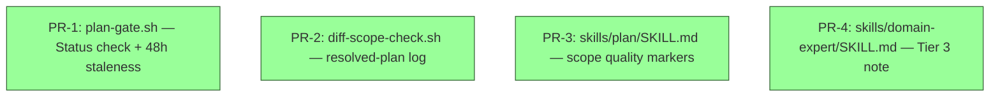

# RFC-001 — Plan Command Quality Gates

## AI context

> This RFC closes the gap between the `/plan` command's governance intent and what its enforcement layer actually checks. The problem is that `plan-gate.sh` passes any plan file — signed or draft — and several conditions that should leave a visible record in the plan artifact (low-provenance scope, scope-delta decisions, degraded traceability mode, no-match domain) produce only transient chat output or nothing at all. The key trade-off is warn vs. block for the unsigned-plan case: blocking is safer but creates false positives during active review, so WARN is the right call here, consistent with the hook philosophy in `CLAUDE.md`.

---

## Problem

The `/plan` command is the plugin's highest-leverage control point. Every downstream phase and hook depends on the plan artifact it produces. Two structural gaps undermine that leverage:

**Gap 1 — `plan-gate.sh` enforces presence, not validity.**

`plan-gate.sh` blocks Edit/Write when no plan file exists. It does not check whether the active plan's `Status:` field is `signed`. A plan written by Claude but never reviewed or signed by a human — `Status: draft` — satisfies the gate and unblocks all edits with the same effect as a properly signed plan. The hook's guarantee is weaker than its documentation implies.

**Gap 2 — Conditions affecting plan quality are silent or transient.**

Four conditions that should leave a visible record in the plan artifact do not:

1. **Low-provenance scope** — when the human has no source material and the skill falls back to a one-paragraph scope statement, nothing in the plan flags that the scope was produced from a single chat message rather than a signed scope document.

2. **Scope-delta decisions** — when the plan task is outside `scope.md`, the skill surfaces three options (treat as CR / expand scope / defer). The human's choice is captured in chat but not written into the plan. The signed plan contains no decision record.

3. **Degraded traceability mode** — when `tracker.type` is not configured, the skill silently falls back to `degrade_to_req_id_only`. The plan artifact contains no banner indicating traceability is degraded.

4. **Domain no-match** — when the `domain-expert` skill finds no matching domain, it exits silently. The plan contains no indication that domain coverage was evaluated and found inapplicable.

In each case, the human at sign-off is missing context that would inform a meaningful decision. The gate file proves a human was present; it does not prove the human had the full picture.

---

## Proposal

Seven targeted changes across four files. Each is a warn-not-block pattern, consistent with the hook philosophy in `CLAUDE.md`. No new infrastructure is required.

### Change 1 — `hooks/plan-gate.sh`: status check

Add a check that reads the active plan's `Status:` field and warns when it is not `signed`:

```bash
STATUS=$(grep -m1 '^\- \*\*Status:\*\*' "$ACTIVE_PLAN" | sed 's/.*Status:\*\* //')
if [ "$STATUS" != "signed" ]; then
  echo "[plan-gate] WARN: active plan Status is '$STATUS', not 'signed'. Run /plan and complete gate sign-off." >&2
fi
```

Severity: WARN (exit 0). Rationale: blocking would fire during the active review window while the plan is still `draft`. The human needs to see the warning, not have their edits refused.

**Known limitation:** the grep pattern assumes the template's `- **Status:**` prefix. A hand-edited plan without that prefix produces an empty STATUS value and triggers a spurious WARN. Acceptable at warn severity — the consequence is a false-positive message, not a false-positive block.

### Change 2 — `hooks/plan-gate.sh`: staleness threshold

Extend the staleness check from 24h (`-mtime -1`) to 48h (`-mtime -2`). A plan produced in the afternoon and resumed the next morning should not warn after 16 hours of inactivity. The updated warning text:

```
WARN: no plan file modified in the last 48h. If this task spans multiple days,
confirm the plan still reflects current scope before continuing.
```

### Change 3 — `hooks/diff-scope-check.sh`: log resolved plan

Add one line after the plan is resolved to log which plan the hook is enforcing against:

```bash
echo "[diff-scope] NOTE: enforcing scope from plan: $PLAN" >&2
```

This surfaces the mtime-based selection so the human can immediately see if the wrong plan is active, without waiting for a false-positive scope warning to appear.

### Change 4 — `skills/plan/SKILL.md`: low-provenance scope marker

In Step 2 (Resolve scope), **Fallback — no source material** path: after writing `.claude/sdlc/scope.md` from the one-paragraph statement, add to the plan artifact:

```markdown
> **Scope source quality: low** — scope was derived from a single chat prompt, not a signed scope document or external source. Validate scope against actual stakeholder intent before advancing to Design.
```

This surfaces the gap without blocking work. **Implementation note:** the skill must also instruct Claude to remove this blockquote when re-running `/plan` after the human provides higher-quality source material (i.e., `scope-ingest` ran successfully vs. the one-paragraph fallback). Scope quality upgrade is not in the materiality list, so it will not trigger a version bump — the removal instruction must be explicit in Step 2 to prevent the marker from persisting after the gap is closed.

### Change 5 — `skills/plan/SKILL.md`: scope-delta decision record

In Step 2 (Resolve scope), after the human selects one of (a) treat as CR / (b) expand scope / (c) defer, write the decision into the plan artifact under a `## Scope decisions` section:

```markdown
## Scope decisions

- **Delta:** <description of out-of-scope item>
- **Decision:** treat as CR | scope expanded | deferred
- **CR reference:** CR-<n> (if treat as CR) | — (otherwise)
- **Decided:** <date>
```

This converts a transient chat decision into a durable artifact record that the sign-off human can evaluate.

### Change 6 — `skills/plan/SKILL.md`: degraded-mode banner

When `config_requirements` conditions trigger `on_skip: degrade_to_req_id_only` (tracker not configured), write a visible marker in the plan artifact immediately after the `## Technology stack & compatibility` table:

```markdown
> **Traceability mode: degraded** — ticket tracker not configured. REQ ID is required as compensating control.
> Set `tracker.type` in `config/tools.json` to enable full project validation.
```

Consistent with principle 5 (graceful degradation): surface the gap, do not silently skip the check.

### Change 7 — `skills/domain-expert/SKILL.md`: domain no-match note

In Tier 3 (No match), instead of exiting silently, write a minimal note in the plan artifact:

```markdown
## Domain context

**Domain:** unknown — no domain profile matched this task. Domain-specific concerns (regulatory requirements, security hotspots, NFR reminders) were not evaluated.
```

This tells the human that domain coverage was evaluated, not skipped, and names the gap explicitly. The authoring flow offer (if the context looks domain-sensitive) is unchanged.

### Scope

- **In scope:** Changes 1–7 above. All are warn-level, all are additions to existing files, none require new hooks or infrastructure.
- **Out of scope:**
  - `gate_hash` verification hook (R-04 from companion analysis) — requires a new hook; scoped as a separate RFC.
  - TBD enforcement at Build phase (R-10) — requires hook extension; scoped separately.
  - Active-task sentinel for multi-plan repos (R-02 long-term) — architectural change; scoped separately.

---

## Alternatives considered

| Alternative | Why rejected |
|---|---|
| Block (exit 2) on unsigned plan in `plan-gate.sh` | False-positive rate too high: the plan is legitimately `draft` during active review. A block would halt edits while the human is mid-review, which is the wrong moment to interrupt. WARN is the correct severity for a recoverable condition. |
| Extend staleness to 72h | Masks genuinely stale plans on long-running tasks. 48h is enough to cover an overnight break and a morning resume without hiding a plan that has actually aged out. |
| Write domain no-match to a separate file (e.g., `.claude/sdlc/hints.jsonl`) | Adds surface area. The plan is the single artifact the human reviews at sign-off; a no-match note belongs there, not in a separate hints file the human may not read. |
| Add `## Scope decisions` as a separate artifact | Adds file proliferation. Scope decisions are part of the plan contract — they belong inline, not in a companion file. |
| Auto-promote scope source quality from `low` to `medium` when scope is expanded | Creates an invisible state transition. Quality should be upgraded explicitly by the human editing `scope.md` with better source material, not automatically. |
| Write domain no-match note only when context appears domain-sensitive (selective, matching the authoring flow offer) | The authoring flow offer is transient — it appears in chat and the user can dismiss it without it persisting anywhere. The no-match note in Change 7 is durable — written into the plan artifact that the human reviews at sign-off. A durable artifact justifies a lower threshold than a transient prompt. Always writing the note is consistent with principle 5 (graceful degradation): domain coverage was evaluated; the result belongs in the artifact regardless of whether the context looks sensitive. |

---

## Implementation plan

Four PRs, all Tier 1 (parallel-ready). Each PR is scoped to a single source file plus its bats test file where applicable. All seven Changes from `## Proposal` map onto exactly one PR; bash and markdown snippets in the **After** blocks reuse the verbatim snippets from `## Proposal` rather than re-deriving them. Mark each PR row in `## Implementation` immediately after it merges (per AGENT-RULES.md §5 step 1).

### PR-1 — `hooks/plan-gate.sh` + `tests/hooks/plan_gate.bats` (Changes 1 + 2)

**Before:** `hooks/plan-gate.sh` is 47 lines, `set -euo pipefail`. The existing `Status: superseded` warn lives at lines 38–40 (warn-level, exit 0). The existing 24h staleness check uses `-mtime -1` at line 43 with the message "no plan file modified in the last 24h." `tests/hooks/plan_gate.bats` has 7 cases — none cover the unsigned-Status path or the 48h boundary.

**After:**
- Insert Change 1's Status-field warn between the existing superseded warn (line 40) and the staleness check (line 42), using the exact snippet from `## Proposal` Change 1: `STATUS=$(grep -m1 '^\- \*\*Status:\*\*' "$ACTIVE_PLAN" | sed 's/.*Status:\*\* //')` then warn if `"$STATUS" != "signed"`. Severity: WARN (exit 0).
- Replace `-mtime -1` with `-mtime -2` on line 43 and update the message text from "24h" to "48h" per Change 2.
- Add three bats cases to `tests/hooks/plan_gate.bats`: (a) `Status: signed` → silent pass on the new check; (b) `Status: draft` → emits `[plan-gate] WARN: active plan Status is 'draft', not 'signed'`; (c) plan modified 30h ago → no longer triggers the (now 48h) staleness warn.

**Dependencies:** none.

**Constraints:** WARN-only (exit 0) — never block on Status mismatch (rationale at `## Proposal` Change 1 paragraph 2). Preserve the documented grep-pattern fragility limitation (RFC-001 line 62) — do not "harden" the regex to swallow hand-edited plans, since that hides the false-positive surface the limitation acknowledges.

### PR-2 — `hooks/diff-scope-check.sh` + `tests/hooks/diff_scope_check.bats` (Change 3)

**Before:** `hooks/diff-scope-check.sh` is 45 lines. The active plan is resolved by `find` + `stat` mtime sort at lines 16–21, with an early `[ -z "${PLAN:-}" ] && exit 0` guard at line 22 and scope extraction beginning at line 24. There is currently no log line surfacing which plan was selected. `tests/hooks/diff_scope_check.bats` has 6 cases — none assert on stderr log output for plan resolution.

**After:**
- Insert one line after line 22 (the `[ -z "${PLAN:-}" ] && exit 0` guard) and before line 24 (scope extraction): `echo "[diff-scope] NOTE: enforcing scope from plan: $PLAN" >&2`. Verbatim from `## Proposal` Change 3.
- Add one bats case asserting that with two plan files of differing mtimes, the hook's stderr contains `[diff-scope] NOTE: enforcing scope from plan: <newer-plan-path>`.

**Dependencies:** none.

**Constraints:** stderr-only (`>&2`) — never alters scope-check behavior or exit code. The log fires on every Edit/Write to a source path the hook intercepts; keep the message single-line so it does not crowd hook output.

### PR-3 — `skills/plan/SKILL.md` (Changes 4 + 5 + 6)

**Before:** `skills/plan/SKILL.md` is 193 lines. Step 2 (Resolve scope) at lines 34–49 has a "Fallback — no source material" path at lines 40–41 and a three-option scope-validation block (treat as CR / expand scope / defer) at lines 44–46. The skill's frontmatter declares `tracker.type` with `on_skip: degrade_to_req_id_only` at lines 4–7. The plan artifact produced by this skill currently has no `## Scope decisions` section, no scope-quality blockquote, and no degraded-traceability blockquote.

**After:**
- **Change 4** — at the end of the "Fallback — no source material" path (after line 41), instruct Claude to append the `> **Scope source quality: low** — …` blockquote from `## Proposal` Change 4 to the plan artifact. Add the explicit removal instruction from RFC-001 line 91: when re-running `/plan` after `scope-ingest` has produced higher-quality scope, the marker is removed; this removal does not trigger a version bump (scope-quality upgrade is not in the materiality list).
- **Change 5** — after the three-option block (line 46), instruct Claude to write the `## Scope decisions` section from `## Proposal` Change 5 into the plan artifact. The section inserts in the plan artifact between current Step 2 output (after line 49 anchor) and Step 2.5 (Domain expert check, line 50).
- **Change 6** — when the `config_requirements` check on `tracker.type` triggers `on_skip: degrade_to_req_id_only`, write the `> **Traceability mode: degraded** — …` blockquote from `## Proposal` Change 6 immediately after the `## Technology stack & compatibility` table in the plan artifact.

**Dependencies:** none.

**Constraints:** All three are warn-by-presence — the markers surface gaps without blocking work. Do not auto-promote `Scope source quality: low` → `medium`/`high` (rejected alternative at RFC-001 line 149). Keep blockquote text identical to `## Proposal` snippets so a future quality-gate hook can match the markers verbatim.

### PR-4 — `skills/domain-expert/SKILL.md` (Change 7)

**Before:** `skills/domain-expert/SKILL.md` is 168 lines. Tier 3 (No match) at lines 68–71 currently sets `domain: unknown` and explicitly says "Do not inject a `## Domain context` section." The skill is invoked from `skills/plan/SKILL.md` Step 2.5 (lines 50–56), which appends the skill's output to the plan artifact; on a Tier 3 no-match the skill returns nothing and Step 2.5 produces no `## Domain context` section.

**After:**
- Replace the Tier 3 "Do not inject a `## Domain context` section" instruction with the snippet from `## Proposal` Change 7: emit a `## Domain context` section whose body is `**Domain:** unknown — no domain profile matched this task. Domain-specific concerns (regulatory requirements, security hotspots, NFR reminders) were not evaluated.`.
- Leave the Tier 3 authoring-flow offer (the optional "do you want to author a domain profile?" prompt) unchanged — only the artifact-write behavior flips.

**Dependencies:** none.

**Constraints:** The note must be durable in the plan artifact — do not gate it on whether the context "looks domain-sensitive" (rejected alternative at RFC-001 line 150). OQ-1 is closed: always write the note, even when no `domains/` directory exists at either level.

### Sequencing



- **Tier 1 (green, parallel-ready):** all four PRs. No file overlap, no shared frontmatter or schema changes, no dependencies between them. Ship in any order or in parallel.

---

## Implementation

> Populate after implementation.

| PR / Commit | What it delivered |
|---|---|
| — | — |

Key files to change:
- `hooks/plan-gate.sh` — Changes 1 and 2
- `hooks/diff-scope-check.sh` — Change 3
- `skills/plan/SKILL.md` — Changes 4, 5, and 6
- `skills/domain-expert/SKILL.md` — Change 7

---

## Related RFCs

- `docs/rfcs/archived/scope-ingest.md` — defined the `domain-expert` skill that Change 7 modifies
- `docs/rfcs/archived/opt-in-activation-suspend-resume.md` — defined the `.enabled` guard pattern that `plan-gate.sh` uses

---

## Second opinion

> Required before `status: accepted` can be set. Complete per `AGENT-RULES.md §3a`.

**Reviewer:** self-review (Claude)
**Date:** 2026-04-27
**Findings:** Four gaps surfaced and addressed in the same pass: (1) AI context grammar fixed inline; (2) Change 1 grep-pattern limitation documented under the bash snippet; (3) Change 4 missing removal mechanism — explicit implementation note added; (4) Alternatives table was missing a row for selective domain no-match note — row added with rationale (durable artifact vs. transient prompt). No conflicts with existing implemented RFCs. No blocking open questions.
**Decision:** proceed

---

## Open questions

| # | Question | Owner | Status |
|---|---|---|---|
| OQ-1 | Should the domain no-match note (Change 7) be omitted when the `domains/` directory does not exist at either level, or should it always appear? | charltond.ho | **closed** — always write the note. A repo without domain files is a repo where domain coverage has not been evaluated; surfacing that gap is consistent with graceful degradation (principle 5). |
