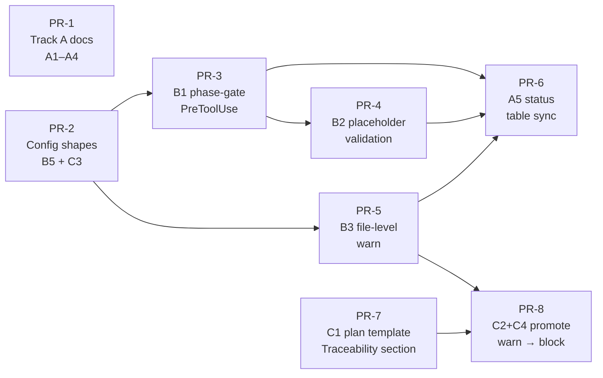

# RFC-003 — Hook Enforcement Alignment

## AI context

> This RFC closes four documented gaps between `USER-MANUAL.md`'s enforcement claims and the actual hook implementations, surfaced by an external review comparing the manual against raw shell scripts. The two most significant gaps are `phase-gate.sh` (documented as a hard `PreToolUse` block, implemented as an advisory `Stop` reminder that exits 0) and `work-item-validation.sh` (documented as file-level REQ/ticket traceability, implemented as plan-level classification only). The remedy runs in three phases: Phase 1 corrects the manual (Track A), Phase 2 implements the stronger hook enforcement (Track B, with file-level tracing as warn-only), and Phase 3 promotes the file-level tracing to a hard block — gated on the plan template first gaining a per-file `## Traceability` table (C1 must merge before C2 can begin).

---

## Problem

An external review compared `docs/USER-MANUAL.md` against the raw hook implementations and found four specific discrepancies. All claims are verifiable against the source.

**Gap 1 — `phase-gate.sh` hook registration and severity**

The manual states that `phase-gate.sh` fires on `PreToolUse` for phase commands and refuses commands like `/build` if the prior gate is missing or malformed.

The actual hook is registered under `Stop` in `hooks/hooks.json`. Its implementation checks whether any gate file was updated in the last two hours and prints an informational message to stderr. It exits 0 unconditionally — it never blocks.

**Gap 2 — `phase-gate.sh` malformed gate validation**

The manual states that `phase-gate.sh` parses manually signed gates and refuses to advance if required fields still contain placeholders.

This logic does not exist in `phase-gate.sh`. Placeholder field validation for deploy and fix-fast gates is not implemented anywhere in the hook layer.

**Gap 3 — `work-item-validation.sh` file-level traceability**

The manual states that `work-item-validation.sh` refuses `Edit`/`Write` during Build if no valid REQ, ticket, or signed CR references the file being edited.

The actual implementation validates two things: (1) the active plan has a `Classification` field set to `new-build`, `fix`, or `change-request`; (2) for change-request plans, a signed CR artifact exists. It does not read the list of files being edited, does not compare against the plan's in-scope file list, and does not require per-file REQ/ticket references.

**Gap 4 — Enforcement language in the manual**

Several sections use language that implies hard enforcement ("refuses", "blocks", "hard phase gate") for behaviors that are currently advisory. This is consistent with the writing anti-pattern documented in `references/_repo-context.md` under "Aspirational framing that outruns what the repo actually does."

---

## Proposal

Two tracks. Track A corrects the documentation to match current behavior. Track B implements the enforcement the manual already describes. The tracks address the same four gaps from opposite directions.

> **Recommended sequencing:** implement Track B first, then update documentation to reflect the new reality. Doing Track A alone removes promises without delivering value. Doing Track B alone leaves the documentation ahead of the implementation again.

### Track A — Documentation corrections

Four targeted edits to `docs/USER-MANUAL.md`:

**A1 — Correct `phase-gate.sh` hook registration description**

Remove the claim that `phase-gate.sh` fires on `PreToolUse` and blocks phase commands. Replace with an accurate description: it runs as a `Stop` hook after each session turn, checks whether any gate file was updated in the last two hours, and prints an advisory reminder. It does not block.

**A2 — Remove or qualify the placeholder field validation claim**

The manual's claim that `phase-gate.sh` parses and validates placeholder fields in manually signed gates has no implementation backing. Either remove the claim or move it to a "Planned enforcement" callout to preserve intent without misrepresenting current behavior.

**A3 — Correct `work-item-validation.sh` description**

Replace the file-level REQ/ticket claim with an accurate description: the hook validates that the active plan has a `Classification` field (`new-build`, `fix`, or `change-request`), and for `change-request` plans requires a matching signed CR artifact. File-level traceability per edited file is not currently enforced.

**A4 — Audit enforcement language throughout**

Review any section that uses "refuses", "blocks", or "hard gate" language for phase-gate behavior and downgrade to advisory language where the implementation does not support a hard block. This is consistent with the writing anti-pattern prohibition in `references/_repo-context.md`.

**A5 — Update the manual only after implementation; use a status table**

Documentation updates for Track B and Phase 3 must be written after the corresponding code ships, not before. Each control documented in the manual must be tagged with one of four statuses to prevent the manual from overclaiming again:

| Status | Meaning |
|---|---|
| Implemented hard block | Hook exits 2 and is confirmed by a passing bats test |
| Implemented warning | Hook exits 0 with stderr output; confirmed by test |
| Planned | Accepted in RFC-003 but not yet shipped |
| Strict-mode only | Requires `enforcement.<key>: block` in `config/tools.json` |

A4 (enforcement language audit) runs now. A5 (status-table updates) runs after each Track B and Phase 3 commit merges.

### Track B — Hook implementation

Four targeted code changes plus tests:

**B1 — `phase-gate.sh` + `hooks.json`: add PreToolUse enforcement**

Register a second entry for `phase-gate.sh` under `PreToolUse` in `hooks.json`, matching `Edit` and `Write`. In the `PreToolUse` path: guard on `.claude/sdlc/.enabled` (exit 0 if not present, consistent with every other hook in the plugin); read the active plan's phase field; determine which prior phase gate is expected; verify it exists in `.claude/sdlc/gates/`; exit 2 if absent. The existing `Stop` registration remains for the 2-hour reminder.

**Accepted phase field names** (the hook must accept either):
- `Active Phase:`
- `Phase:`

**Accepted phase values:** `plan`, `analyze`, `design`, `build`, `test`, `deploy`, `support`, `docs`. Any value outside this set is treated as ambiguous — warn only, do not block.

**Prior-gate map** (exact gate file prefix required before each phase):

| Active phase | Required prior gate prefix | Notes |
|---|---|---|
| `plan` | none | First phase — no prior gate required |
| `analyze` | `plan-` | |
| `design` | `analyze-` | |
| `build` | `design-` or `fix-fast-` | The `/fix-fast` flow collapses Plan/Analyze/Design into a single mini-gate at `fix-fast-<slug>.md`; that gate satisfies the build prior-gate check in lieu of `design-`. Documented in PR-4. |
| `test` | `build-` | |
| `deploy` | `test-` | |
| `support` | `deploy-` or `support-transition-` | Either a deploy gate or an explicit support-transition gate satisfies the check |
| `docs` | warn only (phase gate only) | Cross-cutting phase that may run in parallel — never block on missing prior gate. File-type enforcement still applies: source/test/config edits during docs phase are subject to the file-type scope table below. |

**Repair escape hatch** — the hook must never block edits to governance artifacts. Any file path under `.claude/sdlc/` exits 0 unconditionally. This preserves the ability to fix a malformed plan, fill in a missing gate, or correct a bad phase field without being trapped by the hook the fix requires. Mirrors the existing guard in `plan-gate.sh` line 13.

**File-type enforcement scope:**

| File type | Behavior |
|---|---|
| Source code files | Block if prior gate missing |
| Test files | Block if prior gate missing |
| Config / build files | Block if prior gate missing |
| Documentation files (outside `.claude/sdlc/`) | Warn if prior gate missing |
| `.claude/sdlc/` artifacts | Always allow (repair escape hatch) |

Severity: Block (exit 2) for source, test, and config files. Rationale: a missing prior phase gate means the human did not sign off on the previous phase, which violates the core "human in the lead" principle. This is the same standard used by `plan-gate.sh`. Teams that permit intentional phase skipping (e.g., deferring Analysis in a low-risk hotfix) should set `enforcement.phase_gate: warn` in `config/tools.json` to override the block.

**Docs phase does not bypass file-type enforcement.** The "warn only" row for `docs` in the prior-gate map applies to the phase gate check only (no prior gate required). If source, test, or config files are edited while the active phase is `docs`, the file-type scope table above still applies — those files block if a prior gate is missing. Docs phase is not an escape hatch for editing non-documentation files without a signed gate.

**Known false-positive scenario:** if the user is on the first phase (Plan), there is no prior gate — the hook must handle this gracefully (no block). If the active phase cannot be determined from the plan, exit 0 (warn only) rather than blocking by default on ambiguity. This is the binding design for that edge case (OQ-2 closed).

**B2 — `phase-gate.sh`: add placeholder field validation for deploy and fix-fast gates**

After locating a deploy or fix-fast gate file, scan for unfilled placeholder tokens. A field is considered unfilled if it contains any of the following:

| Token type | Examples |
|---|---|
| Blank fill | `___` |
| TODO marker | `TODO` |
| Angle-bracket identifier | `<signer>`, `<work-item>`, `<timestamp>`, `<confirmation>`, `<acknowledgment>` |

Angle-bracket identifiers match only when the brackets contain alphanumeric/underscore/hyphen text. Raw `<` in HTML or prose does not match. If any required field contains a placeholder, exit 2 with a specific message naming the unfilled fields.

**Detection pattern:** `<[A-Za-z][A-Za-z0-9_-]*>` — each token is matched as a whole word against the field value. The full unfilled-token regex is `___+|^TODO$|<[A-Za-z][A-Za-z0-9_-]*>`.

Required fields to validate: signer, timestamp, work-item reference, acknowledgment, confirmation. These are the five fields the manual describes for manual deploy/fix-fast sign-off.

Severity: Block (exit 2). Rationale: a gate file with placeholder fields is a template that has not been filled in, not a signed artifact. Treating it as signed would silently void the deploy sign-off requirement.

**B3 — `work-item-validation.sh`: add file-level REQ/ticket/CR warning**

Read the file path from `CLAUDE_TOOL_INPUT` — the environment variable Claude Code populates with the raw tool-input JSON for `Edit`/`Write` PreToolUse hooks (confirmed: `plan-gate.sh` already reads this variable to detect `.claude/sdlc/` paths). Extract the `file_path` field via `jq -r '.file_path' 2>/dev/null` or a grep/sed fallback for environments without `jq`. Grep the active plan's in-scope file list for that path. If the file is not in scope, surface a warning — the existing `diff-scope-check.sh` and `adjacent-function-detector.sh` already handle scope drift blocking; this hook should not duplicate their logic.

Additionally grep the plan for any REQ, ticket, or CR reference associated with the file. If no reference is found, warn (not block). Full file-level blocking on traceability carries a higher false-positive risk than classification-level blocking and should begin as a warning.

**Warn-only traceability may use heuristic grep-based parsing.** Promotion to block in Phase 3 requires structured data only — see C2.

**Generated files:** a generated file (e.g., `package-lock.json`, generated API clients, build artifacts) may be edited if its generator or source file is mapped to an approved work item. The hook skips the traceability warning for files identified as generated via a `generated_files` map in `config/tools.json` (the consumer-local file, not committed by the plugin; shape is documented in `config/tools.example.json`). Example shape:

```json
{
  "generated_files": [
    { "path": "package-lock.json", "generated_by": "package.json" }
  ]
}
```

If `generated_by` resolves to a file that is itself in-scope and REQ-mapped, the generated file inherits that mapping.

Severity: Warn (stderr, exit 0) for the file-level check. The classification and CR sign-off checks remain block-level (exit 2).

**B4 — Tests**

The table below lists representative test cases. The full bats suite must additionally cover edge cases including: support phase's dual-gate option (`deploy-` vs. `support-transition-`), fix-fast gate placeholder patterns (all three token types: `___`, `TODO`, `<identifier>`), and generated file inheritance when the source file is itself out-of-scope.

| Scenario | Expected |
|---|---|
| Analyze phase, plan gate present | pass |
| Analyze phase, plan gate missing | block |
| Design phase, analyze gate present | pass |
| Design phase, analyze gate missing | block |
| Build phase, design gate present | pass |
| Build phase, design gate missing | block |
| Deploy phase, test gate present | pass |
| Deploy phase, test gate missing | block |
| Support phase, deploy gate present | pass |
| Support phase, support-transition gate present (no deploy gate) | pass |
| Malformed deploy gate (placeholder fields present) | block |
| Malformed fix-fast gate (placeholder fields present) | block |
| Well-formed deploy gate (all fields filled) | pass |
| Active phase field absent or unrecognised | warn, no block |
| Edit to `.claude/sdlc/` artifact with missing prior gate | allow (repair escape hatch) |
| In-scope file with REQ reference | pass, no warning |
| In-scope file without REQ reference | warn, no block |
| File not in plan scope | warn, no block |
| Generated file whose source is REQ-mapped | pass, no warning |
| Generated file whose source is not in scope | warn, no block |

**B5 — Future-compatible strict mode config shape**

RFC-003 does not implement strict mode but reserves the following config shape. The shape is documented in `config/tools.example.json` (plugin-shipped reference); consumers copy it to `config/tools.json` (local, not committed by the plugin). Hooks must read `config/tools.json` and respect these values. Default for each field is `warn` unless Track B makes it `block` by design.

```json
{
  "enforcement": {
    "phase_gate": "warn|block",
    "file_traceability": "warn|block",
    "scope_drift": "warn|block",
    "missing_tests": "warn|block"
  }
}
```

`phase_gate` defaults to `block` once Phase 2 ships (the entire point of B1). All other fields default to `warn` until Phase 3 or a future RFC promotes them. The `scope_drift` field is reserved for `diff-scope-check.sh`; the `missing_tests` field is reserved for `modified-code-test-gate.sh` or a future RFC — neither is implemented by RFC-003.

---

## Scope

**In scope:** Tracks A and B as described. Changes limited to `hooks/phase-gate.sh`, `hooks/work-item-validation.sh`, `hooks/hooks.json`, `docs/USER-MANUAL.md`, `config/tools.example.json` (plugin-shipped reference; documents strict-mode shape + `generated_files` shape — consumers copy to `config/tools.json`), `templates/plan.md` (Phase 3), and `tests/hooks/`.

**Out of scope:**
- Strengthening other warn-level hooks to block (separate RFC if warranted by evidence)
- Changing `plan-gate.sh` — existing block behavior is correct and accurately documented
- Automated detection of stale gate files beyond the existing 2-hour reminder
- Multi-file scope enforcement — that is `diff-scope-check.sh`'s role

**Phase 3 hard dependency:** C2 (`work-item-validation.sh` promoted to exit 2) must not begin code review until C1 (plan template `## Traceability` table) is merged and present in the active template. Shipping C2 against the old template would block every edit on every plan that lacks the table — a guaranteed false-positive flood.

---

## Alternatives considered

| Alternative | Why rejected |
|---|---|
| Track A only (doc correction, no code change) | Removes promises without delivering value. Lowers the stated standard without improving the real one. |
| Track B only (code change, no doc update) | Leaves the documentation ahead of the implementation again — the original problem restated. |
| Block (exit 2) on file-level traceability in B3 | False-positive risk too high. `work-item-validation.sh` does not currently have a reliable per-file REQ mapping in the plan template; blocking without reliable signal would halt legitimate edits. Start with warn; promote to block if the signal proves reliable. |
| Combine B1 and B2 into a new hook | Both changes belong in `phase-gate.sh`, which owns phase-progression enforcement. A separate hook adds registration complexity for behavior that already has a natural home. |
| Block the `Stop` hook instead of adding a `PreToolUse` path | `Stop` hooks cannot exit 2 to block tool calls — they run after the turn completes. `PreToolUse` is the correct event for blocking. The 2-hour reminder in the `Stop` hook serves a different purpose and should be preserved. |

---

## Implementation plan

Eight PRs across three phases. Phase 1 (PR-1, PR-2) ships immediately and lowers the manual to match current behavior plus reserves the config schema. Phase 2 (PR-3 through PR-6) implements the enforcement the manual already describes. Phase 3 (PR-7, PR-8) promotes file-level traceability to a hard block once the plan template ships the per-file mapping.

### Sequencing



PR-1 and PR-2 are independent. PR-3 and PR-5 may ship in parallel after PR-2 merges. **PR-4 depends on PR-3** — B2 specifies "Block (exit 2)" severity, which requires the PreToolUse infrastructure that PR-3 (B1) introduces; the placeholder scanner naturally extends PR-3's prior-gate verification. PR-6 only ships after Phase 2 lands so the status table reflects shipped reality. PR-7 must merge before PR-8 — see the Phase 3 hard dependency in §Scope.

### PR-1 — Track A documentation corrections (A1–A4)

Lowers the manual's enforcement claims to match current implementation. No code, no tests.

**Files:** `docs/USER-MANUAL.md`

**Before (excerpt):**

> `phase-gate.sh` runs as a `PreToolUse` hook on phase commands and refuses to advance if the prior gate file is missing or has unfilled placeholder fields. `work-item-validation.sh` blocks `Edit`/`Write` during Build if no valid REQ, ticket, or signed CR references the file being edited.

**After (excerpt):**

> `phase-gate.sh` runs as a `Stop` hook after each session turn and prints an advisory reminder if no gate file has been updated in the last two hours. It does not currently block. `work-item-validation.sh` validates that the active plan has a `Classification` field and (for change-request plans) a matching signed CR — file-level REQ/ticket traceability is planned (RFC-003 Phase 2/3) but not currently enforced.

### PR-2 — Config shapes (B5 + C3)

Reserves the strict-mode `enforcement` block and the `generated_files` map in `config/tools.example.json`. Hooks do not yet consume the new keys; PR-2 ships the schema so PR-3 / PR-5 can read them at the same revision they're introduced.

**Files:** `config/tools.example.json`

**Before:**

```json
{
  "_comment": "...existing keys...",
  "formatter": "...",
  "linter": "..."
}
```

**After (additive):**

```json
{
  "_comment": "...existing keys...",
  "formatter": "...",
  "linter": "...",
  "enforcement": {
    "phase_gate": "block",
    "file_traceability": "warn",
    "scope_drift": "warn",
    "missing_tests": "warn"
  },
  "generated_files": [
    { "path": "package-lock.json", "generated_by": "package.json" }
  ]
}
```

### PR-3 — B1: `phase-gate.sh` `PreToolUse` enforcement

Adds a second registration of `phase-gate.sh` under `PreToolUse` matching `Edit`/`Write`. Reads the active plan's phase, looks up the required prior gate from the map in §B1, and exits 2 if the gate is missing — except for `.claude/sdlc/` paths (repair escape hatch) and ambiguous phase values (warn only). Existing `Stop` reminder behavior is preserved.

**Files:** `hooks/phase-gate.sh`, `hooks/hooks.json`, `tests/hooks/phase_gate.bats`

**Before (`hooks.json` excerpt):**

```json
{
  "Stop": [
    { "matcher": ".*", "hooks": [{ "type": "command", "command": ".../phase-gate.sh" }] }
  ]
}
```

**After (`hooks.json` excerpt):**

```json
{
  "PreToolUse": [
    { "matcher": "Edit|Write", "hooks": [{ "type": "command", "command": ".../phase-gate.sh" }] }
  ],
  "Stop": [
    { "matcher": ".*", "hooks": [{ "type": "command", "command": ".../phase-gate.sh" }] }
  ]
}
```

**Before (`phase-gate.sh` behavior):** Single code path — checks gate freshness, prints reminder, exits 0.

**After (`phase-gate.sh` behavior):** Branches on `$CLAUDE_HOOK_EVENT`. PreToolUse path: guard on `.enabled`, allow `.claude/sdlc/` paths, parse phase, look up prior gate, exit 2 if absent (block) for source/test/config files or exit 0 + stderr (warn) for documentation. Stop path: unchanged.

### PR-4 — B2: `phase-gate.sh` placeholder validation

Adds the unfilled-token regex from §B2 (`___+|^TODO$|<[A-Za-z][A-Za-z0-9_-]*>`). Scans the located deploy or fix-fast gate file for any of those tokens in the five required fields (signer, timestamp, work-item reference, acknowledgment, confirmation). Exits 2 with a list of unfilled fields if any match.

**Files:** `hooks/phase-gate.sh`, `tests/hooks/phase_gate.bats`

**Before:** Hook treats any gate file as signed once it exists.

**After:** Hook treats a gate file as signed only if no required field matches the unfilled-token regex. A gate with `Signer: <signer>` blocks; a gate with `Signer: J. Smith` passes.

### PR-5 — B3: `work-item-validation.sh` file-level warning

Reads the edited file path from `$CLAUDE_TOOL_INPUT` (`jq -r '.file_path'` with grep/sed fallback). Compares against the active plan's in-scope file list and the five accepted work-item sources from §B3 / §C2 prerequisite 3. Warns (exit 0 + stderr) on file-not-in-scope or no-REQ-mapping. Skips files identified by the `generated_files` map whose `generated_by` source is itself in-scope and REQ-mapped. Existing classification + CR sign-off checks remain block-level.

**Files:** `hooks/work-item-validation.sh`, `tests/hooks/work_item_validation.bats`

**Before:** Validates two things: (1) plan has a `Classification` field; (2) for change-request plans, a signed CR exists. Does not read the file path.

**After:** Same two block-level checks plus a third warn-level check: read `CLAUDE_TOOL_INPUT.file_path`, look it up against the in-scope file list and work-item sources. No REQ mapping → stderr warning. Generated file with mapped source → silent pass.

### PR-6 — A5: `USER-MANUAL.md` status table sync

Once PR-3, PR-4, PR-5 land, retrofit the manual with the four-status table from §A5. Each enforcement claim now carries a status tag.

**Files:** `docs/USER-MANUAL.md`

**Before (excerpt):**

> The plan-gate hook blocks `Edit`/`Write` when no plan exists.

**After (excerpt):**

> | Control | Status |
> |---|---|
> | `plan-gate.sh` blocks `Edit`/`Write` without a plan | **Implemented hard block** |
> | `phase-gate.sh` blocks phase commands without prior gate | **Implemented hard block** (RFC-003 PR-3) |
> | `phase-gate.sh` blocks gates with placeholder fields | **Implemented hard block** (RFC-003 PR-4) |
> | `work-item-validation.sh` warns on un-traced files | **Implemented warning** (RFC-003 PR-5) |
> | `work-item-validation.sh` blocks un-traced files | **Planned** (RFC-003 PR-8) |

### PR-7 — C1: plan template `## Traceability` section

Adds the per-file traceability table to the canonical plan template. Purely additive — ships before PR-8 to give existing plans time to adopt the section without being blocked.

**Files:** `templates/plan.md`

**Non-conflict note:** RFC-001 Changes 4–7 add five new sections to the plan artifact (scope source quality, scope decisions, degraded-mode banner, domain no-match note). The `## Traceability` table added here is a sixth, purely additive section. It is file-centric (`| File | REQ/Ticket/CR |`) and distinct from the approval-packet's requirement-centric traceability table (`| REQ ID | Requirement summary | Test case | Status |`). No RFC-001 section is modified or removed.

**Before:** Plan template has `Classification`, `In-scope files`, `In-scope functions`, `Out-of-scope`, plus the five RFC-001 sections.

**After:** Same plus a sixth additive section:

```markdown
## Traceability

| File | REQ/Ticket/CR | Change Type |
|---|---|---|
| <relative-file-path> | REQ-NNN or TICKET-NNN or CR-NNN | new / modified / deleted |
```

### PR-8 — C2 + C4: promote `work-item-validation.sh` to block

Promotes the file-level traceability check from warn (PR-5) to block (exit 2), gated on all six C2 prerequisites. Backward-compatibility rule: if the active plan does not have a `## Traceability` table, the hook stays at warn. Override: if `enforcement.file_traceability: warn` is set in `config/tools.json`, the hook stays at warn.

**Files:** `hooks/work-item-validation.sh`, `tests/hooks/work_item_validation.bats`

**Phase 3 hard dependency:** PR-8 must not begin code review until PR-7 merges and at least one active plan in the test repo has been updated to include the `## Traceability` section. Shipping PR-8 against the old template would block every edit on every plan that lacks the table.

**Before:** File-level check is warn-only (PR-5).

**After:** File-level check follows the C2 decision tree:

1. Plan has `## Traceability` table? No → warn only (back-compat).
2. `enforcement.file_traceability: warn` set? Yes → warn only (override).
3. Edited file matches a row in the table with a resolved REQ/ticket/CR? Yes → pass.
4. Otherwise → exit 2 with the unmapped file path in the error message.

The block-level check uses structured table parsing (or `active-plan.trace.json` if present), not heuristic grep — see §C2.

**C2 prerequisites — all six must be satisfied before C2 may ship:**

1. A valid structured traceability map exists in the active plan (`## Traceability` table with at least one row).
2. The edited file path is deterministically matched against the table (exact path, not a substring heuristic).
3. The REQ/ticket/CR reference in the table resolves to an item found in one of the following accepted sources (searched in order; first match wins):
   - Plan frontmatter `work_items` field (YAML list, e.g., `work_items: [REQ-42, TICKET-123]`)
   - `## Requirements` section (any line containing the reference token)
   - `## Change Request` section (any line containing the reference token)
   - `## Linked Tickets` section (any line containing the reference token)
   - `active-plan.trace.json` sidecar file, if present (top-level `work_items` array)

   **Match algorithm:** whole-word, case-insensitive — the reference (e.g., `REQ-42`) must appear as a complete token bounded by non-word characters or line edges. Partial matches do not count: `REQ-4` does not match `REQ-42`, and `req-42` does match `REQ-42`. If none of the five sources produces a whole-word match, the file is treated as untraced (block under C2; warn under B3).
4. Generated files have an explicit `generated_by` source mapping in `config/tools.json`.
5. An override path exists (either the `.claude/sdlc/` repair escape hatch or an `enforcement.file_traceability: warn` config setting).
6. Bats tests prove that mapped files pass, unmapped files block, and table-absent plans warn only.

**C2 blocking requires structured data.** Heuristic grep is not sufficient for a block-level check. The hook must parse the `## Traceability` markdown table deterministically or use an `active-plan.trace.json` sidecar file if markdown parsing proves fragile.

---

## Implementation

| PR / Commit | What it delivered |
|---|---|
| `79a9765` (PR-1) | Track A documentation corrections in `docs/USER-MANUAL.md`. Downgrades five overclaimed enforcement sites to match current hook behavior; tags planned promotions with the corresponding RFC-003 PR (PR-3 / PR-4 / PR-5 / PR-8). |
| `c7e37cd` (PR-2) | Config schemas in `config/tools.example.json`. Adds the `enforcement` strict-mode block (`phase_gate: block`, `file_traceability: warn`, `scope_drift: warn`, `missing_tests: warn`) and the `generated_files` map (array of `{path, generated_by}` entries). Hooks do not yet consume these keys — schema reserved for PR-3 / PR-5. |
| `11d0a0f` (PR-3) | `phase-gate.sh` PreToolUse enforcement. Hook now branches on event: Stop path unchanged (2-hour reminder); PreToolUse Edit/Write/MultiEdit path reads the active plan's `Phase:` field, looks up the required prior-phase gate from §B1's map, and exits 2 for source/test/config files when the prior gate is absent. `.md`/`.rst`/`.txt` files outside `.claude/sdlc/` warn instead of block. Ambiguous phase → warn. `templates/plan.md` updated with a `Phase:` field. 18 new bats scenarios in `tests/hooks/phase_gate.bats`. |
| `ed63950` (PR-3 fix) | Two code-review findings on `11d0a0f` addressed: (1) `Active Phase:` form now parses correctly (regex was missing the optional `Active` segment, causing silent warn-instead-of-block on a documented field name); (2) branch detection now uses `$CLAUDE_HOOK_EVENT` as the primary signal with `$CLAUDE_TOOL_INPUT` presence as backward-compat fallback, matching the RFC's stated mechanism. Two new bats scenarios; 88/88 tests pass. |
| — (PR-4 through PR-8) | Pending |

---

## Related RFCs

- [`docs/rfcs/RFC-001-plan-quality-gates.md`](RFC-001-plan-quality-gates.md) — also closes a `plan-gate.sh` enforcement gap (status check, staleness threshold); RFC-003 extends the same pattern to `phase-gate.sh`
- [`docs/rfcs/archived/guided-entry-session-resume-multi-role.md`](archived/guided-entry-session-resume-multi-role.md) — defined the hook registration patterns this RFC extends

---

## Second opinion

> Required before `status: accepted` can be set. Complete per `AGENT-RULES.md §3a`.

**Review 1**
**Reviewer:** independent subagent (no prior context on RFC)
**Date:** 2026-04-27
**Findings:** Four gaps surfaced and addressed in the same pass: (1) B1 was missing an explicit `.enabled` guard for the PreToolUse path — added inline with a reference to `plan-gate.sh` line 5 as precedent; (2) B3 `CLAUDE_TOOL_INPUT` variable name was ambiguous — confirmed correct via existing hook usage and added `jq`/fallback extraction note; (3) B2 "bare angle-bracket patterns" was too vague — replaced with a precise `<identifier>` definition (alphanumeric/underscore/hyphen only, not raw HTML `<`); (4) OQ-2 contradicted the binding design already stated in §B1 Known false-positive scenario — closed OQ-2 with the prescribed behavior (exit 0, warn).
**Decision:** revise first → revised → proceed (after OQ-1 resolution and Phase 3 added)

---

**Review 2**
**Reviewer:** independent subagent (no prior context on RFC)
**Date:** 2026-04-27
**Findings:** Four gaps surfaced and addressed in the same pass: (1) AI context did not mention Phase 3 or the C1→C2 hard dependency — updated to name all three phases and the template prerequisite; (2) Scope section lacked an explicit hard-dependency statement for Phase 3 — added with a concrete consequence note (false-positive flood if C2 ships without C1); (3) Phase 3 implementation table did not clarify non-conflict with RFC-001's plan template additions — added a non-conflict note distinguishing the file-centric `## Traceability` table from RFC-001's five plan sections and from the approval-packet's requirement-centric traceability table; (4) Phase 3 C2 row did not name the backward-compatibility rule (table absent → warn only) — added inline. All OQs confirmed closed. No conflicts with RFC-001 or implemented RFCs.
**Decision:** proceed

---

**Review 3**
**Reviewer:** independent subagent (no prior context on RFC)
**Date:** 2026-04-27
**Findings:** Three minor documentation gaps surfaced and addressed: (1) B4 test table was representative but incomplete — added rows for support phase dual-gate option (`deploy-` vs. `support-transition-`), fix-fast gate placeholder validation, and generated file inheritance when source is out-of-scope; added a note that the table is illustrative and the full suite must cover named edge cases; (2) B1 file-type enforcement rationale did not address teams that intentionally defer prior phases — added a note directing them to `enforcement.phase_gate: warn` override; (3) B5 strict-mode config shape reserved `scope_drift` and `missing_tests` without naming their owning hooks — added inline clarification (`diff-scope-check.sh` and `modified-code-test-gate.sh` respectively). No design flaws. AI context accurate. All OQs resolved. No conflicts with RFC-001, existing hooks, or config structure.
**Decision:** proceed

---

## Open questions

| # | Question | Owner | Status |
|---|---|---|---|
| OQ-1 | Should B3's file-level traceability warning ever be promoted to a block? If so, what signal threshold is required (e.g., a reliable per-file REQ map in the plan template)? | charltond.ho | **closed** — yes, promote to block, but only once the plan template includes an explicit per-file traceability mapping (a `## Traceability` table with `\| File \| REQ/Ticket/CR \|` rows). Until that template change ships, B3 stays warn-only. The template enhancement is a prerequisite tracked as Phase 3 of this RFC's implementation plan. Once the mapping exists and `work-item-validation.sh` can reliably read it, the warn is upgraded to exit 2. |
| OQ-2 | For B1, when the active phase cannot be determined from the plan, should the hook warn or silently pass? | charltond.ho | **closed** — exit 0 (warn only) when phase is ambiguous. Blocking by default on ambiguity violates the false-positive bar in CLAUDE.md. Binding design stated in §B1 Known false-positive scenario. |
