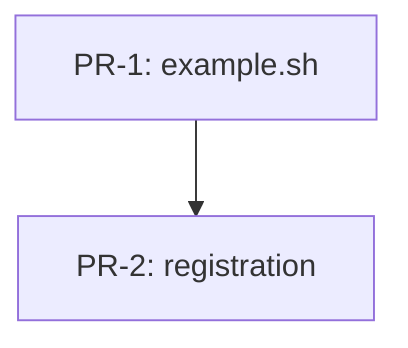

# RFC-NNN — <RFC Title>

## AI context

> Three sentences for fast context loading. (1) What this RFC does. (2) What problem it solves and why the existing approach was insufficient. (3) The one key trade-off or design decision that future readers and AI sessions need to know.

---

## Problem

What is broken, missing, or painful? Ground this in observable behavior — a hook that fires incorrectly, a workflow that requires manual steps, a gap between what the plugin promises and what it delivers. Do not propose a solution here.

---

## Proposal

What exactly changes? Be specific: which files are created or modified, what new behavior is introduced, what old behavior is removed. Use sub-sections if the change has multiple parts.

### Scope

- **In scope:** what this RFC covers
- **Out of scope:** what this RFC explicitly does not address (reduces scope creep in implementation)

---

## Alternatives considered

Document every alternative that was seriously considered and explain concisely why it was rejected. This section prevents the same alternatives from being re-proposed by future contributors or AI sessions.

| Alternative | Why rejected |
|---|---|
| _example: add a block hook instead of a warn_ | _Blocks legitimate edits when the heuristic misfires; false-positive rate too high_ |

---

## Implementation plan

> Populate this section when the RFC moves to `accepted`. Use `### PR-N — <file(s)>` subheadings (per `AGENT-RULES.md §3b`).
> For each PR: a **Before** block (current state or "file does not exist"), an **After** block (exact diff, skeleton, or section outline), one-line **Dependencies** note, and key **Constraints**. Close with a **Sequencing** diagram (Mermaid).

### PR-1 — _example: hooks/example.sh_

**Before:** _file does not exist_

**After:** _new script — sketch its responsibility in 2–4 lines (skeleton, function signatures, or expected behavior). Reference the exact file path._

**Dependencies:** _none_

**Constraints:** _e.g. POSIX bash, no GNU-only flags; backwards-compatible with older config schema; surgical scope_

### Sequencing

> Adjust nodes per actual PR count. Use `classDef` to colour-code dependency tiers if helpful (e.g. `tier1` for parallel-ready PRs, `tier2` for those depending on a tier-1 PR, etc.).

---

## Implementation

> Populate during build stage per `AGENT-RULES.md §3.5` — mark each PR row immediately after it merges. Do not batch at the end. The `rfc-quality-gate.sh` hook WARNs on the `status: implemented` transition while any row holds the `_pending_` sentinel.

| PR | Files changed | Review verdict | Tests | Slop |
|---|---|---|---|---|
| _pending_ | _pending_ | _pending_ | _pending_ | _pending_ |

Key files changed (high-level summary, populated when status moves to `implemented`):
- `path/to/file.sh` — what changed
- `path/to/SKILL.md` — what changed

---

## Related RFCs

- `RFC-NNN-<slug>` — how it relates (e.g., "this RFC extends", "supersedes", "was informed by")

---

## Second opinion

> Required before `status: accepted` can be set. Complete per `AGENT-RULES.md §3a`.

**Reviewer:** <!-- name or "self-review" -->
**Date:** <!-- YYYY-MM-DD -->
**Findings:** <!-- gaps surfaced, alternatives missed, risks not captured — or "no gaps found" -->
**Decision:** <!-- proceed | revise first -->

---

## Open questions

List unresolved questions that must be answered before this RFC can be accepted. Each question should have an owner and a target date if known.

| # | Question | Owner | Status |
|---|---|---|---|
| OQ-1 | _example question_ | — | open |

---

## Deferral note

> Populate only if status changes to `deferred`. Explain why and what conditions would unpark this RFC.

---

## Withdrawal note

> Populate only if status changes to `withdrawn`. Explain why the RFC was abandoned.

---

## Supersession note

> Populate only if status changes to `superseded`. Point to the superseding RFC and summarise what changed.

Superseded by: `RFC-NNN-<new-slug>`
