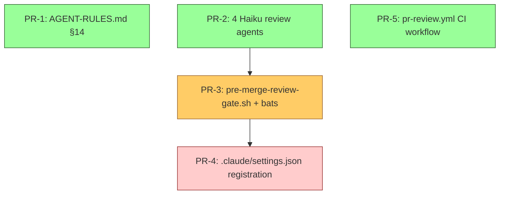

# RFC-004 — Maintainer pre-merge multi-reviewer gate

## AI context

Adds a four-layer pre-merge gate (rule, four parallel Haiku review agents, Stop hook, CI workflow) for maintainers working on this plugin repo, leaving consuming-repo artifacts untouched. The original RFC-004 framing conflated "code review" with the narrower `security-review` skill, so the actual review surface (correctness, test adequacy, dependency hygiene) had no checkpoint at all — this revision splits review into four narrowly-scoped Haiku agents that run in parallel and each write their own artifact. Key trade-offs: WARN at the hook + BLOCK at CI (consistent with `RFC-001`/`CLAUDE.md`); Haiku 4.5 for all review agents (cost discipline matching `RFC-006` — keeps per-PR review at ~3–9k tokens for the four agents in parallel rather than ~40–60k on Sonnet); doc-only PRs bypass the entire gate via the canonical path glob.

---

## Problem

- Maintainer PRs to this repo merge without a required pre-merge review checkpoint. The `security-review` skill exists at `sdlc-plugin/skills/security-review/SKILL.md` but nothing requires it to run before merge on this repo.
- `CLAUDE.md` instructs maintainers to "eat your own dog food," but the plugin's own discipline (security-review, surgical-edit, plan-gate) is enforced only in consuming repos via `sdlc-plugin/hooks/hooks.json` — not on the plugin repo itself.
- The repo currently has no `.github/workflows/pr-review.yml` (only `release.yml` from RFC-002), so there is no merge-time review gate at all.
- **"Code review" was conflated with `security-review` in the original RFC-004 framing.** The `security-review` skill covers ten specific security checks (input validation, authN/authZ, secrets, injection, deps, sensitive data, output encoding, errors, crypto, infra). It explicitly does **not** check correctness vs. requirements, readability, test coverage, or dependency hygiene beyond security scanning. A "code-review" gate that only inspects security artifacts is mis-named and leaves real review surface uncovered.

This is observable today: any maintainer can merge a PR touching `hooks/`, `skills/`, or `scripts/` with no review and no CI check. Even with the original RFC-004 design, three of the four review concerns (correctness, test adequacy, dependency hygiene) would have remained unchecked.

---

## Proposal

### Scope

- **In scope:**
  - New §14 in `sdlc-plugin/AGENT-RULES.md` mandating multi-reviewer pre-merge sign-off on the Build gate.
  - Four new maintainer-only review agents under `.claude/agents/`, each pinned to `claude-haiku-4-5-20251001`, each writing its own artifact to `.claude/sdlc/test/`.
  - New Stop hook `.claude/hooks/pre-merge-review-gate.sh` (warn, exit 0) that checks for the expected review artifacts.
  - New tracked Claude settings `.claude/settings.json` registering the hook.
  - New CI workflow `.github/workflows/pr-review.yml` requiring ≥1 approved human review on code PRs.
- **Out of scope:**
  - Any change to `sdlc-plugin/hooks/`, `sdlc-plugin/skills/`, `sdlc-plugin/agents/`, or `sdlc-plugin/hooks/hooks.json`. Consuming-repo behavior is unchanged.
  - New skills, commands, or templates.
  - Phase order, gate naming, or plan-artifact field changes.
  - Replacing the existing `security-review` skill (it stays — the new `maintainer-security-reviewer` agent reuses its checklist).

### Four layers

| Layer | File(s) | Behavior |
|---|---|---|
| Rule | `sdlc-plugin/AGENT-RULES.md` §14 | Before signing a Build gate on a non-doc PR, spawn the four maintainer review agents in parallel; sign only when all expected artifacts exist with `Verdict: clean` (or concerns explicitly waived in the gate file). Skip entirely for doc-only diffs (canonical glob below). |
| Review agents (Haiku 4.5, parallel) | `.claude/agents/maintainer-security-reviewer.md`, `.claude/agents/maintainer-code-quality-reviewer.md`, `.claude/agents/maintainer-test-adequacy-reviewer.md`, `.claude/agents/maintainer-dependency-reviewer.md` | Each agent narrowly-scoped; each reads the current diff; each writes a structured artifact. See **Review agent set** below. |
| Hook (warn) | `.claude/hooks/pre-merge-review-gate.sh` | Stop hook. Detects non-doc changes via `git diff --name-only`; warns if any of the expected review artifacts is missing in `.claude/sdlc/test/`. Exits 0. |
| Hook registration | `.claude/settings.json` | Tracked project-level Claude settings. Registers the Stop hook for maintainer sessions. |
| CI (block) | `.github/workflows/pr-review.yml` | Triggers on PR open/sync/ready and `pull_request_review` (submitted/dismissed). Diffs `${{ github.event.pull_request.base.sha }}...HEAD`. Doc-only → pass. Code → require ≥1 APPROVED review where `review.author.login != pr.author.login`. |

### Review agent set

All four are maintainer-only (live under `.claude/agents/`, never `sdlc-plugin/agents/`), all pinned to `claude-haiku-4-5-20251001`, all read-only on the source tree (their only write is the structured artifact in `.claude/sdlc/test/`), all spawned together in a single tool-call batch when Build gate is reached on a non-doc PR.

**Per-agent scope:**

| Agent | Reads | Checks | Artifact filename |
|---|---|---|---|
| `maintainer-security-reviewer` | Current diff + dependency manifests if touched | The 10 checks from `sdlc-plugin/skills/security-review/SKILL.md` (input validation, authN/authZ, secrets, injection surfaces, deps, sensitive data, output encoding, errors, crypto, infra) | `.claude/sdlc/test/security-review-<task-slug>.md` |
| `maintainer-code-quality-reviewer` | Current diff + the plan artifact for the task | Correctness vs. requirements, readability and naming, anti-overengineering (matches `minimal-code` skill heuristics), dead code, error-path coverage | `.claude/sdlc/test/code-quality-review-<task-slug>.md` |
| `maintainer-test-adequacy-reviewer` | Current diff + touched test files + plan artifact | Test coverage of changed lines, missing edge-case / failure-path tests, integration vs. unit balance, no test-only mocks that mask production behavior | `.claude/sdlc/test/test-adequacy-review-<task-slug>.md` |
| `maintainer-dependency-reviewer` | Dependency manifests + lockfiles if touched (`package.json`, `requirements.txt`, `go.mod`, `Gemfile`, `pom.xml`, `Cargo.toml`, etc.) | New deps justified, version-pinned, lockfile updated, license acceptable, maintainer activity reasonable. **Conditionally invoked** — agent self-exits with `Verdict: not-applicable` and writes a single-line artifact when no manifest is in the diff. | `.claude/sdlc/test/dependency-review-<task-slug>.md` |

**Common output structure** (each artifact):

```markdown
**Reviewer:** maintainer-<name>-reviewer
**Model:** claude-haiku-4-5-20251001
**Date:** YYYY-MM-DD
**Diff base:** <sha>...HEAD
**Findings:** [list of {severity, location, what, why, suggested-fix} — or "no findings"]
**Verdict:** clean | concerns:[<list>] | not-applicable
```

**Why narrow agents instead of one wider one:** four narrowly-scoped Haiku contexts focus the model on a single concern per pass, surface concrete findings rather than summary verdicts, and let the human reviewer skim the artifacts in any order. One wider Sonnet agent would cost ~10–15k tokens vs. ~3–9k for four parallel Haiku contexts.

**Why scope-conformance is not a fifth agent:** scope discipline (PR files ⊆ plan files, no adjacent functions, no out-of-scope edits) is already enforced by `surgical-edit` skill + `diff-scope-check.sh` + `adjacent-function-detector.sh` hooks shipped to consuming repos and exercised here. A fifth agent would duplicate work the existing hooks do for free.

### Parallel invocation contract

When Build gate is reached on a non-doc PR (per the canonical doc-only definition below), the maintainer (Claude Code session) spawns all four agents in a single tool-call batch — not serially. Each writes to a distinct artifact path; there is no shared file contention. The session waits for all four artifacts to exist before signing the Build gate. If any artifact reports `Verdict: concerns:[…]`, the maintainer either addresses the concerns in the diff or records an explicit waiver in the gate file before signing.

The hook (`pre-merge-review-gate.sh`) does not enforce parallel-vs-serial — it only checks that the artifacts exist. Parallelism is a procedural property maintained by the §14 rule.

### Doc-only definition (canonical)

A PR is doc-only when **every** changed file matches:

```
*.md, docs/**, templates/**, agents/**, commands/**, .github/**
```

**Except:** `.claude/sdlc/plans/**` and `.claude/sdlc/gates/**` are **excluded** from the doc-only set. They are markdown files but represent substantive governance decisions — if they appear in a diff, the PR is treated as a code-PR and review is required. (Resolved: OQ-1.)

This single definition is referenced from the rule, the hook, and the workflow.

### Layer separation (load-bearing)

Maintainer artifacts → `.claude/`, `.github/`, `AGENT-RULES.md`.
Plugin artifacts (ship to consumers) → `sdlc-plugin/**`.
The two layers must not mix. This RFC establishes that pattern; future contributors should not place maintainer-only tooling under `sdlc-plugin/hooks/`, `sdlc-plugin/agents/`, or other plugin-shipped directories.

---

## Alternatives considered

| Alternative | Why rejected |
|---|---|
| Single all-in-one `maintainer-code-reviewer` agent (Sonnet) | Loses focus — one wider context dilutes per-concern findings into a summary. Cost ~10–15k tokens (Sonnet) vs. ~3–9k for four parallel Haiku contexts. Reviewing four narrow artifacts is also easier on the human reader than one wide one. |
| Run reviews serially instead of parallel | Haiku-cost agents are cheap enough that parallel review is just faster (~10–15s wall vs. ~40–60s) with no marginal token cost. Parallel matches the natural orthogonality of the four concerns. |
| Use Sonnet for the review agents | Cost: ~40–60k tokens per Build gate vs. ~3–9k on Haiku 4.5. Haiku is sufficient for the structural checks each agent performs (the security agent walks a fixed 10-item checklist; quality and test-adequacy agents check well-defined heuristics). Re-evaluate only if Haiku misses real defects. |
| Wrap the existing `security-review` skill with a thin invocation rather than a Haiku `maintainer-security-reviewer` agent | Loses parallel symmetry — three concerns become agents, one becomes a skill invocation. Agent symmetry makes §14 prose, the hook check, and the artifact format uniform. The Haiku agent re-implements the skill's checklist in its own context, no skill machinery needed. |
| Make `maintainer-dependency-reviewer` always-on rather than conditional | Wastes Haiku tokens on PRs that touch no manifests (the common case). Conditional invocation (self-exit with `not-applicable` artifact) keeps the artifact-completeness check uniform while spending zero review work where there is nothing to review. |
| Native GitHub branch protection (`require 1 approval`) | Cannot exclude doc-only PRs by path. Doc-only bypass is load-bearing for this prose-heavy repo. |
| Block (exit 2) at the Stop hook instead of warn | Inconsistent with repo philosophy — only `plan-gate.sh` blocks; everything else warns. False positives (e.g., review file just-renamed) would halt legitimate work. |
| Place the hook or agents in `sdlc-plugin/` and gate on a `MAINTAINER=1` env flag | Risks leaking into consuming repos via `scripts/package.sh`; pollutes the plugin's surface. Strict layer separation (`.claude/`) is cleaner. |
| Skip `AGENT-RULES.md §14`, rely on hook + CI only | The rule document is the canonical decision source; without an entry there, future contributors won't know the rule exists. |
| Add a maintainer `/review-mtr` command | Unnecessary — Claude can spawn the four agents directly from §14 prose. A new command would be one more thing to memorize. |
| Add a fifth `maintainer-scope-reviewer` agent | Duplicates work already done by `surgical-edit` skill + `diff-scope-check.sh` + `adjacent-function-detector.sh`. Adding a fifth review of the same property burns Haiku tokens for redundancy. |

---

## Implementation plan

| PR | Files | What |
|---|---|---|
| PR-1 | `sdlc-plugin/AGENT-RULES.md` | Add §14: before signing Build gate on a non-doc PR, spawn the four maintainer review agents in parallel; gate signs only when all four artifacts exist with `Verdict: clean` or explicit waiver in the gate file; skip entirely for doc-only diffs (per canonical definition above) |
| PR-2 | `.claude/agents/maintainer-security-reviewer.md`, `.claude/agents/maintainer-code-quality-reviewer.md`, `.claude/agents/maintainer-test-adequacy-reviewer.md`, `.claude/agents/maintainer-dependency-reviewer.md` | Four new Haiku 4.5 review agents (one file per agent). Each pins `model: claude-haiku-4-5-20251001` exactly, uses the artifact path schema in the table above, declares bounded write scope (artifact only). |
| PR-3 | `.claude/hooks/pre-merge-review-gate.sh`, `tests/hooks/pre_merge_review_gate.bats` | Stop hook (warn, exit 0): detects non-doc changes via `git diff --name-only`; warns if any of `security-review-*.md`, `code-quality-review-*.md`, `test-adequacy-review-*.md`, `dependency-review-*.md` is missing in `.claude/sdlc/test/`. Bats tests cover doc-only bypass, all-artifacts-present pass, and per-artifact missing-warn cases. |
| PR-4 | `.claude/settings.json` | Tracked Claude settings registration: register `pre-merge-review-gate.sh` under `hooks.Stop` matcher. **Cross-RFC coordination with RFC-006 PR-5** — see note below. |
| PR-5 | `.github/workflows/pr-review.yml` | CI workflow: doc-only bypass (plan/gate exclusion applied), ≥1 approved review, self-approval filter (`review.author.login != pr.author.login`); branch-protection requirement documented in file header (resolved: OQ-2) |

**Hard deps:**
- PR-3 after PR-2 (hook artifact filenames must match what agents write).
- PR-4 after PR-3 (settings registration references the hook script that must exist).
- PR-1 and PR-5 are independent of the others.

**Cross-RFC coordination — `.claude/settings.json` is shared with RFC-006 PR-5.** Either may land first:

- _If RFC-004 PR-4 lands first_ (the expected order per `docs/rfcs/README.md` ## Implementation queue): create `.claude/settings.json` with a fresh `hooks.Stop` block containing the `pre-merge-review-gate.sh` entry. RFC-006 PR-5 will later append its `hooks.PostToolUse` block.
- _If RFC-006 PR-5 has already merged_: the file already exists with a `hooks.PostToolUse` block. **Append** the new `hooks.Stop` block — do not recreate or overwrite the file.
- Either path: run `python3 -m json.tool .claude/settings.json` (or equivalent) before commit to confirm the file parses.

**Sequencing:**



- **Tier 1 (parallel-ready):** PR-1, PR-2, PR-5
- **Tier 2:** PR-3 (needs PR-2's agent artifact filenames)
- **Tier 3:** PR-4 (needs PR-3's hook script)

---

## Implementation

| PR / Commit | What it delivered |
|---|---|
| [#36](https://github.com/lantisprime/claude-sdlc/pull/36) — `6ea420f` | **PR-1 + PR-2 (combined).** PR-1: `sdlc-plugin/AGENT-RULES.md` §14 "Pre-merge multi-reviewer gate" — defines the maintainer procedure for invoking the four review agents in parallel before signing a non-doc Build gate; doc-only canonical glob duplicated for self-containment. PR-2: four Haiku 4.5 review agents under `.claude/agents/` — `maintainer-security-reviewer.md`, `maintainer-code-quality-reviewer.md`, `maintainer-test-adequacy-reviewer.md`, `maintainer-dependency-reviewer.md` (last one self-exits `Verdict: not-applicable` when no manifest in diff). |
| [#37](https://github.com/lantisprime/claude-sdlc/pull/37) — `bb4432b` | **PR-3.** `.claude/hooks/pre-merge-review-gate.sh` Stop hook (warn, exit 0) plus `tests/hooks/pre_merge_review_gate.bats` (14 cases, all pass). Hook detects non-doc changes via `git diff --name-only`, glob-checks each artifact pattern in `.claude/sdlc/test/`, warns once per missing artifact. Diff base detection: `origin/main` → `main` → `HEAD~1` fallback. Graceful degradation outside git repo and on missing artifact directory. |
| [#38](https://github.com/lantisprime/claude-sdlc/pull/38) — `6270115` | **PR-4.** `.claude/settings.json` (new) — tracked Claude Code settings registering `pre-merge-review-gate.sh` under `hooks.Stop` matcher with no tool match. Path uses `${CLAUDE_PROJECT_DIR}` (this repo), distinct from `${CLAUDE_PLUGIN_ROOT}` used in `sdlc-plugin/hooks/hooks.json` (consumer-shipped). `_comment` field flags cross-RFC coordination with RFC-006 PR-5. |
| [#39](https://github.com/lantisprime/claude-sdlc/pull/39) — `fcaafd6` | **PR-5.** `.github/workflows/pr-review.yml` CI workflow — `pull_request` + `pull_request_review` triggers, drafts skipped, doc-only bypass via canonical glob, code-PRs require ≥1 APPROVED non-author review (`user.login != PR_AUTHOR` filter). Concurrency cancels superseded runs. Header documents OQ-2 branch-protection PUT command. **Bootstrap chicken-and-egg solved by rebase-last sequencing**: #34–#38 merged first (no gating), then #39 rebased onto main with diff shrunk to single workflow file (matches `.github/*` doc-only glob), self-passed, merged. |

**Key files changed:**
- `sdlc-plugin/AGENT-RULES.md` — new §14 (PR-1)
- `.claude/agents/maintainer-{security,code-quality,test-adequacy,dependency}-reviewer.md` — four Haiku review agents (PR-2)
- `.claude/hooks/pre-merge-review-gate.sh` + `tests/hooks/pre_merge_review_gate.bats` — Stop hook (PR-3)
- `.claude/settings.json` — hook registration (PR-4)
- `.github/workflows/pr-review.yml` — CI workflow (PR-5)

**Post-merge step (one-time, by repo admin):** add `review-required` to required status checks on `main` via `gh api -X PUT repos/${OWNER}/${REPO}/branches/main/protection` (full payload in `pr-review.yml` header comment). Until that runs, the gate is advisory. Note: the workflow file's header originally said `PATCH` — corrected to `PUT` in a follow-up doc-only PR.

**Maintainer-only:** every artifact under `.claude/`, `.github/`, or `sdlc-plugin/AGENT-RULES.md` (which is itself maintainer-only per its line-3 scope statement). `sdlc-plugin/hooks/`, `sdlc-plugin/agents/`, `sdlc-plugin/skills/` untouched. Plugin capability counts (`hooks=14`, `agents=5`) unchanged.

---

## Related RFCs

- `RFC-002-release-packaging` — added `.github/workflows/release.yml`; this RFC adds a sibling workflow `pr-review.yml` in the same directory.
- `RFC-003-hook-enforcement-alignment` — touches similar territory (hook severity and registration) but applies to consuming-repo hooks; this RFC is strictly maintainer-scoped.
- `RFC-006-rfc-lifecycle-quality-gates` — established the precedent for Haiku 4.5 maintainer-only review agents (`rfc-pr-reviewer`). RFC-004's four review agents follow the same model pinning, bounded-write-scope, and consuming-vs-maintainer separation pattern. The two RFCs share `.claude/settings.json`; coordination note in PR-4 covers the append ordering.

---

## Second opinion

> Required before `status: accepted` can be set. Complete per `AGENT-RULES.md §3a`.

### Revision 1 — original 3-PR scope (2026-04-27)

**Reviewer:** independent subagent (background review during planning, 2026-04-27)
**Date:** 2026-04-27
**Findings:**
1. Layer separation is clean; nothing leaks into consuming repos.
2. `.claude/settings.json` is the right place for tracked maintainer hooks — confirmed `.gitignore` does not exclude it.
3. CI workflow must use `${{ github.event.pull_request.base.sha }}...HEAD` for diff base — incorporated into proposal.
4. Hook glob must match what the `security-review` skill produces (`security-review-*.md`), not `code-review-*.md` — corrected in proposal.
5. Self-approval edge case: filter `review.author.login != pr.author.login` — incorporated.
6. Native branch protection considered as alternative — rejected because doc-only bypass needed.

**Decision:** proceed

### Revision 2 — multi-reviewer scope expansion (2026-04-28)

**Reviewer:** independent subagent (Haiku 4.5)
**Date:** 2026-04-28
**Trigger:** scope expansion from single `security-review` artifact check to four parallel Haiku review agents (security, code-quality, test-adequacy, dependency) with renamed hook (`pre-merge-review-gate.sh`) and renamed CI workflow (`pr-review.yml`). Title also changed from "Maintainer code-review enforcement" to "Maintainer pre-merge multi-reviewer gate".
**Findings:** No findings. The reviewer confirmed (a) the AI context still matches the revised scope, (b) the four-agent set is well-justified with clear non-overlapping concerns, (c) the parallel invocation contract is unambiguous, (d) the alternatives table is comprehensive, (e) the 5 PRs are surgical with correct hard deps, (f) OQ-3/OQ-4/OQ-5 are legitimate deferrals to implementation, (g) cross-RFC coordination with RFC-006 PR-5 is explicit, and (h) maintainer-vs-consuming separation holds across every new artifact.
**AI-slop check:** clean — case-insensitive grep over the RFC body for the §12 anti-patterns (inflated metaphors, manufactured personas, formulaic triplets, false severity escalation, unsupported compliance, aspirational framing) returned no matches.
**Decision:** proceed

---

## Open questions

| # | Question | Owner | Status |
|---|---|---|---|
| OQ-1 | Should `.claude/sdlc/plans/*.md` and `.claude/sdlc/gates/*.md` be excluded from doc-only set? They're prose but represent substantive decisions. Proposed default: exclude (treat as code-PR if they appear in diff). | juan.delacruz@acme.com | **resolved** — exclude; see doc-only definition above |
| OQ-2 | Branch protection settings on `main` — does the workflow need to be marked "required" via repo settings for the gate to actually block merge? Confirm with repo admin before merge. | juan.delacruz@acme.com | **resolved** — yes, mark as required; PR-5 documents the required settings in the workflow file header |
| OQ-3 | Should `maintainer-dependency-reviewer` be invoked unconditionally (with self-`not-applicable` exit when no manifest in diff) or conditionally invoked only when `git diff --name-only` shows a manifest path? Default proposal: unconditional with `not-applicable` artifact, so the hook's artifact-completeness check stays uniform across all PRs. Revisit if the not-applicable-pass cost (~500 tokens per dep-less PR) proves visible. | charltond.ho | **resolved (PR-2)** — unconditional invocation; agent self-exits with `Verdict: not-applicable` artifact when no manifest is in the diff, keeping the hook's artifact-completeness check uniform. Implemented in `.claude/agents/maintainer-dependency-reviewer.md`. |
| OQ-4 | Should the four review agents be coordinated by a single dispatcher agent (`maintainer-build-review-coordinator`) or invoked directly from §14 prose by the Claude Code session? Default proposal: direct invocation from §14 — no coordinator needed because there is nothing to coordinate (parallel spawn, independent artifacts, no aggregation step before sign). | charltond.ho | **resolved (PR-1)** — direct invocation from §14 prose; no dispatcher agent. §14 specifies the parallel single-tool-call-batch invocation pattern; aggregation happens in the human's read of the four artifacts before signing the gate. |
| OQ-5 | Should the hook check that artifacts are *fresh* (modified since the last commit on the working branch) rather than just present? Stale artifacts from a previous task could pass the existence check. Proposed default: present-only for v1; revisit if stale-artifact false-passes are observed. | charltond.ho | **resolved (PR-3)** — present-only check shipped in v1. Hook does not check artifact freshness; bats test 13 documents that `Verdict: not-applicable` artifacts (and by extension, any present artifact regardless of mtime) count as present. Revisit if stale-artifact false-passes are observed. |
