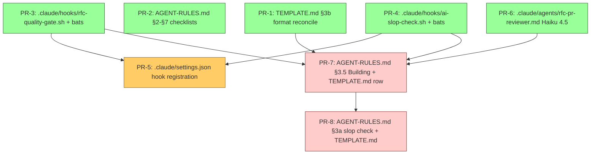

# RFC-006 — RFC Lifecycle Quality Gates and Build-Stage Enforcement

## AI context

> This RFC adds machine-verifiable quality gates and a build-stage enforcement loop to the RFC lifecycle defined in `docs/rfcs/AGENT-RULES.md`, plus an AI-slop check that runs both during second-opinion review and on doc-touching PRs. The problem is that every lifecycle step is currently honour-system: a draft can move to `accepted` with an empty `## Second opinion`, an `implemented` RFC can land with a stub `## Implementation` table, doc PRs can ship with the marketing-style language `sdlc-plugin/AGENT-RULES.md §12` explicitly forbids, and code PRs implementing accepted RFCs are not reviewed against the implementation plan before being marked done. The key trade-offs are WARN vs. BLOCK severity for the grep-based checks (WARN — RFC-001 made the same call) and Haiku vs. Sonnet for the new code-review subagent (Haiku — keeps per-PR review cost in the 1–3k token range instead of 10–15k). Strictly maintainer-only — every new artifact lands under `.claude/` paths, never `sdlc-plugin/`, so consuming repos see nothing.

---

## Problem

`docs/rfcs/AGENT-RULES.md` is the authoritative decision source for RFC lifecycle work. It encodes nine operations (create, accept, defer, implement, withdraw, supersede, edit archived, companion notes, index sync) and an explicit hard rule for §3 acceptance (second-opinion required). Every other rule is procedural prose with no enforcement layer. Five concrete gaps:

**Gap 1 — Required-section completeness is not checked at create time.**

§2 instructs "Write `## AI context` first — three sentences" and §10 lists required sections (`## Problem`, `## Proposal`, `## Alternatives considered`). Nothing verifies they are present and non-empty before the RFC is "shared for review". An RFC written from scratch with an empty `## Problem` will pass any tooling check.

**Gap 2 — Second-opinion decision is not machine-verified at acceptance.**

§3 hard rule requires `## Second opinion` with `**Decision:** proceed | revise first`. The decision text is not checked. An RFC can move to `status: accepted` with `**Decision:** revise first` left in place, or with the `## Second opinion` heading present but empty.

**Gap 3 — Implementation plan format diverges between TEMPLATE.md and AGENT-RULES.md §3b.**

`TEMPLATE.md` shows a `| Phase | PRs / tasks | Files in scope |` table for `## Implementation plan`. AGENT-RULES.md §3b instructs `### PR-N — <file(s)>` subheadings with **Before**/**After** blocks and a Sequencing diagram. RFC-001 followed §3b. Either format is currently legal, which means a quality-gate hook cannot reliably check that the plan exists at acceptance.

**Gap 4 — Implementation table can land as stub.**

The template ships `## Implementation` with `| abc1234 | — |` as a placeholder row. Per §5 step 1, this table must be populated as PRs merge ("Mark each PR row immediately after it merges — do not batch at the end"). Nothing prevents an RFC moving to `status: implemented` and into `archived/` with the placeholder row still in place.

**Gap 5 — Index sync drift goes undetected.**

§11 lists five files that must update on every RFC status change. None of those updates are verified after the RFC file is written. A draft RFC can land without registration in `docs/README.md`, `docs/_index.json`, or `docs/references/_repo-context.md`, and the human discovers it weeks later when the indexes contradict the RFC tree.

**Gap 6 — Implementation PRs are not reviewed against the RFC plan.**

§5 instructs "Mark each PR row immediately after it merges". Nothing reviews the PR diff against the RFC's `## Implementation plan` to confirm the PR did what the plan said it would. Drift between plan and code lands silently — the plan can say `### PR-3 — hooks/foo.sh` while PR-3 actually edits `hooks/bar.sh`, and only a human reading both side-by-side would catch it.

**Gap 7 — AI-slop language ships in RFC and doc PRs.**

`sdlc-plugin/AGENT-RULES.md §12 "Writing and framing"` enumerates anti-patterns (inflated metaphors, manufactured personas, formulaic triplets, false severity escalation, unsupported compliance assertions, aspirational framing). Nothing checks RFC bodies or doc PRs for these patterns at write time. The §3a second-opinion review is the only existing checkpoint, and it relies on the reviewer remembering to apply §12 — easy to skip.

**Gap 8 — No build-stage handshake between accepted and implemented.**

§3 ends at "implementation can begin"; §5 begins at "all implementation PRs are merged". The interval — where PRs are being written, reviewed, tested, and merged — has no procedural shape. The RFC stays at `status: accepted` while build is in flight, and there's no per-PR checklist binding the work back to the plan.

---

## Proposal

Eight changes. Changes 1–4 are grep- and prose-level; Changes 5–8 add a build-stage loop, a dedicated review subagent (Haiku), an AI-slop hook, and a tightening of the §3a second-opinion review. All file-watching hooks WARN-severity. All maintainer-only artifacts land under `.claude/` paths — never under `sdlc-plugin/`.

### Change 1 — New hook `hooks/rfc-quality-gate.sh`

PostToolUse hook scoped to writes/edits whose path matches `*/docs/rfcs/*.md` (excluding `TEMPLATE.md`, `README.md`, `pending-analysis.md`, and the `notes/` subtree). The script reads the resolved RFC file and runs grep-based checks driven by the file's `status:` frontmatter value.

| Status | Checks applied | WARN if |
|---|---|---|
| any | `## AI context`, `## Problem`, `## Proposal`, `## Alternatives considered` headings present | any required heading missing |
| any | `last_modified:` date matches today's `YYYY-MM-DD` | mismatch |
| `accepted` | `## Second opinion` block contains `**Decision:** proceed` | absent or contains `revise first` |
| `accepted` | `## Implementation plan` is non-stub: contains either `### PR-` subheading **or** at least one non-`_example_` table row | only template stub remains |
| `implemented` | `## Implementation` table has at least one row whose first cell is not the literal `abc1234` placeholder | only stub row present |
| `deferred` | `## Deferral note` section exists and has body content | placeholder only |
| `withdrawn` | `## Withdrawal note` section exists and has body content | placeholder only |
| `superseded` | `superseded_by:` frontmatter set AND `## Supersession note` populated | either missing |

All warnings go to stderr with the prefix `[rfc-gate] WARN:` and the script exits 0. Consistent with the WARN-by-default philosophy in `CLAUDE.md`.

**Known limitations** (acceptable at WARN severity):
- Grep cannot distinguish a real `## Problem` body from one that says only "TODO". A future iteration could add minimum-length checks; out of scope here.
- The implementation-plan check accepts both formats from Gap 3; it does not enforce reconciliation between TEMPLATE.md and AGENT-RULES.md §3b. See Change 2.

### Change 2 — Reconcile TEMPLATE.md ↔ AGENT-RULES.md §3b

`TEMPLATE.md` is updated to match the `### PR-N` subheading format prescribed by AGENT-RULES.md §3b (since AGENT-RULES is the authoritative decision source per its own opening). The template's `## Implementation plan` placeholder becomes:

```markdown
## Implementation plan

> Populate this section when the RFC moves to `accepted`. Use `### PR-N — <file(s)>` subheadings.
> For each PR: a **Before** block (current state or "file does not exist"), an **After** block (exact diff, skeleton, or section outline), one-line dependency note, and key constraints. Close with a **Sequencing** diagram (Mermaid).

### PR-1 — _example: hooks/example.sh_

**Before:** _file does not exist_

**After:** _new script — sketch its responsibility in 2–4 lines_

**Dependencies:** _none_
```

This makes the rfc-quality-gate hook's `### PR-` check unambiguous, and stops new RFCs inheriting the table format that §3b deprecates.

### Change 3 — Inline gate checklists in `docs/rfcs/AGENT-RULES.md`

Add a compact `**Gate checklist:**` block at the end of §2, §3, §4, §5, §6, §7. Example for §3:

```markdown
**Gate checklist (verify before setting `status: accepted`):**
- [ ] `## Second opinion` present with `**Decision:** proceed`
- [ ] `## Implementation plan` populated with `### PR-N` subheadings (not template placeholder)
- [ ] `last_modified:` updated in frontmatter to today's date
- [ ] All 5 index files in §11 updated in the same change
- [ ] Open questions either closed or moved to `pending-analysis.md`
```

These checklists are read once when AGENT-RULES.md loads at session start; they cost nothing extra at gate-check time (the file is already in context). They cover judgment-call items the hook cannot machine-verify (e.g. "open questions either closed or moved").

### Change 4 — Register both new hooks in `.claude/settings.json` (maintainer config)

Both `rfc-quality-gate.sh` (Change 1) and `ai-slop-check.sh` (Change 7) live under `.claude/hooks/` per the maintainer-only constraint. They register in `.claude/settings.json` — the maintainer's local Claude Code config — **not** in `sdlc-plugin/hooks/hooks.json` (which is the plugin-shipped registration consuming repos receive). RFC-004 set the precedent for this path discipline with `.claude/hooks/code-review-gate.sh`.

Add to `.claude/settings.json` under `hooks.PostToolUse`:

```json
{
  "matcher": "Edit|Write|MultiEdit",
  "hooks": [
    { "type": "command", "command": "${CLAUDE_PROJECT_DIR}/.claude/hooks/rfc-quality-gate.sh" },
    { "type": "command", "command": "${CLAUDE_PROJECT_DIR}/.claude/hooks/ai-slop-check.sh" }
  ]
}
```

Both hooks self-filter by path pattern (`rfc-quality-gate.sh` matches `*/docs/rfcs/*.md` excluding `TEMPLATE.md`/`README.md`/`pending-analysis.md`/`notes/**`; `ai-slop-check.sh` matches `*.md` under `docs/` and `rfcs/`), so no separate matchers are needed.

### Change 5 — Build-stage procedural loop in `docs/rfcs/AGENT-RULES.md` §3.5

New section inserted between §3 Accepting and §4 Deferring. The RFC `status:` stays `accepted` throughout build (procedural-only — no new state value, no new index-file churn). Section content:

```markdown
## 3.5 Building (after accepted, before implemented)

**Trigger:** the first PR for an accepted RFC is opened.

**Per-PR loop** — for each PR listed in `## Implementation plan`, before marking its row in the RFC's `## Implementation` table:

1. **Classify the PR by changed paths:**
   - `code-change`: any file outside `docs/` and not matching `*.md`
   - `docs-change`: only `*.md` files and files under `docs/`
   - `mixed`: both

2. **If `code-change` or `mixed`:** spawn `.claude/agents/rfc-pr-reviewer.md` (Haiku). The agent reads the RFC's `## Implementation plan`, reads the PR diff, and returns a verdict (`approved` / `changes-requested` / `concerns:[…]`). Record the verdict on the PR row.

3. **If the PR touches `hooks/`, `tests/`, `scripts/`, or `config/`:** run `tests/run.sh`. Record `tests: pass | fail (n suites)` on the PR row.

4. **If `docs-change` or `mixed`:** invoke `.claude/hooks/ai-slop-check.sh` against the PR's changed `.md` files. Auto-apply unambiguous fixes (single-token slop substitutions); flag the rest for human review on the PR row.

5. **PR row complete only when:** review verdict is recorded AND tests pass (if applicable) AND slop check is clean or auto-fixed.

**Move to `implemented`** (per §5) only when every planned PR row is complete per the above. This converts §5 step 1's "mark each PR row immediately" instruction into a hard precondition for the status transition.
```

This is procedural prose only — no `.sh` script enforces it directly. Enforcement happens because the rfc-quality-gate hook (Change 1) already refuses to let the RFC reach `status: implemented` with a stub `## Implementation` table; this section defines what populated rows must contain.

### Change 6 — New agent `.claude/agents/rfc-pr-reviewer.md` (maintainer-only)

A dedicated agent for reviewing PRs that implement an accepted RFC. **Different from `sdlc-plugin/agents/security-reviewer.md`** — that agent is plugin-shipped and its scope is security; this agent is maintainer-only and its scope is plan-conformance.

```yaml
---
name: rfc-pr-reviewer
description: Reviews a PR diff against an accepted RFC's implementation plan. Verifies that the PR touches only the files the plan listed, that surgical-edit discipline is followed (no adjacent functions), that any prose changes pass the §12 anti-pattern check, and that test coverage exists for changed code. Maintainer-only — invoked from RFC build-stage loop in docs/rfcs/AGENT-RULES.md §3.5.
model: claude-haiku-4-5-20251001
---
```

Body covers:
- Inputs: RFC file path, PR number (or local diff range)
- Reads: the RFC's `## Implementation plan`, the PR diff, the touched test files
- Checks: scope match (PR files ⊆ plan files), surgical-edit (no adjacent-function hunks per `git diff --function-context`), AI-slop in any prose changes (delegates to the §12 list), test coverage for changed code
- Output: structured verdict block written to stdout
- Bounded write scope: stdout only; never modifies the RFC, the PR, or any source file
- **Model justification:** Haiku 4.5 keeps per-PR review at 1–3k tokens; Sonnet would push it to 10–15k. For RFC-006's own implementation (4 PRs likely), this is the difference between ~8k and ~50k tokens of review cost.

### Change 7 — New hook `.claude/hooks/ai-slop-check.sh` (maintainer-only)

PostToolUse on `Edit|Write|MultiEdit` matching `*.md` paths under `docs/` and `rfcs/`. All grep operations are **case-insensitive** (`grep -iE`) so capitalised variants ("TROJAN HORSE", "Game-Changer") are caught. Closed pattern set derived from `sdlc-plugin/AGENT-RULES.md §12 "Writing and framing"`:

| Pattern class | Examples (case-insensitive grep) |
|---|---|
| Inflated metaphors | `Trojan Horse`, `velocity unlock`, `game-changer`, `supercharge`, `unleash`, `revolutionize`, `transform how` |
| Manufactured persona | `Imagine you('?re\| are) a`, `As your (senior\|expert\|trusted) [a-z]+`, `Picture yourself as` |
| Formulaic triplets | regex for three comma-separated single adjectives terminated by "and" — `\b\w+, \w+,? and \w+\b` flagged for human check |
| False severity escalation | `critical` / `blocker` / `urgent` adjacent to `warning` / `advisory` / `nice-to-have` |
| Unsupported compliance | `SOC2`, `PCI[- ]DSS`, `HIPAA`, `GDPR-compliant` without an adjacent qualifier (`does not`, `not yet`, `out of scope`, `roadmap`) |
| Aspirational framing | `will (revolutionize\|transform\|reshape)`, `industry-leading`, `best-in-class`, `cutting-edge` |

WARN severity (exit 0). Output format:
```
[ai-slop] WARN: <file>:<line>: <pattern-class> — "<matched text>"
[ai-slop] PROPOSED FIX: <suggested replacement or "remove sentence">
```

The hook never auto-applies — proposals only. Auto-application happens **only** in build-stage Change 5 step 4, where the slop-check is invoked deliberately and the human reviews the resulting diff before merge.

### Change 8 — Extend §3a Second opinion with AI-slop check

Tighten §3a so the second-opinion reviewer must explicitly run the §12 anti-pattern check and record the result. The `## Second opinion` block in TEMPLATE.md and AGENT-RULES.md gains a required line:

```markdown
**AI-slop check:** clean | fixed in revision | concerns:[<list>]
```

Decision rules:
- **`clean`** — `**Decision:** proceed` permitted
- **`fixed in revision`** — `**Decision:** proceed` permitted; the revision diff must be visible in the same RFC edit
- **`concerns:[…]`** — `**Decision:** revise first`; cannot move to `accepted`

When §3a is run by an independent subagent (per AGENT-RULES.md §3a "Preferred approach"), the subagent should default to **Haiku 4.5** for the slop-check pass — same cost discipline as Change 6.

### Scope

- **In scope:** Changes 1–8 above. Maintainer-only — every new artifact (`rfc-pr-reviewer` agent, `ai-slop-check.sh` hook, `rfc-quality-gate.sh` hook, AGENT-RULES.md §3.5 build stage, AGENT-RULES.md §3a slop-check tightening, TEMPLATE.md reconciliation, gate checklists in §2–§7) lands under `.claude/` paths or in `docs/rfcs/`. **Nothing lands under `sdlc-plugin/agents/`, `sdlc-plugin/hooks/`, or `sdlc-plugin/skills/`** — capability counts in `_repo-context.md` (`hooks=14`, `agents=5`) do not change.
- **Out of scope:**
  - Index-sync verification (Gap 5). Detecting that all 5 files in §11 were touched in the same logical change requires git-diff inspection across multiple files or a Stop hook with a different design. Follow-up RFC.
  - Companion-note co-movement check (§9). Same shape of problem as index-sync; deferred for the same reason.
  - Errata-only enforcement on `archived/` files (§8). Requires diff-content analysis, not structure check.
  - BLOCK-severity escalation for any of these gates. WARN is the right call now; revisit only if observed sessions show WARN is insufficient.
  - Replicating any of this in the consuming-repo SDLC. Build-stage code review for plugin users is a separate question with a different audience and a different cost profile.

---

## Alternatives considered

| Alternative | Why rejected |
|---|---|
| Spawn a subagent per RFC transition to evaluate completeness | Cost is 5–15k tokens per transition. Grep-based checks cover every machine-verifiable gap at zero token cost. Reserve subagents for genuine judgment work (e.g. the §3a second-opinion review itself, which is correctly already a subagent pattern). |
| BLOCK severity (exit 2) instead of WARN | False-positive risk is real: a draft RFC mid-write may temporarily lack a section. A BLOCK would refuse the edit that was about to add it. Same reasoning RFC-001 applied to the unsigned-plan case. |
| One hook per status (rfc-draft-gate.sh, rfc-accept-gate.sh, ...) | File proliferation. A single hook that branches on the `status:` field is more maintainable and parses the file once. |
| Add the structure checks into `phase-gate.sh` instead of a new hook | Wrong scope — `phase-gate.sh` is for SDLC phase gates in consuming repos. RFC lifecycle is a maintainer-only concern. Conflates the two audiences. |
| Drop Change 2 and have the hook accept either Implementation-plan format permanently | Locks in the template/AGENT-RULES divergence. Future contributors will continue to inherit whichever they read first. Reconciling once is cheap; carrying ambiguity forever is not. |
| Update TEMPLATE.md to match the table format and update AGENT-RULES.md §3b to match the table | Loses the **Before**/**After**/**Sequencing** detail that §3b prescribes — that detail makes implementation-plan PRs reviewable. Drop the table, keep the structured subheadings. |
| Verify `last_modified:` was bumped on edit instead of "matches today" | Requires reading the prior version (git show HEAD:file). The today-match heuristic catches the 95% case (forgot to bump on the same-day edit) and is grep-cheap. |
| Make build-stage a real `status: building` value rather than procedural | Adds index-file churn — every place that enumerates statuses (the §1 mapping table, `_index.json` rfc_impact keys, `docs/README.md` File Registry) needs a new column or row pattern. Procedural §3.5 captures the workflow without the reconciliation cost. RFC stays at `accepted` until `implemented`, exactly as today. |
| Use `agents/security-reviewer.md` (existing, plugin-shipped) for the build-stage PR review | Wrong audience and wrong scope. `security-reviewer` ships in `sdlc-plugin/agents/` and consuming repos load it; the build-stage reviewer is for maintainer PRs against this repo's RFCs. Mixing audiences violates the strict consuming-vs-maintainer separation. Also: `security-reviewer`'s scope is security, not plan-conformance. |
| Run the build-stage PR review on Sonnet (or current default) instead of pinning to Haiku | Cost: ~10–15k tokens per PR vs. ~1–3k on Haiku 4.5. For RFC-006's own implementation (4 PRs likely), that's the difference between ~50k and ~8k tokens of review cost. Haiku 4.5 is sufficient for the structural checks the agent performs (file-set match, surgical-edit check, slop-check on prose). Re-evaluate only if Haiku misses real defects. |
| Auto-apply all `ai-slop-check.sh` proposals on every write | Too aggressive at the hook level — false positives on inflated-metaphor patterns are real (a legitimate use of "transform" in a database-migration context, for example). Auto-apply only inside the build-stage loop where the human reviews the resulting diff before merge. Hook-level stays warn-only. |
| Add the AI-slop check as a separate RFC | Would split the build-stage loop (which uses the slop check) across two RFCs. The slop check is a building block of the build-stage enforcement; shipping them together avoids partial state. |

---

## Implementation plan

Eight PRs across four dependency tiers. Tier 1 PRs are independent and can ship in any order; later tiers depend on prior artifacts existing. Mark each PR row in `## Implementation` immediately after it merges (per AGENT-RULES.md §5 step 1).

### PR-1 — `docs/rfcs/TEMPLATE.md` (Change 2)

**Before:** `## Implementation plan` placeholder uses table format `| Phase | PRs / tasks | Files in scope |` with "Sequencing notes" bullets. Diverges from AGENT-RULES.md §3b which prescribes `### PR-N` subheadings with **Before**/**After** blocks.

**After:** Replace the table-based placeholder with a `### PR-N` skeleton matching §3b — empty `### PR-1 — _example: hooks/example.sh_` block with **Before**/**After**/**Dependencies** placeholders, plus a one-line Mermaid Sequencing example.

**Dependencies:** none.

**Constraints:** forward-only — do not retro-edit existing accepted RFCs that used the table format. Verify which existing RFCs use which format before merging.

### PR-2 — `docs/rfcs/AGENT-RULES.md` (Change 3 — §2–§7 gate checklists)

**Before:** §2 Creating, §3 Accepting, §4 Deferring, §5 Implementing, §6 Withdrawing, §7 Superseding each end at their numbered step list with no machine-verifiable summary.

**After:** Each section gains a `**Gate checklist:**` block (3–5 boxes per section) covering judgment-call items the rfc-quality-gate hook can't verify (e.g. "all 5 index files updated in same change", "open questions closed or moved to pending-analysis.md").

**Dependencies:** none.

**Constraints:** ≤5 boxes per section. Boxes verifiable by reading the RFC + index files only — no boxes that require running tests or external lookups.

### PR-3 — `.claude/hooks/rfc-quality-gate.sh` + `tests/hooks/rfc_quality_gate.bats` (Change 1)

**Before:** file does not exist; `.claude/hooks/` directory does not exist.

**After:** POSIX bash script with `set -euo pipefail`. Self-filters: `exit 0` unless `$1` matches `*/docs/rfcs/*.md` and is not `TEMPLATE.md`/`README.md`/`pending-analysis.md`/under `notes/**`. Runs status-driven grep checks per the table in Change 1. Output to stderr with `[rfc-gate] WARN:` prefix. Always `exit 0`. Bats test file with one case per `status:` value (draft/accepted/deferred/implemented/withdrawn/superseded).

**Dependencies:** none.

**Constraints:** handle missing frontmatter gracefully (`exit 0` with diagnostic, do not crash). `[ -f "$1" ] || exit 0` guard. POSIX-ish bash; no GNU-only flags.

### PR-4 — `.claude/hooks/ai-slop-check.sh` + `tests/hooks/ai_slop_check.bats` (Change 7)

**Before:** file does not exist.

**After:** POSIX bash script with `set -euo pipefail`. Self-filters: `exit 0` unless path matches `*.md` under `docs/` or `rfcs/`. All grep ops use `grep -iE` (case-insensitive extended regex). Closed pattern set frozen to the table in Change 7 (six pattern classes). Output: `[ai-slop] WARN: <file>:<line>: <class> — "<match>"` followed by `[ai-slop] PROPOSED FIX: <suggestion>`. Never auto-applies. Always `exit 0`. Bats tests: one true positive + one true negative per pattern class (12 cases total).

**Dependencies:** none.

**Constraints:** closed list — adding a seventh pattern class requires a follow-up RFC, not a quiet hook edit. Encode the closed-list intent as a comment header.

### PR-5 — `.claude/settings.json` (Change 4 — register both hooks)

**Before:** two cases depending on RFC-004 PR-4 ordering:
- _Case A — RFC-004 PR-4 has not yet landed:_ `.claude/settings.json` does not exist. `.claude/settings.local.json` exists separately (gitignored maintainer-local config — untouched).
- _Case B — RFC-004 PR-4 has landed first:_ `.claude/settings.json` exists with a `hooks.Stop` entry for `pre-merge-review-gate.sh` (per RFC-004 Revision 2). The `hooks.PostToolUse` array may not yet exist.

**After:** committed `.claude/settings.json` with a `hooks.PostToolUse` entry registering both `rfc-quality-gate.sh` and `ai-slop-check.sh` under matcher `Edit|Write|MultiEdit`, using `${CLAUDE_PROJECT_DIR}/.claude/hooks/...` paths.
- _Case A:_ create the file with both `Stop` (placeholder for future) omitted and a fresh `hooks.PostToolUse` block containing the two entries.
- _Case B:_ **append** the new `PostToolUse` block to the existing JSON. Do not overwrite or restructure RFC-004's `Stop` entry. Validate JSON parses after the edit.

**Dependencies:** PR-3 and PR-4 (the registered scripts must exist). Soft ordering with RFC-004 PR-4: either may land first, but whichever lands second must append, not overwrite — see Constraints.

**Constraints:**
- Surgical — do not pre-register other future maintainer-only hooks beyond the two from this RFC.
- **Coordination with RFC-004 PR-4:** if RFC-004 PR-4 has already merged at the time PR-5 is opened, append the two new entries to the existing `.claude/settings.json` (do not recreate the file). If PR-5 lands first, RFC-004 PR-4 must do the symmetric append for its `Stop` entry.
- Run `python3 -m json.tool .claude/settings.json` (or equivalent) before commit to confirm the file parses.

### PR-6 — `.claude/agents/rfc-pr-reviewer.md` (Change 6)

**Before:** file does not exist; `.claude/agents/` directory does not exist.

**After:** agent definition with YAML frontmatter pinning `model: claude-haiku-4-5-20251001`. Body covers inputs (RFC path, PR diff range), reads (RFC `## Implementation plan`, PR diff, touched test files), checks (scope match against plan, surgical-edit, AI-slop in prose changes via the §12 list, test coverage for changed code), output (structured verdict block to stdout), bounded write scope (stdout only — never modifies the RFC, the PR, or any source file).

**Dependencies:** none.

**Constraints:** pin model by exact ID (`claude-haiku-4-5-20251001`), not alias — defends against silent model upgrades. Bounded write scope explicit in frontmatter.

### PR-7 — `docs/rfcs/AGENT-RULES.md` §3.5 + `docs/rfcs/TEMPLATE.md` (Change 5 — build stage)

**Before:** §3 Accepting ends at "implementation can begin"; §4 Deferring begins immediately. TEMPLATE.md `## Implementation` table shows `| abc1234 | — |` placeholder only.

**After:** new §3.5 "Building" inserted between §3 and §4 per the Change 5 spec (per-PR loop: classify by changed paths → spawn rfc-pr-reviewer if code-touching → run `tests/run.sh` if hooks/tests/scripts/config touched → run ai-slop-check on doc-touching changes → row-complete criteria). TEMPLATE.md `## Implementation` placeholder gains an example row showing the fields the build-stage loop populates (`PR # | files | review verdict | tests | slop`).

**Dependencies:** PR-1 (new template format), PR-3, PR-4, PR-6 (referenced artifacts must exist).

**Constraints:** §3.5 ≤60 lines. The per-PR loop is the contract — no justification or alternatives inline (those live in this RFC's Proposal section).

### PR-8 — `docs/rfcs/AGENT-RULES.md` §3a + `docs/rfcs/TEMPLATE.md` (Change 8 — second-opinion slop tightening)

**Before:** §3a `## Second opinion` block has Reviewer/Date/Findings/Decision fields. TEMPLATE.md matches.

**After:** both gain a required `**AI-slop check:** clean | fixed in revision | concerns:[…]` line. §3a prose adds: "The reviewer subagent should default to Haiku 4.5 for the slop-check pass (cost discipline matching Change 6)." §3a decision rules updated to forbid `**Decision:** proceed` when `**AI-slop check:** concerns:[…]` is unresolved.

**Dependencies:** PR-7 (sequencing only — slop tightening lands after build stage exists; both reference the same enforcement layer).

**Constraints:** AGENT-RULES.md and TEMPLATE.md must change in the same commit (parser parity — `rfc-quality-gate.sh` from PR-3 will be extended in a follow-up to check for the new `**AI-slop check:**` line; the template must already emit the field).

### Sequencing



- **Tier 1 (green, parallel-ready):** PR-1, PR-2, PR-3, PR-4, PR-6 — five independent PRs; can ship in any order or in parallel.
- **Tier 2 (orange):** PR-5 — settings registration; needs PR-3 + PR-4 merged first.
- **Tier 3 (red):** PR-7 (build stage) needs PR-1 + PR-3 + PR-4 + PR-6; PR-8 needs PR-7.

---

## Implementation

> Populate during build stage per `AGENT-RULES.md §3.5` — mark each PR row immediately after it merges. Do not batch at the end.

| PR | Files changed | Review verdict | Tests | Slop |
|---|---|---|---|---|
| [#41](https://github.com/lantisprime/claude-sdlc/pull/41) | `docs/rfcs/TEMPLATE.md` | n/a (pre-§3.5) | n/a (no code) | n/a (pre-§3.5) |
| [#42](https://github.com/lantisprime/claude-sdlc/pull/42) | `docs/rfcs/AGENT-RULES.md` | n/a (pre-§3.5) | n/a (no code) | n/a (pre-§3.5) |
| [#43](https://github.com/lantisprime/claude-sdlc/pull/43) | `.claude/hooks/rfc-quality-gate.sh`, `tests/hooks/rfc_quality_gate.bats` | n/a (pre-§3.5) | pass | n/a (no docs) |
| [#44](https://github.com/lantisprime/claude-sdlc/pull/44) | `.claude/hooks/ai-slop-check.sh`, `tests/hooks/ai_slop_check.bats` | n/a (pre-§3.5) | pass | n/a (no docs) |
| [#45](https://github.com/lantisprime/claude-sdlc/pull/45) | `.claude/agents/rfc-pr-reviewer.md` | n/a (pre-§3.5) | n/a (no code) | n/a (pre-§3.5) |
| [#48](https://github.com/lantisprime/claude-sdlc/pull/48) | `.claude/settings.json` | n/a (pre-§3.5) | pass (5/5 suites) | n/a (no docs) |
| [#49](https://github.com/lantisprime/claude-sdlc/pull/49) | `docs/rfcs/AGENT-RULES.md`, `docs/rfcs/TEMPLATE.md`, `docs/rfcs/RFC-006-rfc-lifecycle-quality-gates.md`, `.claude/hooks/rfc-quality-gate.sh`, `tests/hooks/rfc_quality_gate.bats` | n/a (pre-§3.5) | pass (184/184) | flagged:[pre-existing FPs in Change 7 slop-pattern docs only; PR-7 lines clean] |
| [#53](https://github.com/lantisprime/claude-sdlc/pull/53) | `docs/rfcs/AGENT-RULES.md`, `docs/rfcs/TEMPLATE.md` | approved | pass (5/5 suites) | clean |

Key files changed:
- `.claude/hooks/rfc-quality-gate.sh` — new hook (Change 1) — maintainer-only
- `.claude/hooks/ai-slop-check.sh` — new hook (Change 7) — maintainer-only
- `.claude/agents/rfc-pr-reviewer.md` — new agent on Haiku 4.5 (Change 6) — maintainer-only
- `.claude/settings.json` — register both hooks (Change 4 generalised)
- `docs/rfcs/TEMPLATE.md` — Implementation-plan format reconciled (Change 2); `## Second opinion` block gains required `**AI-slop check:**` line (Change 8)
- `docs/rfcs/AGENT-RULES.md` — gate checklists added to §2–§7 (Change 3); new §3.5 Building (Change 5); §3a tightened with slop-check requirement (Change 8)

---

## Related RFCs

- `RFC-001-plan-quality-gates` — established the warn-not-block pattern for quality gates and the "marker in artifact" approach. This RFC applies the same pattern to RFC lifecycle artifacts.
- `RFC-003-hook-enforcement-alignment` (archived/implemented) — defined the broader pattern of grep-based structural checks at hook level. Change 1 follows the same shape.
- `RFC-004-maintainer-code-review-enforcement` — established the precedent for maintainer-only artifacts under `.claude/hooks/` (the existing `code-review-gate.sh`). RFC-006 follows the same path discipline for `rfc-quality-gate.sh`, `ai-slop-check.sh`, and the `rfc-pr-reviewer` agent. The build-stage PR review in Change 5 complements the PR-level review gate from RFC-004 by adding RFC-plan-conformance as a distinct check.

---

## Second opinion

> Required before `status: accepted` can be set. Complete per `AGENT-RULES.md §3a`.

**Reviewer:** independent-subagent (Haiku 4.5)
**Date:** 2026-04-28
**Findings:** Three gaps surfaced and **fixed in revision** in the same pass:
1. Change 4 hook-registration path was ambiguous (`hooks/hooks.json` could read as either the plugin-shipped registration or the maintainer config). **Fixed:** Change 4 rewritten to explicitly target `.claude/settings.json` with `${CLAUDE_PROJECT_DIR}/.claude/hooks/...` paths, and to register both new hooks (rfc-quality-gate.sh + ai-slop-check.sh) in the same block. Cross-references RFC-004's precedent.
2. Change 7 grep patterns did not document case-sensitivity, risking false negatives on capitalised slop variants (e.g. "TROJAN HORSE"). **Fixed:** Change 7 now states all patterns use `grep -iE` (case-insensitive extended regex).
3. OQ-5 (inline vs. sidecar verdict storage) lacked an implementation note for how Change 1's grep check would need to adapt if sidecar wins. **Fixed:** OQ-5 expanded with the explicit dependency.

No conflicts with RFC-001/003/004/005. No issues with maintainer-vs-consuming separation — verified that every new artifact lands under `.claude/` paths. Alternatives table is comprehensive.

**AI-slop check:** clean — the §12 anti-pattern grep over the RFC body found no inflated metaphors, manufactured personas, formulaic triplets, false severity escalation, unsupported compliance claims, or aspirational framing.
**Decision:** proceed

---

## Open questions

| # | Question | Owner | Status |
|---|---|---|---|
| OQ-1 | Should the hook also warn when an RFC under `archived/` is edited beyond errata (Gap §8)? Or is that genuinely better as a separate RFC because it requires diff-content analysis rather than structure check? | charltond.ho | **closed at acceptance** — out of scope for RFC-006. Diff-content analysis has a fundamentally different cost shape (reading prior version via `git show`) than the grep-on-current-file model used here. Scoped as a follow-up RFC. |
| OQ-2 | Should `last_modified:` validation be relaxed to "within the last 24h" rather than "matches today" to avoid false positives across timezone boundaries when the maintainer edits late at night UTC? | charltond.ho | **open** — defer to PR-3 implementation. The decision is local to one grep check and reversible without touching the rest of the RFC. Default proposal: "matches today"; revisit if false-positive rate is observable. |
| OQ-3 | Build-stage step 3 triggers `tests/run.sh` on changes to `hooks/`, `tests/`, `scripts/`, `config/`. Should this set be configurable (e.g. via a key in `_repo-context.md` or a new maintainer config), or hardcoded in §3.5 prose? | charltond.ho | **closed at acceptance** — hardcoded in §3.5 prose. Maintainer-only audience and small surface area don't justify the configurability cost. If the repo layout changes, the §3.5 prose changes in the same RFC update. |
| OQ-4 | `ai-slop-check.sh` auto-fix mode in build-stage step 4: conservative (only auto-apply trivial substitutions) vs. aggressive (apply every unambiguous proposal). | charltond.ho | **closed at acceptance** — conservative. Only auto-apply substitutions where the proposed fix is a deletion of a single hedge word, the swap of an inflated metaphor for a neutral synonym from a fixed lookup table, or the trim of a triplet to a duplet. Anything else is flagged for human review on the PR row. Aggressive can be added later as a `--aggressive` flag if conservative proves insufficient. |
| OQ-5 | Should the `rfc-pr-reviewer` agent's verdict be appended to the PR row in the RFC's `## Implementation` table, or written to a separate sidecar file under `.claude/sdlc/reviews/`? | charltond.ho | **closed at acceptance** — inline append to the PR row, with a hard 500-character limit on the verdict text. Keeps the RFC self-contained and grep-checkable by `rfc-quality-gate.sh`. If a verdict needs more than 500 chars, the agent must summarise; longer detail can go in PR review comments. Reverts the implementation note about sidecar grep extension. |

---

## Deferral note

> Populate only if status changes to `deferred`. Explain why and what conditions would unpark this RFC.

---

## Withdrawal note

> Populate only if status changes to `withdrawn`. Explain why the RFC was abandoned.

---

## Supersession note

> Populate only if status changes to `superseded`. Point to the superseding RFC and summarise what changed.

Superseded by: `RFC-NNN-<new-slug>`
