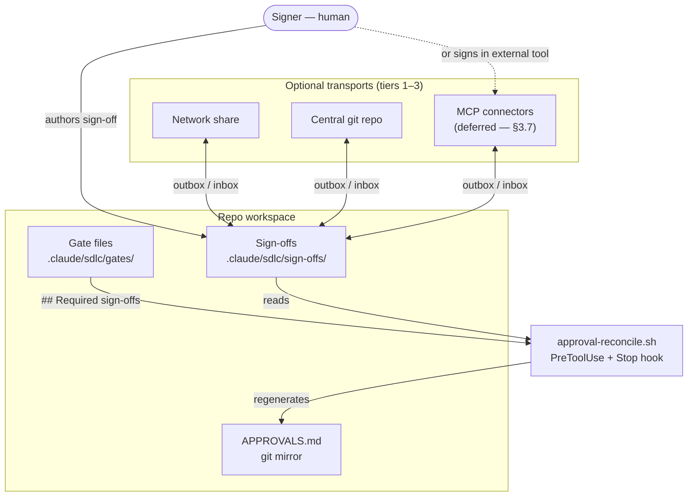
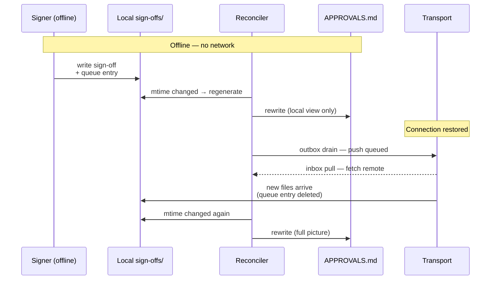

# RFC: Multi-team approval across Claude Code sessions

**Status:** Implemented — all 5 steps shipped 2026-04-26 (step 4 + step 5 via amendments A1/A2). Accepted 2026-04-19 by Charlton Ho. Further changes require an amendment recorded in the sign-off block at the bottom.

Related reading: [CLAUDE.md](../../CLAUDE.md), [docs/SDLC.md](../SDLC.md), [templates/sign-off.md](../../templates/sign-off.md).

---

## 1. Problem

Sign-offs today live in gate files, signed by a human editing the markdown. When one team owns the code, this is simple. When a change needs multiple teams' approval — security + product, backend + frontend, compliance + dev — the model breaks down:

- Team B is in a different repo / different Claude Code session
- Team A's session has no native way to see "has security signed off yet?"
- Coordination is ad-hoc (Slack, PR comments, "did you sign the gate file yet?")
- Audit trail is split across artifacts that don't reference each other

The existing `templates/sign-off.md` captures one approver against one change request. It has no notion of role, no notion of *which teams are still pending*, and no contract for how approvals arrive from other sessions or other tools.

## 2. Design goals (mapped to core principles)

| Principle | How this RFC respects it |
|---|---|
| 1. Human in the lead | Every sign-off is a human signature. No auto-approval, no subagent can produce one. |
| 2. Plan before code | Unchanged — approvals gate post-plan phases, not pre-plan. |
| 3. Surgical edits | Unchanged. |
| 4. Work-item traceability | **Strengthened.** Every approval references a REQ ID and a gate file. |
| 5. Graceful degradation | **Load-bearing.** Works fully offline with local files. Network share, git, and Slack are optional transports, never required. |
| 6. Stack-agnostic | **Load-bearing.** No tool-specific logic in skills or hooks. `APPROVALS.md` is plain markdown. Slack is a *file drop*, not an identity source. |

No direct conflict with the six principles.

## 3. Proposed design

### 3.0 Component overview

The plugin core owns `sign-offs/` and `APPROVALS.md`. Transports are optional pipes that move files in and out of `sign-offs/`; external tools are never trusted as sources of truth.



### 3.1 Approval artifact contract

One file per signer, at `.claude/sdlc/sign-offs/<REQ-ID>-<role>.md`. The plugin's reconciler treats this location as **authoritative**: every transport syncs files *into* this directory.

Fields (YAML frontmatter + statement block):

```markdown
---
req_id: REQ-042
gate_ref: .claude/sdlc/gates/design-auth-refresh.md
gate_hash: sha256:e3b0c44298fc1c149afbf4c8996fb92427ae41e4649b934ca495991b7852b855
role: security
signer: juan.delacruz@acme.com
timestamp: 2026-04-19T14:22:00Z
transport: network-share
evidence: share://approvals/REQ-042/security.md
---
I, Juan Dela Cruz (Security), approve REQ-042 per gate `design-auth-refresh`.
Reviewed threat model §3; OWASP A02 addressed.
```

`gate_hash` is the sha256 of the gate file content **above the `## Required sign-offs` heading** (or the whole file if that heading is absent), captured at signing time. This lets the required-role list evolve — e.g., adding a signer — without invalidating already-filed sign-offs, while still flagging changes to the *design content* the signer reviewed. The reconciler compares it against the current gate hash and warns on mismatch — see §6.5.

This extends [templates/sign-off.md](../../templates/sign-off.md) with four fields needed for cross-team reconciliation (`role`, `transport`, `req_id`, `gate_hash`) while preserving the original's approver/date/evidence/statement shape. A new template `templates/sign-off-multi.md` will mirror this contract.

**Why one file per signer, not one file per gate:** parallel signing. Two teams can produce their files independently without merge conflicts. The reconciler composes them into a gate view.

### 3.2 Gate-file integration

Gate files declare required sign-offs in a new, parseable block:

```markdown
## Required sign-offs
- security
- product
- compliance
```

Roles are free-form strings; the plugin doesn't enforce a fixed vocabulary. Teams define their own.

### 3.3 Reconciliation hook

A new hook `hooks/approval-reconcile.sh` runs:

- **PreToolUse** on phase-advance commands (`/test`, `/deploy`, etc.) — reads the current gate file's `## Required sign-offs` block, checks `.claude/sdlc/sign-offs/` for one file per required role, and **warns (exit 0 with stderr)** if any are missing.
- **Stop** — same check, surfaces status in the turn summary.

Warn, not block — consistent with the plugin's hook-strictness philosophy (CLAUDE.md §"Hook strictness"). The human decides whether to proceed.

Teams that want hard enforcement should layer it in CI against the git-tracked `APPROVALS.md` (§3.5), not inside the plugin. Keeping the plugin warn-only avoids a config toggle that rewards cargo-cult enablement and then produces false positives at the phase-advance boundary.

### 3.4 Transport ladder

Transports *deliver* sign-off files into `.claude/sdlc/sign-offs/`. They never replace it.

| Tier | Transport | Config key | When used | Failure mode |
|---|---|---|---|---|
| 0 | Local file | — | Baseline; signer authors the file in their own session | Always works |
| 1 | Network share | `approvals.share_path` | Enterprise environments with SMB/NFS; cross-repo visibility | Reconciler warns if path unreachable; local still works |
| 2 | Git central repo | `approvals.git_repo` | Orgs with a shared git host; strong audit trail | Warn on fetch failure; local still works |
| 3 | MCP connector | `approvals.mcp.*` | Teams whose approvals naturally live in another tool (Slack, GitHub, Jira, ServiceNow, …) | No connector in core today (§3.7); when one is loaded, warn if unreachable and drain queue on reconnect |

**Local is authoritative.** All transports are eventual-consistency pipes. A signer who authors the file locally has produced a valid sign-off regardless of transport availability.

**Online-sync behavior (tiers 1–3).** The reconciler treats connectivity as a property of each run, not a precondition. When a tier's destination is unreachable, the reconciler writes a small queue entry under `.claude/sdlc/sign-offs/.queue/<REQ-ID>-<role>.<transport>` — a sidecar, not a modification of the signed file. On the next reconciler run where the destination *is* reachable, the outbox drains (pushes queued files and deletes their queue entries) and the inbox pulls (fetches externally-produced sign-offs into `sign-offs/`). The signed artifact itself never changes after it is authored. Signers can work fully offline; the shared view catches up without manual intervention. Conflict handling is covered in §6.7.

### 3.5 Git mirror: `APPROVALS.md`

When the repo is git-tracked, the reconciler regenerates a tracked file `APPROVALS.md` at the repo root listing open and closed approvals:

```markdown
# Approvals

> Generated from `.claude/sdlc/sign-offs/` by `approval-reconcile.sh`. Do not edit by hand.
>
> **On git merge conflict:** accept either side. The reconciler will regenerate from `sign-offs/`
> on its next run and warn if it detects leftover merge markers.

## Open
- REQ-042 — waiting on: compliance
  - [x] security — juan.delacruz@acme.com — 2026-04-19
  - [x] product — (pending)
  - [ ] compliance — (pending)

## Closed
- REQ-039 — all sign-offs received 2026-04-12
```

This is the "todo in git" surface: pending approvals show up in PR diffs, git blame, and any tool that reads markdown. It is plain markdown — no GitHub-specific integration, no Jira hook. Stack-agnostic.

**Regeneration vs. hand-edit:** the file is machine-generated; hand-edits are overwritten. A header comment warns. Teams that want richer tracking can add a separate hand-edited file; the plugin owns only `APPROVALS.md`.

**Regeneration trigger.** Regenerate when `.claude/sdlc/sign-offs/` directory mtime is newer than `APPROVALS.md`'s header timestamp. This gives the same freshness guarantee as running on every reconciler invocation without updating the file's mtime when nothing changed — avoiding spurious `git status` dirt. See §6.2.

**Regeneration across sync events.** Because `APPROVALS.md` is generated purely from the local `sign-offs/` directory, offline and online behavior share the same code path. Offline signers produce files locally; the next reconciler run regenerates `APPROVALS.md` to reflect them (no network needed). On reconnect, the transport sync (§3.4) pulls external sign-offs into `sign-offs/`, bumps its mtime, and the next reconciler run regenerates with the full picture.



**Guiding the human through merge conflicts.** Two layers, both stack-agnostic and requiring no client-side git config:

1. **File-header rule.** The generated `APPROVALS.md` begins with a blockquote stating the resolution rule: *accept either side; the reconciler will regenerate from `sign-offs/` on its next run.* Visible in both raw markdown and rendered views.
2. **Reconciler self-heals.** On each run, the reconciler scans `APPROVALS.md` for leftover merge markers (`<<<<<<<`, `=======`, `>>>>>>>`). If found, it auto-regenerates from `sign-offs/` and surfaces a warning naming the affected REQs — the human sees what happened and can verify.

The file remains a *rendered view* over the authoritative `sign-offs/` directory. `sign-offs/` is truth; `APPROVALS.md` is the PR-visible projection.

### 3.6 Identity model

External tools are **file-drop transports, not signature sources.** A signer authors the sign-off file (in their own Claude Code session or by hand); the transport moves it *out* to the external system and *in* from others. The plugin does not read external user IDs, does not map them to emails, and does not trust external authentication layers. Each MCP connector documents its own identity semantics externally; the plugin core stays agnostic.

Three alternatives were considered and rejected (see §5).

**Consequence:** the "approve from my phone by replying yes" pattern is *not supported by the plugin core.* Teams that want it must build a connector or sidecar outside the plugin that produces a valid sign-off file on their behalf. The plugin reconciles whatever files appear in `sign-offs/`.

### 3.7 MCP connector transport (deferred)

Tier 3 is opened as a config surface (`approvals.mcp.*`) but the transport contract itself is **deferred** — no connector ships with the plugin core, and we'd rather shape the contract against a real connector than up-front. Until a first connector lands, tier 3's behavior is: config is accepted, reconciler warns "no connector loaded," and the approval flow falls through to tiers 0–2. When the first connector lands, its repo will propose the operation contract (list / fetch / push or whatever shape fits) as an amendment to this RFC. Principle 6 is preserved: no tool name appears in any skill or hook.

### 3.8 Role vocabulary and velocity

The suggested role vocabulary (§6.4) and the queueing cost of enumerating roles on every gate. The matrix of *which role signs which gate* lives in [Appendix A](#appendix-a--role-to-gate-mapping-matrix) — it is guidance, not enforcement, and repos pick which roles a specific change actually needs.

**Role definitions**

- **product** — Owns the product vision and user outcomes. Signs that the ask is worth building (Plan), REQs capture the intent (Analyze), and the release is ready for users (Deploy).
- **ba** — Business analyst; translates stakeholder needs into concrete, testable requirements. Signs that requirements are complete and unambiguous (Analyze); optionally validates acceptance in Test.
- **architecture** — Technical lead or architecture review board. Signs that the design fits existing system constraints, avoids duplication, and handles cross-cutting concerns (Design).
- **security** — Application security / infosec engineer. Signs the threat model and design (Design), security-critical code paths (Build, situational), and release-time vulnerability posture (Deploy); on-call during Support incidents.
- **privacy** — Data protection officer (DPO) or privacy engineer. Signs when the change touches personal data — confirming lawful basis, retention, GDPR/CCPA compliance (scope-triggered across Analyze, Design, Deploy).
- **compliance** — Regulatory / audit lead. Signs when the change falls under industry regulation (SOX, HIPAA, PCI, etc.) — confirming controls are met and audit evidence is captured (scope-triggered across Plan, Analyze, Deploy).
- **sre** — Site reliability / platform engineer. Signs that the change is operationally sound — deployable, monitorable, has a runbook and a viable rollback plan (Design, Deploy, Support).
- **qa** — Quality assurance lead representing the test organization. Signs that test coverage meets policy, exploratory testing is done, and no blocker defects remain (Test); optionally co-signs Deploy.
- **legal** — Legal counsel. Signs when the change touches IP, open-source licenses, third-party data sharing, or contractual terms (scope-triggered across Design, Deploy).

**Velocity considerations (for scrum teams).** Multi-team sign-off is overhead. The plugin mitigates queueing with one-file-per-signer (parallel signing), warn-not-block defaults, offline outbox drain for cross-timezone work, and the `/fix-fast` bypass for small fixes. The biggest velocity lever, though, is in the team's hands: *which roles a gate actually requires*. Surgical role scoping on each story adds a single-digit-percent overhead; cargo-culting all nine roles on every story can halve sprint velocity. Treat the matrix in [Appendix A](#appendix-a--role-to-gate-mapping-matrix) as a tool for narrowing, not a checklist to satisfy.

### 3.9 Threat model and limits

Sign-offs in this design are **attested artifacts, not cryptographic attestations.** The plugin trusts whatever conforming file appears in `.claude/sdlc/sign-offs/`. Specifically:

- The `signer` field is self-asserted. Anyone with write access to `sign-offs/` can author a file claiming to be anyone. There is no cryptographic check.
- Every transport inherits this: a network share, a git repo, or an MCP connector is trusted to the extent its *write-access control* is trusted. Compromise of any one transport that feeds `sign-offs/` compromises the approval record.
- Transport-level identity (Slack user, GitHub reviewer, etc.) is only as strong as the connector's identity resolution, which each connector's own repo documents. The plugin core does not verify it.

**What the design relies on instead.** The same social/audit guarantees that today's single-signer [templates/sign-off.md](../../templates/sign-off.md) relies on: git history for tamper-evidence, the `evidence` field (§6.6) for a link to an external record, PR review for human cross-check, and real-world consequences for a person caught forging a sign-off. Teams wanting cryptographic signatures should add a signed-commit or HMAC layer *outside* the plugin — we rejected building it in (§5) on friction grounds.

**What this means in practice.** Treat sign-offs as IOUs with an audit trail, not as proofs. They document who-said-what-when to the degree that write access to the relevant files and transports is controlled. Escalating from "IOU" to "attestation" is the team's responsibility, not the plugin's.

## 4. Degradation matrix

| Scenario | Behavior | Principle |
|---|---|---|
| No network, no git, no Slack | Local `sign-offs/` only. All signers commit files directly. | 5 — always works offline |
| Share configured but unreachable | Warn on reconcile; local signatures still count | 5 |
| Git configured but unreachable | Warn on reconcile; `APPROVALS.md` regenerates from whatever is local | 5 |
| MCP connector unreachable | Warn only if `approvals.mcp.*` is set; new sign-offs get a queue entry under `sign-offs/.queue/`; outbox drains on next reachable reconcile | 5 |
| Required role has no sign-off file | Warn. Teams that want hard enforcement layer a CI check on the git-tracked `APPROVALS.md` | 1 — human decides |
| Sign-off file present but `gate_ref` points at a gate that doesn't exist | Warn; reconciler flags as "orphan" | 4 |

## 5. Alternatives considered

Mapped to the five options in [pending-analysis.md §3](./pending-analysis.md#3-multi-team-approval-across-claude-code-sessions):

| Option (pending-analysis) | Decision | Reason |
|---|---|---|
| A — multi-signature gate files | **Partially adopted.** We keep the gate file as the declaration of required signers (3.2), but move the signatures themselves into per-signer files (3.1) so teams sign without merge conflicts. | Parallel signing. |
| B — external approval references | **Absorbed.** The git transport (3.4 tier 2) is a constrained form of this. | Simpler than arbitrary URL refs. |
| C — shared central approvals repo | **Adopted as tier 2.** Not as the primary model. | Graceful degradation requires local to be canonical. |
| D — integrate with GitHub / Jira / etc. | **Partially adopted** via the deferred MCP connector transport (§3.7). Specific integrations ship outside the plugin core; the contract itself is deferred until a real connector shapes it. | Keeps principle 7 while enabling the integrations users want. |
| E — document the manual pattern, don't solve | **Rejected.** The artifact contract is cheap, the reconciler is cheap, and the gap is real. | Demand is concrete. |

Rejected identity models (for §3.6):

| Model | Why rejected |
|---|---|
| Slack author = signer | Requires Slack API integration; spoofable if channel→role isn't enforced; Slack messages are editable |
| Signed phrase / HMAC challenge | Signers must manage secrets; friction for product/compliance signers; overkill |
| Two-factor (Slack + local confirm) | Two steps per approval kills the mobile-convenience value |

## 6. Open questions

Each question below must be answered before the RFC can be marked **Accepted** in §8. A proposal is recorded for each; reviewers either confirm the proposal (write "confirm proposal") or replace it with an alternative. Record the resolution inline under **Answer**.

### 6.1 Locking on network shares

Concurrent writes from two sessions to the same share path — acceptable or needs file locking? SMB and NFS behave differently.

- **Proposal:** rely on one-file-per-signer to avoid overlap; document that the plugin does not implement locking.
- **Answer:** Confirmed. The plugin does not implement locking. One-file-per-signer (§3.1) eliminates collisions in the common case; the remaining risk — two signers claiming the same role for the same REQ — is a *conflict*, not a locking problem, and is handled by §6.7.

### 6.2 `APPROVALS.md` regeneration timing

On every reconcile run, or only on phase advance?

- **Proposal:** on every reconcile (cheap; keeps the file fresh).
- **Answer:** Regenerate when `.claude/sdlc/sign-offs/` directory mtime is newer than `APPROVALS.md`'s header timestamp — same freshness as "every reconcile" without spurious mtime churn. Merge conflicts guided in two layers: file-header rule, and reconciler self-heal on leftover merge markers. Archival / bounded-growth is deferred until the active list actually grows long enough to matter. See §3.5.

### 6.3 `/fix-fast` interaction

The fast-path collapses Plan + Analyze + Design; cross-team approval is almost certainly out of scope for a ≤2-file, ≤50-LOC fix.

- **Proposal:** `/fix-fast` does not parse `## Required sign-offs` and does not run the reconciler. Documented exception.
- **Answer:** Confirmed. If a task needs cross-team sign-off it is out of `/fix-fast` scope by definition — fix-fast eligibility already excludes schema/API/security/UX changes. The correct response is "promote to `/plan`," not widening the fast path. To be documented alongside the fix-fast eligibility rules in [docs/SDLC.md](../SDLC.md).

### 6.4 Role vocabulary

Free-form per §3.2, but should the plugin ship a suggested list (security, product, compliance, sre, legal)?

- **Proposal:** yes, in [docs/SDLC.md](../SDLC.md) as guidance, not enforcement.
- **Answer:** Per-repo configurable vocabulary. New config key `approvals.roles` in `config/tools.json`. Default suggested list (9 roles): `security, product, compliance, sre, legal, privacy, architecture, qa, ba`. Reconciler warns on unknown roles (catches typos) but does not enforce membership. See §3.8 for role definitions and velocity considerations; [Appendix A](#appendix-a--role-to-gate-mapping-matrix) for the suggested role-to-gate mapping matrix.

### 6.5 Signer revocation

If Juan signs, then the design changes substantively — is Juan's sign-off auto-invalidated?

- **Proposal:** no, but the reconciler warns when `gate_ref`'s mtime is newer than the sign-off's `timestamp`. Human judgment call.
- **Answer:** No automatic invalidation — stays a human judgment call (principle 1). Replace mtime comparison with a `gate_hash` field in the sign-off frontmatter: at signing time, capture `sha256` of the referenced gate file's content; the reconciler compares against the current gate hash and warns on mismatch. Content hash fires only on *actual* content drift in the reviewed material — not on `touch`, rebase, fresh clone, filesystem restore, or adding a new required role to the gate's sign-off list. The hash covers the gate file content *above* the `## Required sign-offs` heading; see §3.1 for the field.

### 6.6 Evidence field integrity

Can the `evidence` URL point at something mutable (a Slack message that gets deleted)?

- **Proposal:** document that evidence should be immutable where possible; no enforcement.
- **Answer:** Confirmed. No enforcement — parsing arbitrary URL schemes would couple the plugin to specific tools (principle 7). Accompany with a short **evidence quality ladder** in docs: *prefer* git SHA, PDF path with sha256, archived email message ID, signed commit; *avoid* Slack message links, editable wiki pages, cloud-doc URLs without a version pin.

### 6.7 Sync conflict resolution

If a sign-off exists both locally and externally (via an MCP connector) with different content, which wins? One-file-per-signer (§3.1) makes this rare, but not impossible — e.g., two sessions edit the same `REQ-042-security.md` before either syncs.

- **Proposal:** last-write-wins by `timestamp` field; the losing copy is preserved as `REQ-042-security.conflict.md` for human review; reconciler warns.
- **Answer:** No automatic winner. Last-write-wins on `timestamp` risks clock-skew silent overwrites and makes a judgment call without a human (principle 1). On conflict, preserve both variants as `REQ-042-security.local.conflict.md` and `REQ-042-security.remote.conflict.md`; the reconciler blocks that specific role as "conflicting" until a human picks one and deletes the other. More friction, better principle fit. Applies only across transports. Within a single connector (e.g., two Slack messages for the same role), dedup is connector-internal and documented by each connector's own repo.

## 7. Rollout

Incremental. Each step is independently valuable and stops a useful place:

1. **Contract + template + reconciler (tier 0 only).** Ship [templates/sign-off-multi.md](../../templates/), `hooks/approval-reconcile.sh`, and the `## Required sign-offs` gate-file convention. Teams can already do multi-team approval via local files + manual distribution.
2. **Git mirror (`APPROVALS.md`) + merge guidance.** Add the generator with the mtime-gated trigger, the file-header merge rule, and the reconciler's leftover-merge-marker self-heal. Stack-agnostic; no config.
3. **Network share transport (tier 1).** Add `approvals.share_path` support. Simple copy-in, copy-out.
4. **Git transport (tier 2).** ~~Add `approvals.git_repo` with fetch/push semantics.~~ **Shipped 2026-04-26** — see amendment §A1.
5. ~~**MCP connector transport (tier 3).** Accept `approvals.mcp.*` config and wire the outbox/inbox drain as a subphase of the reconciler; the connector operation contract itself stays deferred (§3.7) until the first real connector proposes its shape as an amendment. Reference connectors (Slack, GitHub) ship in separate repos, not in the plugin core.~~ **Shipped 2026-04-26** — see amendment §A2.

Stop after step 1 if usage stays flat. *Flat* means, concretely: fewer than ≥3 repos adopting the step, or fewer than ≥5 sign-offs produced across those repos, or less than ≥4 weeks of observation — whichever threshold isn't met. Each further step is gated on seeing real adoption of the previous one.

## 8. Decision & sign-off

**Decision:** **Accepted** — 2026-04-19.

**Prerequisite:** all seven questions in §6 had to have a recorded **Answer** before this section was signed. The sign-off below attests that the answers in §6 are the ones the plugin will implement.

Now that this RFC is accepted, the `Status` line at the top is updated and [pending-analysis.md §3](./pending-analysis.md#3-multi-team-approval-across-claude-code-sessions) points here as the accepted RFC. Implementation proceeds per the rollout in §7.

### Sign-off

- **RFC:** [multi-team-approval.md](./multi-team-approval.md) (this file)
- **Maintainer:** Charlton Ho (author)
- **Date:** 2026-04-19
- **Evidence:** commit `54437d4` on `main` at `lantisprime/claude-sdlc`

**Statement**

> I, Charlton Ho (author), approve this RFC for implementation in the sdlc-plugin
> repository. The answers in §6 reflect the implementation path; the design in §3, the
> degradation model in §4, and the rollout sequence in §7 define the scope of work.
> Material deviations during implementation will be recorded here before they land.

**Signature:** commit `54437d4` on `main` — self-referencing per §3.9's IOU model; verifiable against git history.

---

## Amendment §A1 — Step 4 shipped ahead of adoption gate (2026-04-26)

**Decision:** Step 4 (git transport, tier 2) shipped on 2026-04-26 without waiting for the §7 adoption gate (≥3 repos, ≥5 sign-offs, ≥4 weeks of step 3 observation). The maintainer exercised author discretion to proceed.

**Design decisions recorded here per the original sign-off statement:**

- `approvals.git_repo` points to a **dedicated central approvals repo** whose root is the sign-offs store (flat `.md` files at root). This resolves the open "sparse checkout vs. dedicated branch" question in favor of a dedicated repo — no sparse checkout needed, no branch juggling, most portable across enterprise git versions.
- Conflict logic in `sync_signoff_git` applies **both directions**: any timestamp mismatch (local-newer or remote-newer) produces `.local.conflict.md` + `.remote.conflict.md` locally; neither side is auto-pushed. This is stricter than tier 1's `sync_signoff` (which silently overwrites on local-newer) and correctly implements §6.7's resolved answer.
- On push failure, staged files are **re-queued** as `.git-transport` entries before tmpdir cleanup. The "retry on next run" path is real — not an orphaned commit.
- `git pull --rebase` before push handles the common concurrent-push case. Shallow clone (`--depth=1`) ancestry failures on force-pushed remotes are documented in the hook but not prevented — acceptable at current adoption scale.

**Signed:** Charlton Ho (author) — commit to follow on `main` at `lantisprime/claude-sdlc`.

---

## Amendment §A2 — Step 5 shipped ahead of adoption gate (2026-04-26)

**Decision:** Step 5 (MCP connector transport, tier 3) shipped on 2026-04-26 without waiting for the §7 adoption gate (≥3 repos, ≥5 sign-offs, ≥4 weeks of step 4 observation). The maintainer exercised author discretion to proceed, consistent with §A1.

**Design decisions recorded here per the original sign-off statement:**

- `approvals.mcp.connector` names the MCP connector to use for tier 3 transport. The field is `null` by default (tier 3 disabled) and must be set explicitly in `config/tools.json`.
- When set, `approval-reconcile.sh` queues local sign-offs as `.mcp` queue entries under `.claude/sdlc/sign-offs/.queue/` and emits a sync prompt for Claude to act on. The connector operation contract remains deferred (RFC §3.7); Claude handles the actual MCP call after reading the hook output.
- No reachability probe or operation contract is wired in the hook — those semantics belong to the first connector's amendment (§3.7). Queue entries persist until the connector confirms sync and removes them.
- The `/configure` wizard's Q6 gains option E (MCP connector) and a corresponding Q7 branch for the connector name, consistent with how options B (network share) and C (central git) were wired for steps 3 and 4.

**Signed:** Charlton Ho (author) — commit to follow on `main` at `lantisprime/claude-sdlc`.

---

## Appendix A — Role-to-gate mapping matrix

**Legend:** ● typically required · ○ situational (depends on scope) · blank = not expected

| Role | Plan | Analyze | Design | Build | Test | Deploy | Support |
|---|:-:|:-:|:-:|:-:|:-:|:-:|:-:|
| product | ● | ● |  |  | ○ | ● |  |
| ba | ○ | ● |  |  | ○ |  |  |
| architecture | ○ |  | ● |  |  |  |  |
| security |  |  | ● | ○ |  | ● | ○ |
| privacy |  | ○ | ○ |  |  | ○ |  |
| compliance | ○ | ○ |  |  |  | ● | ○ |
| sre |  |  | ○ |  |  | ● | ● |
| qa |  |  |  |  | ● | ○ |  |
| legal |  |  | ○ |  |  | ○ |  |

**Notes**

- **Build** phase has no typical cross-team sign-off. Code review + adjacent-function detector + tests inside the dev team cover it.
- **`privacy`, `legal`, `compliance`** are *scope-triggered* — only require them when the work actually touches data handling, IP/licensing, or regulated concerns. Declaring them on every gate trains teams to rubber-stamp.
- **`product`** appears twice intentionally — approving the ask at Plan and approving the release at Deploy are different questions.
- **Docs (phase 8)** is cross-cutting with no dedicated gate file; attach docs sign-off to whichever phase gate touches user-facing content.
- **`/fix-fast`** skips the reconciler entirely (§6.3).
