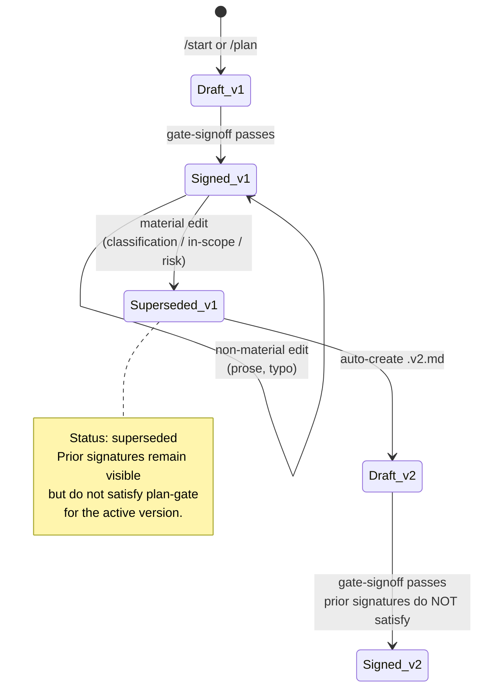

# RFC: Guided Entry, Session Resume, and Approval UX

**Status:** Accepted — 2026-04-25 by lantisprime. Merged via PR #1 (https://github.com/lantisprime/claude-sdlc/pull/1). Further changes require an amendment.
**Author:** Charlton Ho
**Target:** `lantisprime/claude-sdlc`
**Date:** 2026-04-20
**Reshaped:** 2026-04-24

---

## Relationship to `multi-team-approval.md`

The accepted `multi-team-approval.md` (2026-04-19) is the authoritative design for *how* cross-team sign-off works in this plugin: one file per signer under `.claude/sdlc/sign-offs/`, a `## Required sign-offs` block in each gate file, an `approval-reconcile.sh` hook, a transport ladder (Tier 0 local → Tier 1 network share → Tier 2 central git → Tier 3 deferred MCP), and a git-tracked `APPROVALS.md` projection.

This RFC **layers UX surfaces on top of that mechanism.** It does not modify the sign-off contract, the transport ladder, the reconciler, `APPROVALS.md`, or the 9-role vocabulary. Where this RFC touches approvals, it references those constructs verbatim.

The eight PRs below are complementary to the accepted RFC:

- **PR 1** `/status` — read-only task state, renders sign-off progress for the active gate
- **PR 2** `/start` — guided intake, front door for new users
- **PR 3** SessionStart plan-check hook — surfaces in-flight work and unsigned roles
- **PR 4** plan versioning and supersede
- **PR 6** approval packet — derived artifact referenced by the `evidence:` field in sign-off files
- **PR 8** `/configure` — guided configuration, scoped to what the user is actually doing
- **PR 9** glossary + `/help` + shared message library
- **PR 10** automatic next-step hints

Two PRs from earlier draft iterations (in-session multi-role approval chain, distributed sign-off via git commits) were dropped during reshape because they duplicated or conflicted with the accepted RFC's model. See the PR 5 and PR 7 placeholders below for the reshape notes.

---

## Summary

Add eight small, independent improvements to the claude-sdlc plugin that reduce onboarding friction and make the accepted multi-team-approval mechanism easier to live with day-to-day, without modifying any of the plugin's load-bearing invariants.

Each change ships as a separate PR, scoped to one concern, graceful-degrading, optional by default so existing users see no behavior change until they opt in.

## Motivation

Three concrete problems surfaced in discussion:

1. **New users don't know where to start.** The plugin exposes eleven commands. A new user doesn't know which to run first, what information the system needs, or whether their task qualifies for `/fix-fast`. Today they either read the README carefully or run `/plan` with incomplete input.

2. **Session resume is invisible.** On SessionStart, `env-detect.sh` reports integrations but not in-flight SDLC work. A user returning to a project with a half-drafted plan has no signal that one exists, and no prompt to continue or revise.

3. **The accepted multi-team-approval mechanism is discoverable only on explicit inspection.** A returning approver has no pull-side signal that sign-off files are expected from them on the active branch. The mechanism works; the *surfacing* of pending work does not. Today a signer must read the gate file's `## Required sign-offs` block, diff it against `sign-offs/`, and notice their role is still open — or wait to be told. This RFC's PR 3 and PR 1 close that pull-side gap.

A secondary motivation: after multiple rounds of design iteration, the work converged on changes that fit the repo's existing patterns rather than requiring new architecture. This RFC captures that convergence before implementation begins.

## Non-goals

Explicitly not in scope, based on `CLAUDE.md`'s "Things NOT to change" section, the accepted multi-team-approval RFC, and prior design discussion:

- Reordering or renaming the 8 phases
- Adding a 4-phase user abstraction over the 8 internal phases
- Widening `/fix-fast` eligibility rules
- Auto-classifying risk from LOC or file count
- Adding a second convenience path beyond `/fix-fast`
- Renaming any plan artifact field parsed by hooks
- Building appeal paths, reviewer-of-reviewers, or retrospective audits
- Rewriting hooks in Python or JavaScript
- Bundling multiple changes per PR
- **Modifying the accepted multi-team-approval sign-off contract, transport ladder, reconciler, `APPROVALS.md` generator, or 9-role set** — this RFC consumes those constructs; any change to them requires an amendment to that RFC
- Auto-running `/configure` on anything other than first install (Layer 0) or explicit command-time need (Layer 2) — Layer 1 (partial/broken config) stays warn-only
- Auto-writing config without an explicit diff confirmation — `/configure` always shows the proposed change before saving

Deferred work (appeal paths, audit retrospectives, sophisticated delegation) will be reconsidered after real usage generates requirements, not before.

## Proposed changes

### 1. `/status` command — read-only task state

A new command that prints the current in-flight task: active phase, pending gate, blockers, next action, and **sign-off progress for the active gate.** Reads `.claude/sdlc/env.json`, `gates/*.md`, `plans/*.md`, and `.claude/sdlc/sign-offs/`. Writes nothing.

**Sign-off progress render.** When an active gate has a `## Required sign-offs` block (per accepted RFC §3.2), `/status` renders one line showing which roles have landed files in `sign-offs/` and which haven't:

```
Plan: auth-refresh (signed)
Gate: design-auth-refresh (awaiting sign-offs)
Sign-offs: security ✓ | product ✓ | compliance □
Next: await compliance, or /help sign-offs for the sign-off file format.
```

Symbols: `✓` file present in `sign-offs/<REQ-ID>-<role>.md`, `□` expected but absent. The render is **unordered** because the accepted RFC's model is parallel, not sequential — the row's order is the order the roles appear in the gate file's sign-offs block. If no gate is active or the gate has no sign-offs block, the line is omitted.

**Files added:** `commands/status.md`, `skills/status/SKILL.md`
**Files modified:** none
**Rationale:** Attacks the "where am I, what's blocking me" cognitive load directly. The sign-off render recovers most of the "chain visualization" affordance that dropped PRs 5 and 7 had provided, re-expressed honestly against the accepted RFC's unordered parallel model. Pure additive, zero regression risk.

### 2. `/start` command — guided intake

A thin wrapper over the existing `plan` skill. Asks the user: task type, UI impact, API impact, size estimate, then prompts for risk-level declaration with required free-text justification. If answers match `/fix-fast` eligibility, offers to route there. Otherwise hands pre-filled answers to the `plan` skill as Plan v0 draft. Prints a disclaimer at handoff reminding the user they are responsible for reviewing and completing the draft before approval.

**Files added:** `commands/start.md`, `skills/start/SKILL.md`
**Files modified:** `README.md` (command table, quick-start)
**Rationale:** Serves as the front door for new users without duplicating `/plan`'s logic. Risk as declared judgment, not calculation, matches the plugin's human-in-the-lead principle.

### 3. SessionStart plan check hook

A new hook running alongside `env-detect.sh` on SessionStart. Scans `plans/`, `gates/`, and `.claude/sdlc/sign-offs/`, and prints one of:

- **No active work** — nudges the user: "Run `/start` to begin."
- **Drafted-but-unsigned plan** — offers resume or revise.
- **Signed mid-phase task** — shows active phase and next action.
- **Sign-offs pending on `<branch>`** — lists unsigned roles from the active gate's `## Required sign-offs` block. See sub-section below for partial personalization.
- **Multiple active plans** — lists them.

Writes nothing. Blocks nothing. Matches the existing `env-detect.sh` pattern.

**Partial personalization (opt-out).** The hook cross-references `git config user.email` against the `signer:` frontmatter of *previously-signed* sign-off files in the repo. If the returning user's email has historically signed as role X on past REQs, the hook assumes the same person is likely expected to sign as role X on the current REQ, and upgrades the line from *"Sign-offs pending: security, compliance"* to *"Likely awaiting your signature (security) — based on past sign-offs."*

The heuristic is flagged honestly ("based on past sign-offs") and can be silenced per-repo via `display.session_signoff_hints: off` in `config/tools.json`. If no historical sign-off exists for that email, the hook degrades to the unpersonalized list. The plugin does not introduce a role-to-email map in config — the accepted RFC deliberately keeps identity in the sign-off file, not in config, and this RFC honors that.

**Output budget (applies to all SessionStart hooks).** Each SessionStart hook is capped at roughly 5 lines of output by convention; anything longer is hidden behind an on-demand command (`/status` for task detail, `/configure --check` for config-validation detail once PR 8 lands). Goal: the first thing a returning user sees is scannable in under a second.

**Files added:** `hooks/session-plan-check.sh`
**Files modified:** `hooks/hooks.json`
**Rationale:** Surfaces existing state so users can choose to continue, revise, or start new work. The "sign-offs pending" state is the pull-side signal that the accepted multi-team-approval RFC deliberately leaves to UX layers — catching approvers when they next open the repo without the plugin owning notification infrastructure or introducing a role-to-email config. Warn-only, exit 0.

### 4. Plan versioning and supersede

Adds `Version` and `Status` front-matter to `templates/plan.md`. Material edits to a signed plan — changes to scope, classification, in-scope files, or risk level — trigger a rename of the current file to `<slug>.v1.md` with `Status: superseded`, and creation of `<slug>.v2.md`. Prior gate signatures remain visible on superseded files but do not satisfy the plan-gate for the active version. Non-material edits do not version.



The "material edit" prompt fires only when a save touches Classification, In-scope files, In-scope functions, Out-of-scope, or the Risk-level field. All other edits — prose clarification, typo fixes, reformatting — pass silently. Visibility only, no enforcement.

Versioning interaction with accepted RFC's `gate_hash` field: a material edit to a signed plan changes the gate file content, which changes the `gate_hash` computed at sign-off time. The reconciler already warns on hash mismatch per accepted RFC §6.5. Plan versioning makes the mismatch explicit in the artifact itself — prior sign-offs remain on the `v1` file, and the `v2` file accumulates its own sign-offs. Reconciler and version machinery agree on the outcome.

**Soft handling to reduce friction.** Versioning adds concepts (version, supersede, material change) that didn't exist before. Three affordances keep them out of the user's way when possible:

- **Hide version when v1 is the only version.** `/status` and other surfaces render `Plan: <slug>` with no version suffix until v2+ exists. One version costs zero UI.
- **Narrative prompts, not terse confirms.** Instead of "this is a material edit, confirm?", the prompt names the specific field change and its consequence: "Changing risk level from `medium` to `high` will create plan v2. Your v1 sign-off is archived but won't carry over. Continue? [Y/n]". The *why* is in the message.
- **One-line confirmation after a version bump.** Post-save: `Saved as v2. v1 archived at plans/<slug>.v1.md (superseded).` User knows what happened and where to find it.

**Files added:** none
**Files modified:** `templates/plan.md`, `skills/plan/SKILL.md`, `hooks/plan-gate.sh`, `hooks/diff-scope-check.sh`, `docs/SDLC.md`
**Rationale:** Closes the gap where the plan file itself is mutable after signing. Existing `change-request.md` covers scope changes via ceremony; versioning covers them via the artifact itself. Existing unversioned plans continue to work as `Version: 1` implicit.

### 5. [Dropped during reshape]

PR 5 (in-session multi-role approval chain, `approvals.chain` + `assignments` config) was dropped during reshape on 2026-04-24. Multi-role approval is the scope of accepted [multi-team-approval.md](./multi-team-approval.md) — see §3.1 (sign-off file contract), §3.2 (gate-file `## Required sign-offs` block), §3.3 (reconciler hook), and §6.4 (role vocabulary). This RFC does not introduce a parallel chain mechanism; PR 1's `/status` render and PR 3's SessionStart hook surface the accepted model instead.

### 6. Approval packet

A derived artifact compiled at sign-off time containing scope, delta from previous approved version, risk level and justification, mitigation and rollback plan, traceability links, decision required, and reason for approval request. Includes a header disclaimer reminding reviewers the packet is a summary and source artifacts remain authoritative. Every section links to its source.

**Integration with accepted RFC's `evidence:` field.** A sign-off file's `evidence:` field (accepted RFC §3.1) names an artifact that substantiates the sign-off. The packet is designed to be a natural target: a reviewer opens the packet, reads the summary with source links, then writes their sign-off file with `evidence: .claude/sdlc/approval-packets/REQ-042-v2.md`. The packet complements the accepted RFC's §6.6 **evidence quality ladder** (*prefer* git SHA, PDF path with sha256, signed commit; *avoid* editable wiki pages, Slack message links) — a packet in the repo, referenced by relative path, sits at the "prefer" end of that ladder.

If the compiled packet exceeds roughly two screens (around 100 lines), the skill prompts the author to summarize further. Warning, not block.

**Files added:** `templates/approval-packet.md`
**Files modified:** `skills/gate-signoff/SKILL.md`, `docs/SDLC.md`
**Rationale:** Reviewers today must stitch together four or more files to understand what they're signing. The packet is a compile step, not new information. Packet-as-evidence gives the accepted RFC's `evidence:` field a canonical, high-quality default.

### 7. [Dropped during reshape]

PR 7 (distributed sign-off via commits-per-signature, `@@SIGNATURE` gate-file blocks, `CLAUDE_SDLC_APPROVER_IDENTITY` env var) was dropped during reshape on 2026-04-24. The accepted [multi-team-approval.md](./multi-team-approval.md) handles distributed sign-off via **file transports** rather than commits-as-signatures: §3.4 Tier 2 moves sign-off files through a central git repo, §3.5 projects them into a git-tracked `APPROVALS.md`. Identity lives in the `signer:` field of each sign-off file (accepted RFC §3.6), not in a config map or env var. PR 7's companion note is preserved at `docs/rfcs/notes/guided-entry-pr7-degradation.md` with status `superseded` for historical reference.

### 8. Guided configuration (`/configure`)

Replaces manual editing of `config/tools.json` for first-time setup and common reconfigurations. Extends `env-detect.sh` with a config-validation pass; commands that need config they're missing auto-invoke `/configure` in scoped mode and resume afterward. Power users can still edit config files by hand — `/configure` is an on-ramp, not a replacement.

**Files added:** `commands/configure.md`, `skills/configure/SKILL.md`
**Files modified:** `hooks/env-detect.sh`, every skill that reads config (adds `config_requirements` frontmatter), `docs/SDLC.md`

**Four-layer invocation model.**

| Layer | Trigger | Behavior |
|---|---|---|
| 0 | Fresh install: no `config/tools.json`, no `tools.local.json`, no content in `plans/` or `gates/`, inside a git repo | Auto-invoke `/configure` on the first user turn. First prompt is opt-out-first: `[Y] continue / [n] skip / [?] help`. On successful completion, prompt once: `Start a task now? [Y/n]` — if Y, auto-invoke `/start` so "install → configure → first task" is one unbroken flow. |
| 1 | Partial or broken config, no command yet invoked | SessionStart warn-only. Informational: "commands will auto-prompt for config they need when you run them." No auto-invoke. |
| 2 | Command invoked, its required config is missing or malformed | Auto-invoke `/configure --needs <keys>` scoped to the specific fields the command declared. Resume the original command on success; abort with a clear "cannot proceed without `<field>`" on cancel. |
| 3 | Config unparseable (invalid JSON, structurally broken) | Refuse. `/configure` offers rebuild-from-scratch, backing up the current file to `config/tools.json.bak`. |

The rule: **if user intent is unambiguous, auto-invoke; if not, warn.** Layers 0 and 2 mean a new user never has to learn that `/configure` exists — the commands they're already running pull it in at the right moments. `/configure` as a standalone command is only for proactive changes (adding a role, switching tracker), a smaller audience that's happy to type it.

**Scoped mode (`/configure --needs <key[,key...]>`).** Asks only about the specified fields, skips the rest, exits when done or cancelled. Used by Layer 2 so commands don't drag the user into unrelated config questions. Example: `/plan` invokes `/configure --needs tracker.type,tracker.project`, not the full wizard.

**Resume semantics.** When Layer 2 invokes `/configure`, the original command is stashed. On successful completion, it resumes with the new config in scope. On cancel or decline, the original command aborts with a clear message naming the missing field. No silent success, no orphaned state.

**Config requirements declaration.** Each skill that reads config adds a `config_requirements` block to its SKILL.md frontmatter:

```yaml
config_requirements:
  - key: tracker.type
    required: true
    on_skip: refuse
  - key: tracker.auth_token
    required: false
    on_skip: degrade_with_todo_links
```

Layer 2 reads this block to decide what to pass to `/configure --needs` and how to handle cancel. Keeps the auto-invoke logic declarative — no per-command branching.

**Public vs. local config.** Non-secret keys (`approvals.roles`, `approvals.share_path`, `approvals.git_repo`, `tracker.type`, `tracker.project`) go to `config/tools.json` (version-controlled). Auth tokens and anything secret go to `config/tools.local.json`. `/configure` adds `config/tools.local.json` to `.gitignore` on first write if not already present. Always shows a diff of the proposed change before saving — never writes without explicit confirmation.

**Dry-run.** `/configure --check` parses current config, runs the validation pass, prints what would be asked. No prompts, no writes. Mirrors `/status`'s read-only posture.

**First-install question budget: 8 questions maximum.** Layer 0's wizard is capped to keep onboarding from becoming a tax. Progressive disclosure enforces the cap.

**Scope of the multi-team questions (Q5–Q8).** Three things the accepted RFC leaves out of config are deliberately absent from this wizard:

- **No per-role email assignments.** Signer identity lives in the `signer:` field of each sign-off file (accepted RFC §3.1, §3.6), never in config. The wizard does not ask "who signs what."
- **No signed-commit enforcement.** Cryptographic attestation is a team-workflow concern outside the plugin (accepted RFC §3.9). Teams that want `git commit -S` should configure git itself.
- **No tracker-notification-on-signature.** Not in accepted-RFC scope; would need its own mini-RFC before this wizard could prompt for it.

The questions:

1. Tracker type? (Linear / GitHub Issues / Jira / none)
2. Tracker auth token? (only if tracker chosen; stored in `tools.local.json`)
3. Tracker project key or repo? (only if tracker chosen)
4. Will this project use multi-team sign-off? (Y/n) — **if `n`, skip questions 5–8 and finish**
5. Role vocabulary? (suggested 9-role set from accepted RFC §6.4 / custom comma-separated list) — writes `approvals.roles`. *No per-role email prompt follows; identity lives in the sign-off file itself per accepted RFC §3.6.*
6. Sync sign-off files across machines? (none / network share / central git repo / defer). *Transport is a file-delivery mechanism, not an identity source — no signed-commit prompt follows.*
7. (Conditional on Q6) Share path or central git repo URL? — writes `approvals.share_path` or `approvals.git_repo`
8. Enable `display.session_signoff_hints` personalization in PR 3? (Y/n; default Y)

Single sign-off users answer 3 questions and finish. Multi-team users answer up to 8. No question presents a free-text field without a sensible default offered where possible. The budget is a ceiling, not a target — adding a 9th question requires justifying why it can't be deferred to a later reconfigure flow.

**Context-aware defaults.** `/configure` inspects the environment before prompting and pre-selects likely answers: `.github/` directory → suggest GitHub Issues; `.linear.yml` or the Linear CLI on PATH → suggest Linear; `git remote -v` containing `github.com` → suggest GitHub Issues as the secondary default. User can always override; the point is to make the default the user's probable answer so accept-and-continue is a single keystroke.

**Rationale.** `/configure` addresses a concrete, named friction: today's users must read `config/tools.example.json`, infer the schema, and know which fields are secret. `/configure` asks plain-language questions, validates as it goes, handles the public/local split automatically, and — because Layers 0 and 2 auto-invoke — removes the need to memorize the command at all. The question bank stays tight: three questions for single-signer users, up to seven for multi-team users, with one optional display preference.

### 9. Glossary, `/help`, and shared message library

Three user-facing-text assets that ship together because they share the same audience (anyone reading plugin output) and the same failure mode (inconsistent wording confuses users). Bundling keeps the vocabulary, the lookup, and the message phrasing coordinated.

**Glossary.** Adds `docs/GLOSSARY.md` defining the vocabulary this RFC introduces and the accepted-RFC vocabulary it consumes.

RFC-introduced terms: *plan version*, *supersede*, *material change*, *approval packet*, *config requirements*, *Layer 0–3*, *session sign-off hint*.

Accepted-RFC terms this RFC consumes (referenced, not redefined): *sign-off file*, *gate_hash*, *`APPROVALS.md`*, *reconciler*, *transport ladder*, *Tier 0–3*, *role vocabulary*, *evidence field*, *evidence quality ladder*.

Each entry: one-sentence definition, one-sentence context, link to the section or RFC where it's defined. Accepted-RFC terms link to `multi-team-approval.md` directly so the glossary doesn't become a second source of truth.

**Callout: sign-offs are unordered parallel.** A dedicated glossary paragraph (and a one-paragraph note in `/help sign-offs`) explicitly teaches that the accepted multi-team-approval model is parallel, not sequential. No signer waits for another; any ordering seen in output is presentation-only. This prevents users migrating from single-signer or chain-style mental models from assuming an ordering that doesn't exist and getting confused when a "later" role signs before an "earlier" one.

**`/help` command.** Bridges vocabulary, commands, and current state into one "I'm confused" destination:

- `/help` (no arguments) — prints (1) current SDLC state (mirror of `/status` output), (2) the command table with one-line descriptions, (3) the five most-relevant glossary terms for the current state. Three-section layout, clearly delimited, budgeted to fit in one screen.
- `/help <term>` — prints just the matching glossary entry.
- `/help <command>` — prints the command's purpose, arguments, and a usage example.
- `/help sign-offs` — prints the unordered-parallel callout, the sign-off file format, and a pointer to accepted-RFC §3.1.

Showing state alongside vocabulary means a confused user doesn't have to guess whether to run `/status` or `/help` — the bridge-command handles the overlap and points them at the narrower commands when they know what they need.

**Shared message library.** Adds `skills/_shared/messages/` — a catalog of reusable user-facing strings keyed by event ID. Every skill that prints a refuse, degrade, handoff, or warn message reads from the catalog rather than hardcoding text. Examples relevant to the reshaped PR set: `config_unparseable`, `gate_hash_mismatch`, `signoff_file_malformed`, `transport_unreachable`, `session_signoff_hint_personalized`, `session_signoff_hint_unpersonalized`.

Benefits: (1) wording stays consistent across commands; (2) translation/rewording is one file, not a grep across every skill; (3) the `/help` glossary can cross-link to the messages that use each term.

**Files added:** `docs/GLOSSARY.md`, `commands/help.md`, `skills/help/SKILL.md`, `skills/_shared/messages/` (catalog files, one per event category)
**Files modified:** `README.md` (point at GLOSSARY for term lookup), every skill that prints refuse/degrade/handoff/warn messages (reads from the message catalog instead of hardcoding)
**Rationale:** This RFC adds new vocabulary on top of the accepted RFC's vocabulary, and introduces new failure-mode messages. Forcing users to grep docs for definitions, or letting wording drift across skills, are both avoidable frictions. The unordered-parallel callout in particular prevents a common mental-model error that would otherwise keep biting users long after the RFC ships. Ships after PR 8 so the full configuration surface exists when the catalog is first populated.

### 10. Automatic next-step hints

Every user-visible command appends a single "Next:" line at the end of its output, suggesting the most likely next action based on current state. This is not a new command — it is an output convention every skill adopts. The user never runs anything new; the commands they already run get one extra line that teaches the workflow.

Examples:

- `/plan` completes with an unsigned plan → `Next: /status to review, or write your sign-off file at sign-offs/<REQ-ID>-<role>.md when ready.`
- Sign-off file lands and all required roles are covered → `Next: begin analyze phase.`
- `/configure` completes via Layer 2 auto-invoke → *no "Next:" printed — the resumed command IS the next step.*
- `/status` with no active work → `Next: /start to begin a new task.`
- `/status` with a signed mid-phase task → `Next: continue with <phase> commands, or sign the phase gate when ready.`
- `/status` with pending sign-offs and user matches a likely role → `Next: write your sign-off at sign-offs/<REQ-ID>-<role>.md.`

**Declarative per-skill.** Each skill's SKILL.md gains a `next_suggestions` frontmatter block. The suggestion is chosen by matching the `when` condition against current state:

```yaml
next_suggestions:
  - when: plan_drafted_and_unsigned
    suggest: "/status to review, or write your sign-off file at sign-offs/<REQ-ID>-<role>.md when ready"
  - when: plan_signed_and_no_phase_active
    suggest: "begin analyze phase"
```

A shared helper at `skills/_shared/next-hint.sh` resolves `when` conditions against `.claude/sdlc/env.json`, `gates/*.md`, `plans/*.md`, and `sign-offs/*.md` state, and prints the first matching `suggest`. If no condition matches, no "Next:" line is printed — silence is better than a wrong hint.

**Suppression — three honest signals, no guessing at "is this a power user."**

1. **Auto-suppress on non-TTY.** If stdout isn't a TTY (piped output, script, CI), no "Next:" line prints. Zero config, handles automation correctly.
2. **Fade-after-3 per unique hint.** Each distinct `suggest` string has a shown-count tracked in `.claude/sdlc/hints.jsonl`. Once a user has seen a given hint three times, it silently stops appearing for them — regardless of how often the `when` condition fires. New hints (new `when` conditions that haven't been encountered) still get full treatment. The user doesn't classify themselves; each hint retires itself once it has served its teaching purpose.
3. **Explicit opt-out.** `display.next_hints: off` in `config/tools.json` suppresses all hints. For users who want them gone entirely without waiting for the fade.

Combined, these mean: scripts never see hints; new users see them until they internalize (typically 1–3 appearances); returning users aren't re-taught what they already know; anyone can opt out if they want. No heuristic tries to label the human — the system adapts through exposure, which is honest.

**Files added:** `skills/_shared/next-hint.sh`
**Files modified:** every skill's SKILL.md (adds `next_suggestions` frontmatter and invokes `next-hint.sh` at the end of its output), `docs/SDLC.md`

**Rationale.** Cognitive load during a multi-step workflow isn't about the *current* command — it's about "what now?" Users currently have to remember the workflow or re-read docs. Making every command's output self-suggest the next move means users learn the workflow by *using* it. Scales across the entire surface with one convention. The `when`-condition pattern keeps suggestions state-aware rather than generic, so the hint is right for *this* user's *current* situation. Ships last because the convention is easiest to apply uniformly once every skill's output shape is stable.

## Dependency graph and ship order

```
PR 1 (status)             — independent; renders accepted-RFC sign-off state
PR 2 (/start)             — independent
PR 3 (session check)      — independent; interim caveat points users at PR 4
PR 4 (versioning)         — independent; strengthens PR 3's revise path
PR 8 (/configure)         — independent; retroactively reduces setup friction for PR 1–4
PR 9 (glossary + /help)   — best after PR 8 (full new vocabulary has landed)
PR 6 (approval packet)    — best after PR 4 (version-aware delta) and PR 9 (glossary link target)
PR 10 (auto next-step hints) — ships last; applied uniformly across every skill once outputs are stable
```

**Ship order:** 1 → 2 → 3 → 4 → 8 → 9 → 6 → 10

The ordering rationale separates hard dependencies from soft preferences:

- **Hard:** PR 10 must ship last — it rewrites every skill's output shape and is cleanest when every other skill has settled. PR 6 uses PR 4's version machinery in its delta section, so PR 4 precedes it.
- **Soft (quality-of-rollout):** PR 3 ships before PR 4 because session-resume is the fastest-visible cognitive-load win, not because PR 4 depends on it. Until PR 4 lands, PR 3's "drafted-but-unsigned" output includes a short caveat ("revising a signed plan currently mutates it in place; versioning ships in PR 4"). PR 9 ships after PR 8 because the glossary reads better when `approvals.roles` and the transport config keys are already user-facing; PR 9 would still ship fine before PR 8 with a shorter initial glossary. PR 6 is placed after PR 9 so packet cross-links into the glossary work on day one.

No two PRs block each other outside PR 4→6 and PR 10-last; the rest of the order is a rollout preference, not a constraint.

**Estimated effort:** roughly one week of focused work for one engineer, or one-and-a-half to two weeks calendar with testing, documentation, and iterating on skill descriptions until they trigger reliably. (Reduced from pre-reshape estimate because PRs 5 and 7 represented roughly one-third of the original scope.)

## Alignment with design principles

| Principle | How this RFC preserves it |
|---|---|
| Human in the lead | No PR adds auto-approve. Every sign-off still needs a human authoring a sign-off file per accepted RFC §3.1. PR 3's partial personalization is a *hint*, not a binding claim, and is opt-out. |
| Plan before code | No PR loosens `plan-gate.sh`. PR 4 strengthens it — versioning invalidates stale gates; accepted RFC's `gate_hash` warns on post-sign edits. |
| Surgical edits | Each PR is one concern. No PR spans unrelated skills or hooks. |
| Work-item traceability | No PR adds a bypass. PR 6 makes traceability more visible via the packet and gives the accepted RFC's `evidence:` field a canonical target. |
| Graceful degradation | Every new config key is optional. Missing `approvals` block means current behavior. PR 3's personalization degrades cleanly to the unpersonalized list when no historical sign-off exists for the user's email. |
| Stack-agnostic | No hardcoded tool names. All new hooks use POSIX bash. No new runtime dependencies. |

## What we will measure

Following the existing `token-tracker.sh` pattern: append JSONL lines to a history file. No dashboards, no committed percentage targets.

- Time from `/start` to signed plan gate
- Number of intake iterations before plan submission
- Number of plan versions per task (PR 4 onward)
- Packet length per task (PR 6 onward)
- `/configure` invocation source: Layer 0 auto-launch, Layer 2 resume, or manual (PR 8 onward)
- `/help <term>` lookups by term — which vocabulary confuses users most (PR 9 onward)
- Next-hint accept rate: did the user's next command match the suggested "Next:" line (PR 10 onward)
- Session sign-off hint fire rate and personalization hit rate (PR 3 onward) — how often does the hint trigger, and how often does the historical heuristic produce a personalized line vs. fall back

Metrics describe reality. They do not predict it. No improvement percentages are committed in this RFC — baseline first, interpret later.

## Alternatives considered

**A rewrite with new architecture.** Three design iterations proposed new directory hierarchies (`.claude/sdlc/tasks/<task-id>/`), a new config file (`approval_config.json`), a new state machine, and commands prefixed `/sdlc:*`. Rejected because the repo already implements most of this via `plans/<slug>.md`, `config/tools.json`, gate files, the accepted RFC's `sign-offs/` directory, and the existing command set. Building parallel structure would duplicate rather than improve.

**A 4-phase user abstraction over the 8 internal phases.** Considered in two design rounds. Rejected because exposing both creates a dual vocabulary users must reconcile against error messages, logs, and hooks that speak the 8-phase language. One surface vocabulary is less cognitive load than two.

**Auto-classified risk from LOC and file count.** Considered in design v2. Rejected because LOC thresholds create an illusion of determinism that doesn't hold — a 50-line change to rate-limiting logic is not the same risk as a 50-line rename. Declared judgment with required justification is the honest alternative.

**A forced "reviewer must confirm traceability" checkbox at sign-off.** Considered and rejected. A forced checkbox is friction without function; reviewers who would skip traceability will click the box, reviewers who check it already do so. PR 6's source-link requirement is the nudge; the accepted RFC's `evidence:` field is the non-trivial ack.

**A role-to-email map in config (for PR 3 personalization).** Considered during reshape. Rejected because the accepted multi-team-approval RFC deliberately keeps identity in the sign-off file, not in config, to avoid stale config and to preserve the "signer is self-asserted" threat model (§3.6, §3.9). PR 3's historical heuristic recovers most of the UX value without opening that door.

**An in-session chain render for PR 1.** The dropped PR 5 proposed an ordered chain (`tech_lead ✓ → architect ⏳ → security □`). Rejected at reshape because the accepted RFC's model is parallel, not sequential — a chain render would misrepresent the mechanism. PR 1's unordered pipe-separated render (`security ✓ | product ✓ | compliance □`) is the honest equivalent.

**Appeal paths, reviewer-of-reviewers, sophisticated delegation.** Deferred. Real usage will generate specific requirements; pre-building governance for abuse cases that may not occur is how systems become unusable.

## Open questions

Questions that must be answered before the corresponding PR lands. Each lists a proposal; reviewers confirm or replace with an answer inline.

### OQ-1 — PR 4 material-edit detection for `In-scope files`

The material-edit prompt fires when a save touches the `In-scope files` field of a signed plan. "Touches" is underspecified: does adding a file count? Removing one? Reordering? Renaming a path the linter reformatted? Each choice trades false-positive rate (annoying the user) against false-negative rate (a material change slips through unversioned).

- **Proposal:** material change = the *set* of in-scope files changes (additions or removals). Pure reordering does not trigger. Path rename detected via git rename heuristics (or the user confirms on prompt) counts as set-preserving, not material. This keeps the prompt quiet on cosmetic edits while firing on the cases that matter for `gate_hash` (accepted RFC §6.5) consistency.
- **Answer (resolved 2026-04-25):** Accept proposal as written. Additionally, `Classification` changes are always material — any change to the classification field triggers re-sign regardless of set-vs-ordering framing, because classification determines which hooks fire and what the gate certifies. `In-scope functions` and `Out-of-scope` follow the same set-vs-ordering rule as `In-scope files`.

## Pending discussions

Directions that surfaced during design iteration and are worth resolving before or alongside implementation, but haven't been decided yet. Captured here so they aren't lost; each can fold into an existing PR, become a new PR, or defer to post-ship.

### A. Workflow templates in `/configure`

Offer named presets at Layer 0 question 5 so users with no opinion don't have to design a role vocabulary from scratch:

- **Solo developer** — no sign-off roles required; skips Q5–Q8.
- **Small team** — `approvals.roles: [product, qa]`; sync mode `none`.
- **Open source** — `approvals.roles: [product, architecture]`; sync mode `central git repo` (per-team choice).
- **Enterprise** — `approvals.roles` set to the full 9-role vocabulary from accepted RFC §6.4: `[security, product, compliance, sre, legal, privacy, architecture, qa, ba]`; sync mode `central git repo`.
- **Custom** — free-form list (today's default).

All four non-Custom presets use roles from the accepted RFC's suggested 9-role vocabulary (§6.4). The accepted RFC permits free-form role strings (§3.2) — teams that prefer labels like `tech_lead`, `reviewer`, or `maintainer` should pick **Custom**; the reconciler will still recognize them and warn only on typos, not on presence outside the suggested set.

Each preset bundles matching `approvals.roles` and `approvals.share_path`/`approvals.git_repo` defaults. Would fold into §8 if accepted. Note: presets do not bundle per-role email assignments or signed-commit enforcement — both are deliberately out of scope per accepted RFC.

**Cognitive-load impact: high** — turns "design your role vocabulary" into "pick your situation."

**Resolved (2026-04-25): keep orthogonal.** Workflow presets (this section) configure sign-off mechanics — they are pure config bundled at `/configure` Q5. Domain files (`domains/payments.md` etc.) inject domain knowledge — they are pure content maintained by domain owners. The two serve different purposes and have different stewards. Advisory bridge: domain file schema gains optional `suggested_roles: []`; plan skill surfaces it at plan-time as context but does not enforce or override `approvals.roles`. Both can now build independently. Coordination gate lifted.

### B. Back/cancel navigation in interactive flows

Every interactive prompt across `/configure`, `/start`, and sign-off-file authoring supports:

- `b` — back to the previous question (answers already given are preserved as defaults)
- `?` — contextual help for the current prompt
- `q` — quit without saving

Implemented once in `skills/_shared/prompt.sh` and consumed by every skill that prompts. **Cognitive-load impact: medium** — lowers the stakes on any individual answer; users stop re-reading every question for fear of picking wrong.

### C. Error-message audit to the three-part template

Once PR 9's shared message library exists, every user-facing error and warning in the plugin gets audited and rewritten to match a three-part template:

1. **What happened** ("Sign-off file `sign-offs/REQ-042-security.md` has malformed frontmatter")
2. **Why** ("missing required field `gate_hash`")
3. **What to do** ("re-author via the sign-off template, or run `/help sign-offs` to see the format")

Mechanical once the catalog exists. Could be part of PR 9 scope or ship as a PR 9-follow-on. **Cognitive-load impact: medium-high** — failure moments are peak anxiety; consistent message shape collapses the panic-to-fix cycle.

### D. Integration with Claude Code's native TodoWrite

When a user enters a phase, the plugin could auto-populate Claude Code's native todo list with that phase's checklist. Phase work becomes visible in the same place the user tracks everything else — less context switching between "what does the plugin want?" and "what am I doing?"

Tension: the plugin's design principles claim stack-agnostic posture, but Claude Code is its native environment, and integrating there doesn't break agnosticism for other environments (the integration is gated on Claude Code being present). **Cognitive-load impact: potentially high.** Deferred pending usage data — does the context-switch cost actually bite in practice?

### E. Per-phase checklist rendering in `/status`

`/status` currently shows task state at a high level ("signed mid-phase task"). When in-phase, it could render the phase's checklist with completion markers:

```
Phase 3 of 8 — analyze
  [x] Read CLAUDE.md and relevant READMEs
  [x] Identify in-scope files
  [ ] Identify out-of-scope files
  [ ] Confirm risk level
  [ ] Document assumptions
Next: continue analyze, or write sign-off files when complete.
```

Turns opaque "mid-phase" into concrete progress. Would expand §1's `/status` spec if accepted. **Cognitive-load impact: medium.**

## Security and privacy considerations

No new external services. No new network calls. No new secrets handling beyond what the plugin already does. All state remains local to `.claude/sdlc/` and to the repo's git history.

This RFC preserves the accepted multi-team-approval RFC's threat model intact (§3.9): sign-offs are attested artifacts, not cryptographic attestations; `signer:` is self-asserted; transport inherits the write-access control of whatever moves files. No PR in this RFC introduces a new identity claim or trust assumption.

**PR 3 partial personalization specifically.** The historical-email heuristic reads sign-off files the user already had access to (they're in `.claude/sdlc/sign-offs/`, tracked in the repo). It surfaces no new information — a user who can read their own git history can already infer the same mapping. The hint is advisory, explicitly labeled "based on past sign-offs," and opt-out via config.

Role assignments do not exist in this RFC (accepted RFC keeps identity in the sign-off file, not in config). Teams concerned about role information in repo history should follow the accepted RFC's guidance rather than any new mechanism introduced here.

## Backward compatibility

Every change is default-off or graceful-degrading.

- Existing plan files without `Version`/`Status` front-matter behave as `Version: 1, Status: active`
- Existing `config/tools.json` without an `approvals` block behaves as today's single sign-off; accepted multi-team-approval RFC mechanisms activate only when the corresponding keys (`approvals.roles`, `approvals.share_path`, etc.) are present
- The new SessionStart hook is additive; removing it returns behavior to current
- `/status` and `/start` are new commands; existing `/plan`, `/analyze`, etc. are untouched
- The approval packet is a derived artifact; source files remain authoritative and unchanged in shape
- PR 8 is additive. Hand-edited `config/tools.json` continues to work untouched; `/configure` only modifies fields the user is actively configuring and always shows a diff first. Users who prefer manual editing never have to invoke it (beyond the first-install prompt, which they can skip)
- PR 9 is purely additive — existing users see no change until they run `/help` or read the glossary
- PR 10 modifies output of every skill to append a "Next:" line, but adds no new behavior. Skills with no matching `when` condition print nothing extra, identical to today's behavior

No migration required for existing users.

## Implementation checklist

- [x] PR 1: `/status` command + skill (includes sign-off progress render)
- [ ] PR 2: `/start` command + skill
- [ ] PR 3: SessionStart plan check hook (includes opt-out partial personalization)
- [ ] PR 4: Plan versioning and supersede
- [ ] PR 8: `/configure` command + env-detect config validation (reshaped question bank)
- [ ] PR 9: Glossary + `/help` (with unordered-parallel callout) + shared message library
- [ ] PR 6: Approval packet (as `evidence:` field target)
- [ ] PR 10: Automatic next-step hints (output convention adopted by every skill)
- [ ] Dogfood on 2–3 real projects
- [ ] Collect observed blockers; generate next backlog from real usage

---

*End of RFC.*
