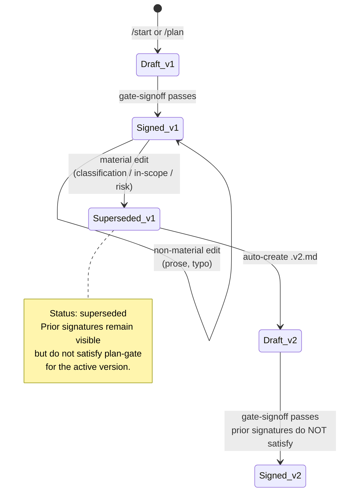
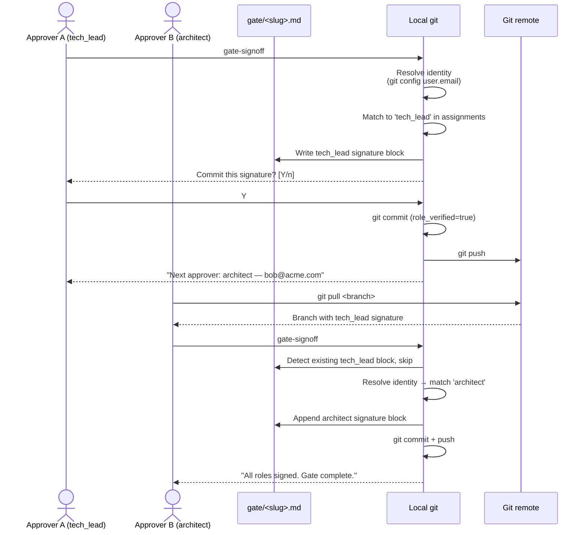

# RFC: Guided Entry, Session Resume, and Multi-Role Approvals

**Status:** Draft — **NEEDS RESHAPE before acceptance.** PRs 5 and 7 conflict with the already-accepted [multi-team-approval.md](./multi-team-approval.md) mechanism (which uses per-signer files under `.claude/sdlc/sign-offs/` + `## Required sign-offs` block in gate files + transport ladder; this RFC's PRs 5 and 7 propose an incompatible `approvals.chain` config + `@@SIGNATURE` blocks inside gate files + git-commits-per-signature). Path-A reshape (drop PRs 5 and 7, adjust PRs 3/6/8/9 to speak multi-team-approval's vocabulary) is pending — work continues next session.
**Author:** Charlton Ho
**Target:** `lantisprime/claude-sdlc`
**Date:** 2026-04-20

---

## Relationship to `multi-team-approval.md`

The accepted `multi-team-approval.md` (2026-04-19) defines *how* cross-team sign-off works in this plugin: one file per signer under `.claude/sdlc/sign-offs/`, a `## Required sign-offs` block in each gate file, a reconciler hook, a transport ladder, and an `APPROVALS.md` git mirror. That mechanism is the authoritative design for multi-team approvals in this repo.

This RFC's *complementary* PRs layer on top of that mechanism without touching it:
- PR 1 `/status`, PR 2 `/start`, PR 3 SessionStart hook, PR 4 plan versioning, PR 6 approval packet, PR 8 `/configure`, PR 9 glossary + `/help` + message library, PR 10 auto next-step hints.

This RFC's *conflicting* PRs need to be dropped or reshaped before acceptance:
- PR 5 (multi-role approval chain) — proposes `approvals.chain` + `assignments` in `config/tools.json`. Conflicts with multi-team-approval's "`## Required sign-offs` in the gate file, roles declared per-gate" model. **Drop.** Any role-configuration work should extend `approvals.roles` as defined in multi-team-approval §6.4 instead.
- PR 7 (distributed sign-off via git) — proposes `@@SIGNATURE` blocks inside gate files and commits-per-signature. Conflicts with multi-team-approval's "sign-off files are separate artifacts, one per signer, synced via transport ladder" model. **Drop.** Multi-team-approval's Tier 2 git-central-repo transport already provides distributed sign-off, differently.

Path-A reshape (drop PRs 5 and 7, adjust vocabulary in the rest) is the path forward. This draft preserves today's brainstorming for tomorrow's session.

---

## Summary

Add six small, independent improvements to the claude-sdlc plugin that reduce onboarding friction and support multi-team approval workflows, without modifying any of the plugin's load-bearing invariants.

The changes ship as six separate PRs, each scoped to one concern, each graceful-degrading, each optional by default so existing users see no behavior change until they opt in.

## Motivation

Three concrete problems have surfaced in discussion and in principle, though not yet validated against real usage:

1. **New users don't know where to start.** The plugin exposes eleven commands. A new user doesn't know which to run first, what information the system needs, or whether their task qualifies for `/fix-fast`. Today they either read the README carefully or run `/plan` with incomplete input.

2. **Session resume is invisible.** On SessionStart, `env-detect.sh` reports integrations but not in-flight SDLC work. A user returning to a project with a half-drafted plan has no signal that one exists, and no prompt to continue or revise.

3. **Single sign-off and single-machine sign-off don't scale to distributed contributors.** `gate-signoff` captures one human signature in one Claude Code session on one machine. Open-source contributors approving a plan from different continents, or even a small team with a tech lead in a different office, cannot both sign the same gate today without co-locating at one keyboard. Organizations with formal change control need tech-lead, architect, and approver sign-offs in sequence — typically across three different people on three different machines.

A secondary motivation: after three rounds of design iteration on these problems, the work converged on changes that fit the repo's existing patterns rather than requiring new architecture. This RFC captures that convergence before implementation begins.

## Non-goals

Explicitly not in scope, based on `CLAUDE.md`'s "Things NOT to change" section and prior design discussion:

- Reordering or renaming the 8 phases
- Adding a 4-phase user abstraction over the 8 internal phases
- Widening `/fix-fast` eligibility rules
- Auto-classifying risk from LOC or file count
- Adding a second convenience path beyond `/fix-fast`
- Renaming any plan artifact field parsed by hooks
- Building appeal paths, reviewer-of-reviewers, or retrospective audits
- Rewriting hooks in Python or JavaScript
- Bundling multiple changes per PR
- Auto-running `/configure` on anything other than first install (Layer 0) or explicit command-time need (Layer 2) — Layer 1 (partial/broken config) stays warn-only
- Auto-writing config without an explicit diff confirmation — `/configure` always shows the proposed change before saving

Deferred work (appeal paths, audit retrospectives, sophisticated delegation) will be reconsidered after real usage generates requirements, not before.

## Proposed changes

### 1. `/status` command — read-only task state

A new command that prints the current in-flight task: active phase, pending gate, blockers, next action. Reads `.claude/sdlc/env.json`, `gates/*.md`, and `plans/*.md`. Writes nothing.

**Files added:** `commands/status.md`, `skills/status/SKILL.md`
**Files modified:** none
**Rationale:** Attacks the "where am I, what's blocking me" cognitive load directly. Pure additive, zero regression risk.

### 2. `/start` command — guided intake

A thin wrapper over the existing `plan` skill. Asks the user: task type, UI impact, API impact, size estimate, then prompts for risk-level declaration with required free-text justification. If answers match `/fix-fast` eligibility, offers to route there. Otherwise hands pre-filled answers to the `plan` skill as Plan v0 draft. Prints a disclaimer at handoff reminding the user they are responsible for reviewing and completing the draft before approval.

**Files added:** `commands/start.md`, `skills/start/SKILL.md`
**Files modified:** `README.md` (command table, quick-start)
**Rationale:** Serves as the front door for new users without duplicating `/plan`'s logic. Risk as declared judgment, not calculation, matches the plugin's human-in-the-lead principle.

### 3. SessionStart plan check hook

A new hook running alongside `env-detect.sh` on SessionStart. Scans `plans/` and `gates/` and prints one of:

- **No active work** — nudges the user: "Run `/start` to begin."
- **Drafted-but-unsigned plan** — offers resume or revise.
- **Signed mid-phase task** — shows active phase and next action.
- **Awaiting your signature on branch `<name>`** — fires when identity resolves via `git config user.email` or `CLAUDE_SDLC_APPROVER_IDENTITY`, `approvals.assignments` is configured (PR 5), and the resolved identity maps to an unsigned role on an active gate.
- **Multiple active plans** — lists them.

Writes nothing. Blocks nothing. Matches the existing `env-detect.sh` pattern.

**Output budget (applies to all SessionStart hooks).** Each SessionStart hook is capped at roughly 5 lines of output by convention; anything longer is hidden behind an on-demand command (`/status` for task detail, `/configure --check` for config-validation detail once PR 8 lands). Goal: the first thing a returning user sees is scannable in under a second. This constraint applies to `env-detect.sh`, this hook, and any future SessionStart hook.

**Files added:** `hooks/session-plan-check.sh`
**Files modified:** `hooks/hooks.json`
**Rationale:** Surfaces existing state so users can choose to continue, revise, or start new work. The "awaiting your signature" state is the pull-side complement to PR 5/7's push-side CLI output and tracker comments — catches approvers when they next open the repo without the plugin owning notification infrastructure. Warn-only, exit 0.

### 4. Plan versioning and supersede

Adds `Version` and `Status` front-matter to `templates/plan.md`. Material edits to a signed plan — changes to scope, classification, in-scope files, or risk level — trigger a rename of the current file to `<slug>.v1.md` with `Status: superseded`, and creation of `<slug>.v2.md`. Prior gate signatures remain visible on superseded files but do not satisfy the plan-gate for the active version. Non-material edits do not version.



The "material edit" prompt fires only when a save touches Classification, In-scope files, In-scope functions, Out-of-scope, or the Risk-level field. All other edits — prose clarification, typo fixes, reformatting — pass silently. Visibility only, no enforcement.

**Soft handling to reduce friction.** Versioning adds concepts (version, supersede, material change) that didn't exist before. Three affordances keep them out of the user's way when possible:

- **Hide version when v1 is the only version.** `/status` and other surfaces render `Plan: <slug>` with no version suffix until v2+ exists. One version costs zero UI.
- **Narrative prompts, not terse confirms.** Instead of "this is a material edit, confirm?", the prompt names the specific field change and its consequence: "Changing risk level from `medium` to `high` will create plan v2. Your v1 sign-off is archived but won't carry over. Continue? [Y/n]". The *why* is in the message.
- **One-line confirmation after a version bump.** Post-save: `Saved as v2. v1 archived at plans/<slug>.v1.md (superseded).` User knows what happened and where to find it.

**Files added:** none
**Files modified:** `templates/plan.md`, `skills/plan/SKILL.md`, `hooks/plan-gate.sh`, `hooks/diff-scope-check.sh`, `docs/SDLC.md`
**Rationale:** Closes the gap where the plan file itself is mutable after signing. Existing `change-request.md` covers scope changes via ceremony; versioning covers them via the artifact itself. Existing unversioned plans continue to work as `Version: 1` implicit.

### 5. Multi-role approval chain

Extends `gate-signoff` from single sign-off to a configurable approval chain. Adds an `approvals` block to `config/tools.example.json` (no new config file) with chain, assignments, timeout, fallback, and notify keys. Gate-signoff walks the chain in order, prompting each role with the existing URL-as-acknowledgment convention preserved per role.

When the signer does not match the assigned user or group, sign-off fails with a clear message. When assignments are unresolvable (no git config, no env var, empty assignments), the check degrades to a warning and captures the signature with a `role_verified: false` flag rather than blocking. Rejection requires a free-text reason. Role overlap is allowed and logged, not blocked.

The optional `notify.on_signature` key controls push-side notification when a role signs. Values: `"none"` (default, no behavior change) or `"comment_on_workitem"` (post a comment to the work item already linked in the plan, naming the role just signed and the next assignee). Uses the same work-item integration the plugin already relies on for traceability — no new dependency. If the tracker is unreachable, unconfigured, or authentication fails, the hook degrades to local print and records `notification_sent: false` in the signature block. This pairs with PR 3's SessionStart "awaiting your signature" state to give both push- and pull-side signals without the plugin owning notification infrastructure.

**Chain visibility — one render across all surfaces.** When an approval chain exists, a single one-line render shows its state everywhere the chain is surfaced: `/status`, the SessionStart "awaiting your signature" output (PR 3), and tracker-comment notifications (the `notify` feature above). Format:

```
Chain: tech_lead ✓ alice  →  architect ⏳ bob (awaiting)  →  security □ carol
```

Symbols: `✓` signed, `⏳` awaiting current user or next assignee, `□` pending future approver. A shared helper in `skills/gate-signoff/` renders the line from gate-file state; all three surfaces consume the same helper so users learn one visual pattern, not three. Appears only when a chain is configured — single sign-off users see nothing new.

If the `approvals` block is absent, behavior is exactly today's single sign-off.

**Files added:** none
**Files modified:** `config/tools.example.json`, `templates/gate.md`, `skills/gate-signoff/SKILL.md`, `hooks/phase-gate.sh`, `docs/SDLC.md`
**Rationale:** Separates authority from visibility. Lets organizations declare their chain in config without touching code. Default-off means zero impact on current users.

### 6. Approval packet

A derived artifact compiled at sign-off time containing scope, delta from previous approved version, risk level and justification, mitigation and rollback plan, traceability links, decision required, and reason for approval request. Includes a header disclaimer reminding reviewers the packet is a summary and source artifacts remain authoritative. Every section links to its source, not just references it.

If the compiled packet exceeds roughly two screens (around 100 lines), the skill prompts the author to summarize further. Warning, not block.

**Files added:** `templates/approval-packet.md`
**Files modified:** `skills/gate-signoff/SKILL.md`, `docs/SDLC.md`
**Rationale:** Reviewers today must stitch together four or more files to understand what they're signing. The packet is a compile step, not new information.

### 7. Distributed sign-off via git

Makes `gate-signoff` resumable across machines so each role in the approval chain can sign from their own environment. Each signature becomes its own commit; the gate file is a collaboratively-edited artifact rather than a single-session output.

When `gate-signoff` runs, it reads the existing gate file and detects which signatures are already present. It prompts only for the next missing role in the chain. It writes just that signature block and does not overwrite prior signatures. The approver commits and pushes; the next approver in the chain pulls the branch, runs `gate-signoff`, and signs their block.



Role identity is resolved from `git config user.email` as the primary source, with `CLAUDE_SDLC_APPROVER_IDENTITY` as an override for environments where git config is unavailable. The resolved identity is matched against the `assignments` map from PR 5.

The commit containing each signature becomes part of the audit trail. Git authorship, timestamp, and optionally GPG signing (`git commit -S`) layer on top of the URL-as-acknowledgment convention. The gate file itself continues to quote each human's raw URL acknowledgment verbatim.

Optional: the hook or skill can prompt "Commit this signature now? [Y/n]" after writing, making the git flow explicit to users who may not realize the sign-off needs to land in a commit.

**Graceful degradation — summary.** PR 7 has more failure modes than PR 5 and treats each according to intent. The plugin degrades, hands off, or refuses depending on which layer is missing. The short version:

- **Not in a git repo** → hand off to PR 5 in-session multi-role
- **Identity unresolvable and `assignments` absent** → capture signature with `role_verified: false`
- **Identity unresolvable but `assignments` configured** → *refuse*, with a clear message (intentional, not a gap)
- **Identity resolved but mismatches assignment** → *refuse* (intentional)
- **No remote or push rejected** → local commit stands, print next-step guidance
- **`commit -S` requested but signing key missing** → sign unsigned, flag `commit_signed: false`

The full decision tree, including test cases and interaction with branch protection, lives in the implementation note at `docs/rfcs/notes/guided-entry-pr7-degradation.md` (added alongside the RFC). Implementers should read the note before writing the skill changes. **Note:** this whole PR is marked for drop in the reshape pass — see the "Relationship to multi-team-approval.md" section.

**Files added:** `docs/rfcs/notes/0001-pr7-degradation.md` (implementation note)
**Files modified:** `skills/gate-signoff/SKILL.md`, `templates/gate.md` (structure for multiple independent signature blocks), `docs/SDLC.md`
**Rationale:** The existing sign-off model assumes one human at one keyboard. Contributors to an open-source repo, or distributed teams, cannot both sign the same gate without co-locating. Git is already the repo's state store, branches are already the coordination mechanism, PRs are already how changes cross machines — treating gate files as commit-by-commit artifacts uses infrastructure already present. No new services, no new protocols. Preserves all invariants: still human-in-the-lead, still URL-acknowledged, still fresh per role, with an explicit degradation matrix rather than the single-line fallback PR 5 could offer.

### 8. Guided configuration (`/configure`)

Replaces manual editing of `config/tools.json` for first-time setup and common reconfigurations. Extends `env-detect.sh` with a config-validation pass; commands that need config they're missing auto-invoke `/configure` in scoped mode and resume afterward. Power users can still edit config files by hand — `/configure` is an on-ramp, not a replacement.

**Files added:** `commands/configure.md`, `skills/configure/SKILL.md`
**Files modified:** `hooks/env-detect.sh`, every skill that reads config (adds `config_requirements` frontmatter), `docs/SDLC.md`

**Four-layer invocation model.**

| Layer | Trigger | Behavior |
|---|---|---|
| 0 | Fresh install: no `config/tools.json`, no `tools.local.json`, no content in `plans/` or `gates/`, inside a git repo | Auto-invoke `/configure` on the first user turn. First prompt is opt-out-first: `[Y] continue / [n] skip / [?] help`. On successful completion, prompt once: `Start a task now? [Y/n]` — if Y, auto-invoke `/start` so "install → configure → first task" is one unbroken flow. |
| 1 | Partial or broken config, no command yet invoked | SessionStart warn-only. Informational: "commands will auto-prompt for config they need when you run them." No auto-invoke. |
| 2 | Command invoked, its required config is missing or malformed | Auto-invoke `/configure --needs <keys>` scoped to the specific fields the command declared. Resume the original command on success; abort with a clear "cannot proceed without `<field>`" on cancel. |
| 3 | Config unparseable (invalid JSON, structurally broken) | Refuse. `/configure` offers rebuild-from-scratch, backing up the current file to `config/tools.json.bak`. |

The rule: **if user intent is unambiguous, auto-invoke; if not, warn.** Layers 0 and 2 mean a new user never has to learn that `/configure` exists — the commands they're already running pull it in at the right moments. `/configure` as a standalone command is only for proactive changes (adding a role, switching tracker), a smaller audience that's happy to type it.

**Scoped mode (`/configure --needs <key[,key...]>`).** Asks only about the specified fields, skips the rest, exits when done or cancelled. Used by Layer 2 so commands don't drag the user into unrelated config questions. Example: `/plan` invokes `/configure --needs tracker.type,tracker.project`, not the full wizard.

**Resume semantics.** When Layer 2 invokes `/configure`, the original command is stashed. On successful completion, it resumes with the new config in scope. On cancel or decline, the original command aborts with a clear message naming the missing field. No silent success, no orphaned state.

**Config requirements declaration.** Each skill that reads config adds a `config_requirements` block to its SKILL.md frontmatter:

```yaml
config_requirements:
  - key: tracker.type
    required: true
    on_skip: refuse
  - key: tracker.auth_token
    required: false
    on_skip: degrade_with_todo_links
```

Layer 2 reads this block to decide what to pass to `/configure --needs` and how to handle cancel. Keeps the auto-invoke logic declarative — no per-command branching.

**Public vs. local config.** Non-secret keys (chain, assignments, notify preference, tracker.type, tracker.project) go to `config/tools.json` (version-controlled). Auth tokens and anything secret go to `config/tools.local.json`. `/configure` adds `config/tools.local.json` to `.gitignore` on first write if not already present. Always shows a diff of the proposed change before saving — never writes without explicit confirmation.

**Dry-run.** `/configure --check` parses current config, runs the validation pass, prints what would be asked. No prompts, no writes. Mirrors `/status`'s read-only posture.

**First-install question budget: 8 questions maximum.** Layer 0's wizard is capped to keep onboarding from becoming a tax. Progressive disclosure enforces the cap:

1. Tracker type? (Linear / GitHub Issues / Jira / none)
2. Tracker auth token? (only if tracker chosen; stored in `tools.local.json`)
3. Tracker project key or repo? (only if tracker chosen)
4. Will this project need multi-person sign-off? (Y/n) — **if `n`, skip questions 5–8 entirely and finish**
5. Which roles in the chain? (comma-separated; default: `tech_lead, approver`)
6. Email/identity for each role? (one prompt per role; `git config user.email` pre-filled as default for the first unassigned slot)
7. Notify on signature? (none / comment on work item)
8. Require signed commits (GPG/SSH) for sign-off? (default: no)

Single sign-off users answer 3 questions and finish. Multi-role users answer up to 8. No question presents a free-text field without a sensible default offered where possible. The budget is a ceiling, not a target — adding a 9th question requires justifying why it can't be deferred to a later reconfigure flow.

**Context-aware defaults.** `/configure` inspects the environment before prompting and pre-selects likely answers: `.github/` directory → suggest GitHub Issues; `.linear.yml` or the Linear CLI on PATH → suggest Linear; `git remote -v` containing `github.com` → suggest GitHub Issues as the secondary default. User can always override; the point is to make the default the user's probable answer so accept-and-continue is a single keystroke.

**Rationale.** `/configure` is the largest single cognitive-load win in this RFC. Current users must read `config/tools.example.json`, infer the schema, and know which fields are secret. `/configure` asks plain-language questions, validates as it goes, handles the public/local split automatically, and — because Layers 0 and 2 auto-invoke — removes the need to memorize the command at all.

### 9. Glossary, `/help`, and shared message library

Three user-facing-text assets that ship together because they share the same audience (anyone reading plugin output) and the same failure mode (inconsistent wording confuses users). Bundling keeps the vocabulary, the lookup, and the message phrasing coordinated.

**Glossary.** Adds `docs/GLOSSARY.md` defining the vocabulary this RFC introduces (plan version, supersede, material change, approval chain, role, assignment, approver, packet, `role_verified`, `commit_signed`, `notification_sent`, `config_requirements`, Layer 0–3) and the pre-existing terms the RFC builds on (plan, gate, sign-off, phase, in-scope/out-of-scope, change-request). Each entry: one-sentence definition, one-sentence context, link to the section where it's used.

**`/help` command.** Bridges vocabulary, commands, and current state into one "I'm confused" destination:

- `/help` (no arguments) — prints (1) current SDLC state (mirror of `/status` output), (2) the command table with one-line descriptions, (3) the five most-relevant glossary terms for the current state. Three-section layout, clearly delimited, budgeted to fit in one screen.
- `/help <term>` — prints just the matching glossary entry.
- `/help <command>` — prints the command's purpose, arguments, and a usage example.

Showing state alongside vocabulary means a confused user doesn't have to guess whether to run `/status` or `/help` — the bridge-command handles the overlap and points them at the narrower commands when they know what they need.

**Shared message library.** Adds `skills/_shared/messages/` — a catalog of reusable user-facing strings keyed by event ID. Every skill that prints a refuse, degrade, handoff, or warn message reads from the catalog rather than hardcoding text. Examples: `identity_unresolvable_with_assignments`, `tracker_notification_failed`, `config_unparseable`, `chain_role_already_signed`.

Benefits: (1) wording stays consistent across commands — "identity unresolvable" reads identically whether it's printed from `gate-signoff`, `/configure`, or `/status`; (2) translation/rewording is one file, not a grep across every skill; (3) the `/help` glossary can cross-link to the messages that use each term.

**Files added:** `docs/GLOSSARY.md`, `commands/help.md`, `skills/help/SKILL.md`, `skills/_shared/messages/` (catalog files, one per event category)
**Files modified:** `README.md` (point at GLOSSARY for term lookup), every skill that prints refuse/degrade/handoff/warn messages (reads from the message catalog instead of hardcoding)
**Rationale:** This RFC introduces roughly ten new nouns on top of existing vocabulary and many new failure-mode messages. Forcing users to grep docs to recover a definition, or forcing wording to drift across three skills that all say "identity unresolvable" slightly differently, are both avoidable frictions. Bundling the glossary, the `/help` bridge, and the shared message catalog keeps the user-facing text layer coherent. Ships after PR 5 so the full new vocabulary and the full new set of messages exist when the catalog is first populated.

### 10. Automatic next-step hints

Every user-visible command appends a single "Next:" line at the end of its output, suggesting the most likely next action based on current state. This is not a new command — it is an output convention every skill adopts. The user never runs anything new; the commands they already run get one extra line that teaches the workflow.

Examples:

- `/plan` completes with an unsigned plan → `Next: /status to review, or /gate-signoff when ready.`
- `/gate-signoff` completes with chain fully signed → `Next: begin analyze phase.`
- `/configure` completes via Layer 2 auto-invoke → *no "Next:" printed — the resumed command IS the next step.*
- `/status` with no active work → `Next: /start to begin a new task.`
- `/status` with a signed mid-phase task → `Next: continue with <phase> commands, or /gate-signoff to approve.`

**Declarative per-skill.** Each skill's SKILL.md gains a `next_suggestions` frontmatter block. The suggestion is chosen by matching the `when` condition against current state:

```yaml
next_suggestions:
  - when: plan_drafted_and_unsigned
    suggest: "/status to review, or /gate-signoff when ready"
  - when: plan_signed_and_no_phase_active
    suggest: "begin analyze phase"
```

A shared helper at `skills/_shared/next-hint.sh` resolves `when` conditions against `.claude/sdlc/env.json`, `gates/*.md`, and `plans/*.md` state, and prints the first matching `suggest`. If no condition matches, no "Next:" line is printed — silence is better than a wrong hint.

**Suppression — three honest signals, no guessing at "is this a power user."**

1. **Auto-suppress on non-TTY.** If stdout isn't a TTY (piped output, script, CI), no "Next:" line prints. Zero config, handles automation correctly.
2. **Fade-after-3 per unique hint.** Each distinct `suggest` string has a shown-count tracked in `.claude/sdlc/hints.jsonl`. Once a user has seen a given hint three times, it silently stops appearing for them — regardless of how often the `when` condition fires. New hints (new `when` conditions that haven't been encountered) still get full treatment. The user doesn't classify themselves; each hint retires itself once it has served its teaching purpose.
3. **Explicit opt-out.** `display.next_hints: off` in `config/tools.json` suppresses all hints. For users who want them gone entirely without waiting for the fade.

Combined, these mean: scripts never see hints; new users see them until they internalize (typically 1–3 appearances); returning users aren't re-taught what they already know; anyone can opt out if they want. No heuristic tries to label the human — the system adapts through exposure, which is honest.

**Files added:** `skills/_shared/next-hint.sh`
**Files modified:** every skill's SKILL.md (adds `next_suggestions` frontmatter and invokes `next-hint.sh` at the end of its output), `docs/SDLC.md`

**Rationale.** Cognitive load during a multi-step workflow isn't about the *current* command — it's about "what now?" Users currently have to remember the workflow or re-read docs. Making every command's output self-suggest the next move means users learn the workflow by *using* it. Scales across the entire surface with one convention. The `when`-condition pattern keeps suggestions state-aware rather than generic, so the hint is right for *this* user's *current* situation. Ships last because the convention is easiest to apply uniformly once every skill's output shape is stable.

## Dependency graph and ship order

```
PR 1 (status)             — independent
PR 2 (/start)             — independent
PR 3 (session check)      — independent; interim caveat points users at PR 4
PR 4 (versioning)         — independent; strengthens PR 3's revise path
PR 8 (/configure)         — independent; retroactively reduces setup friction for PR 1–4, unlocks PR 5
PR 5 (multi-role chain)   — much easier to adopt after PR 8
PR 9 (glossary + /help)   — best after PR 5 (full new vocabulary has landed)
PR 7 (distributed signoff) — depends on PR 5 (reads the chain and assignments)
PR 6 (approval packet)    — best after PR 4 and PR 5
PR 10 (auto next-step hints) — ships last; applied uniformly across every skill once their outputs are stable
```

**Ship order:** 1 → 2 → 3 → 4 → 8 → 5 → 9 → 7 → 6 → 10

PR 3 ships before PR 4 because session-resume is the fastest-visible cognitive-load win. Until PR 4 lands, PR 3's "drafted-but-unsigned" and "signed mid-phase" outputs include a short caveat: "revising a signed plan currently mutates it in place; versioning ships in PR 4." PR 8 lands immediately before PR 5 because the configuration surface jumps significantly at PR 5 — without `/configure`, teams would have to hand-edit JSON to adopt multi-role approval, which is exactly the friction this RFC is trying to remove. PR 8 also retroactively improves onboarding for PRs 1–4 (tracker config for `/plan`, etc.) by providing a guided path to whatever config they need. PR 9 lands after PR 5 so the glossary is written once against the full new vocabulary, not grown piecemeal. PR 7 lands immediately after PR 5 because multi-role in a single session is a half-feature for this repo's primary audience — open-source contributors who do not share a keyboard. PR 6 ships after PR 7 so the packet's signature section reflects the final shape of PR 5 + PR 7 together. PR 10 is last because it's a cross-cutting output convention — applying it to every skill is cleanest when each skill has settled into its final output shape.

**Estimated effort:** roughly one to two weeks of focused work for one engineer, or two to three weeks calendar with testing, documentation, and iterating on skill descriptions until they trigger reliably.

## Alignment with design principles

| Principle | How this RFC preserves it |
|---|---|
| Human in the lead | No PR adds auto-approve. Every gate still needs fresh URL-acknowledged sign-off. PR 5 and PR 7 together add more humans across more machines, not fewer. |
| Plan before code | No PR loosens `plan-gate.sh`. PR 4 strengthens it — versioning invalidates stale gates. |
| Surgical edits | Each PR is one concern. No PR spans unrelated skills or hooks. |
| Work-item traceability | No PR adds a bypass. PR 6 makes traceability more visible via the packet; PR 7 makes each signature a git commit, strengthening the audit trail. |
| Graceful degradation | Every new config key is optional. Missing `approvals` block means current behavior. Missing git config in PR 7 degrades to same-session multi-role from PR 5. |
| Stack-agnostic | No hardcoded tool names. All new hooks use POSIX bash. No new runtime dependencies. PR 7 uses only `git`, already a hard dependency. |

## What we will measure

Following the existing `token-tracker.sh` pattern: append JSONL lines to a history file. No dashboards, no committed percentage targets.

- Time from `/start` to signed plan gate
- Number of intake iterations before plan submission
- Number of plan versions per task (PR 4 onward)
- Approval cycle time per role (PR 5 onward)
- Packet length per task (PR 6 onward)
- `/configure` invocation source: Layer 0 auto-launch, Layer 2 resume, or manual (PR 8 onward)
- `/help <term>` lookups by term — which vocabulary confuses users most (PR 9 onward)
- Next-hint accept rate: did the user's next command match the suggested "Next:" line (PR 10 onward)

Metrics describe reality. They do not predict it. No improvement percentages are committed in this RFC — baseline first, interpret later.

## Alternatives considered

**A rewrite with new architecture.** Three design iterations proposed new directory hierarchies (`.claude/sdlc/tasks/<task-id>/`), a new config file (`approval_config.json`), a new state machine, and commands prefixed `/sdlc:*`. Rejected because the repo already implements most of this via `plans/<slug>.md`, `config/tools.json`, gate files, and the existing command set. Building parallel structure would duplicate rather than improve.

**A 4-phase user abstraction over the 8 internal phases.** Considered in two design rounds. Rejected because exposing both creates a dual vocabulary users must reconcile against error messages, logs, and hooks that speak the 8-phase language. One surface vocabulary is less cognitive load than two.

**Auto-classified risk from LOC and file count.** Considered in design v2. Rejected because LOC thresholds create an illusion of determinism that doesn't hold — a 50-line change to rate-limiting logic is not the same risk as a 50-line rename. Declared judgment with required justification is the honest alternative.

**A forced "reviewer must confirm traceability" checkbox at sign-off.** Considered and rejected. A forced checkbox is friction without function; reviewers who would skip traceability will click the box, reviewers who check it already do so. PR 6's source-link requirement is the nudge; the URL-as-acknowledgment convention is the non-trivial ack.

**Appeal paths, reviewer-of-reviewers, sophisticated delegation.** Deferred. Real usage will generate specific requirements; pre-building governance for abuse cases that may not occur is how systems become unusable.

**A centralized sign-off service or external API for PR 7.** Considered and rejected. Would introduce a network dependency, require hosting, and create a second source of truth competing with the repo. Git commits already give cryptographic authorship, ordered history, and a shared transport — no service needed. Teams that want cryptographic strength beyond commit authorship can opt into `git commit -S` without the plugin knowing or caring.

## Open questions

1. **"Unresolvable assignments" definition in PR 5.** Four cases: no git config, no env var, `assignments` key absent, `assignments` key present but empty. Default proposal: all four degrade to warning-plus-flag. Worth confirming before implementation.

2. **Packet length threshold.** Two screens, roughly 100 lines, is a soft target. The actual number should come from observing real packets in dogfooding rather than committing now.

3. **PR 7 commit flow.** Should `gate-signoff` commit the signature automatically, or prompt the user to commit? Auto-commit is cleaner UX but couples the plugin to a git write. Prompting preserves the "plugin proposes, human acts" posture. Default proposal: prompt, with a config flag to auto-commit for teams that want it.

4. **PR 7 and branch protection.** If the repo has branch protection rules requiring PR review, the signature commits may need to land on a feature branch rather than directly on main. The plugin should not mandate a workflow — it writes the commit; how it's merged is the team's concern.

5. **PR 7 identity spoofing risk.** `git config user.email` is trivially changeable. A malicious contributor could set it to impersonate an approver. Mitigation options: (a) accept the risk — existing sign-off has the same property, just more tightly bound to one session; (b) enable branch protection with required PR review so signature commits cannot land on a protected branch without a second human approving the merge — the pragmatic baseline; (c) opt into `git commit -S` with GPG or SSH verification against a published keyring for cryptographic authorship; (d) defer stronger identity to a future PR. Default proposal: (a) for now, document the risk clearly, recommend (b) for teams that want a mitigation today, allow teams to opt into (c).

## Pending discussions

Directions that surfaced during design iteration and are worth resolving before or alongside implementation, but haven't been decided yet. Captured here so they aren't lost; each can fold into an existing PR, become a new PR, or defer to post-ship.

### A. Workflow templates in `/configure`

Offer named presets at Layer 0 question 5 so users with no opinion don't have to design a chain from scratch:

- **Solo developer** — no chain, just self sign-off; skips questions 5–8.
- **Small team** — `tech_lead, approver`; notify = `none`; auto_commit = `false`.
- **Open source** — `maintainer, approver`; notify = `comment_on_workitem`; distributed sign-off (PR 7) enabled.
- **Enterprise** — `tech_lead, architect, security, approver`; notify = `comment_on_workitem`; require_signed_commits = `true`.
- **Custom** — free-form list (today's default).

Each preset bundles matching notify/auto_commit/require_signed_commits defaults. Would fold into §8 if accepted. **Cognitive-load impact: high** — turns "design your approval workflow" into "pick your situation."

### B. Back/cancel navigation in interactive flows

Every interactive prompt across `/configure`, `/start`, and `gate-signoff` supports:

- `b` — back to the previous question (answers already given are preserved as defaults)
- `?` — contextual help for the current prompt
- `q` — quit without saving

Implemented once in `skills/_shared/prompt.sh` and consumed by every skill that prompts. **Cognitive-load impact: medium** — lowers the stakes on any individual answer; users stop re-reading every question for fear of picking wrong.

### C. Error-message audit to the three-part template

Once PR 9's shared message library exists, every user-facing error and warning in the plugin gets audited and rewritten to match the three-part template PR 7's refusal messages already follow:

1. **What happened** ("Identity unresolvable for role 'architect'")
2. **Why** ("no git config user.email, no CLAUDE_SDLC_APPROVER_IDENTITY set")
3. **What to do** ("Run `/configure --needs assignments.architect`, or set git config")

Mechanical once the catalog exists. Could be part of PR 9 scope or ship as a PR 9-follow-on. **Cognitive-load impact: medium-high** — failure moments are peak anxiety; consistent message shape collapses the panic-to-fix cycle.

### D. Integration with Claude Code's native TodoWrite

When a user enters a phase, the plugin could auto-populate Claude Code's native todo list with that phase's checklist. Phase work becomes visible in the same place the user tracks everything else — less context switching between "what does the plugin want?" and "what am I doing?"

Tension: the plugin's design principles claim stack-agnostic posture, but Claude Code is its native environment, and integrating there doesn't break agnosticism for other environments (the integration is gated on Claude Code being present). **Cognitive-load impact: potentially high.** Deferred pending usage data — does the context-switch cost actually bite in practice?

### E. Per-phase checklist rendering in `/status`

`/status` currently shows task state at a high level ("signed mid-phase task"). When in-phase, it could render the phase's checklist with completion markers:

```
Phase 3 of 8 — analyze
  [x] Read CLAUDE.md and relevant READMEs
  [x] Identify in-scope files
  [ ] Identify out-of-scope files
  [ ] Confirm risk level
  [ ] Document assumptions
Next: continue analyze, or /gate-signoff when complete.
```

Turns opaque "mid-phase" into concrete progress. Would expand §1's `/status` spec if accepted. **Cognitive-load impact: medium.**

## Security and privacy considerations

No new external services. No new network calls. No new secrets handling beyond what the plugin already does. All state remains local to `.claude/sdlc/` and to the repo's git history. Role assignments in `config/tools.json` are user-visible and version-controlled; teams concerned about role information in repo history should place assignments in a `tools.local.json` added to `.gitignore`.

**PR 7 specifically.** Identity for sign-off derives from `git config user.email`, which any contributor can set. This is the same trust model the repo already uses for commit authorship — anyone can author a commit as anyone. Teams that need stronger guarantees should (a) enable branch protection so signature commits go through PR review before merging, and (b) opt into `git commit -S` with GPG or SSH signing and verify against a known keyring at review time. The plugin does not enforce these; it records the signature and leaves verification to the team's git workflow.

## Backward compatibility

Every change is default-off or graceful-degrading.

- Existing plan files without `Version`/`Status` front-matter behave as `Version: 1, Status: active`
- Existing `config/tools.json` without an `approvals` block behaves as today's single sign-off
- The new SessionStart hook is additive; removing it returns behavior to current
- `/status` and `/start` are new commands; existing `/plan`, `/analyze`, etc. are untouched
- The approval packet is a derived artifact; source files remain authoritative and unchanged in shape
- PR 7 is additive to PR 5: in the same session, multi-role still works exactly as PR 5 describes. Distributed sign-off is opt-in by convention — each approver runs `gate-signoff` on their own machine rather than all in one session
- PR 8 is additive. Hand-edited `config/tools.json` continues to work untouched; `/configure` only modifies fields the user is actively configuring and always shows a diff first. Users who prefer manual editing never have to invoke it (beyond the first-install prompt, which they can skip)
- PR 9 is purely additive — existing users see no change until they run `/help` or read the glossary
- PR 10 modifies output of every skill to append a "Next:" line, but adds no new behavior. Skills with no matching `when` condition print nothing extra, identical to today's behavior

No migration required for existing users.

## Implementation checklist

- [ ] PR 1: `/status` command + skill
- [ ] PR 2: `/start` command + skill
- [ ] PR 3: SessionStart plan check hook
- [ ] PR 4: Plan versioning and supersede
- [ ] PR 8: `/configure` command + env-detect config validation
- [ ] PR 5: Multi-role approval chain (+ optional tracker notification, + shared chain-visibility render)
- [ ] PR 9: Glossary + `/help` (with bridge behavior) + shared message library
- [ ] PR 7: Distributed sign-off via git
- [ ] PR 6: Approval packet
- [ ] PR 10: Automatic next-step hints (output convention adopted by every skill)
- [ ] Dogfood on 2–3 real projects
- [ ] Collect observed blockers; generate next backlog from real usage

---

*End of RFC.*
