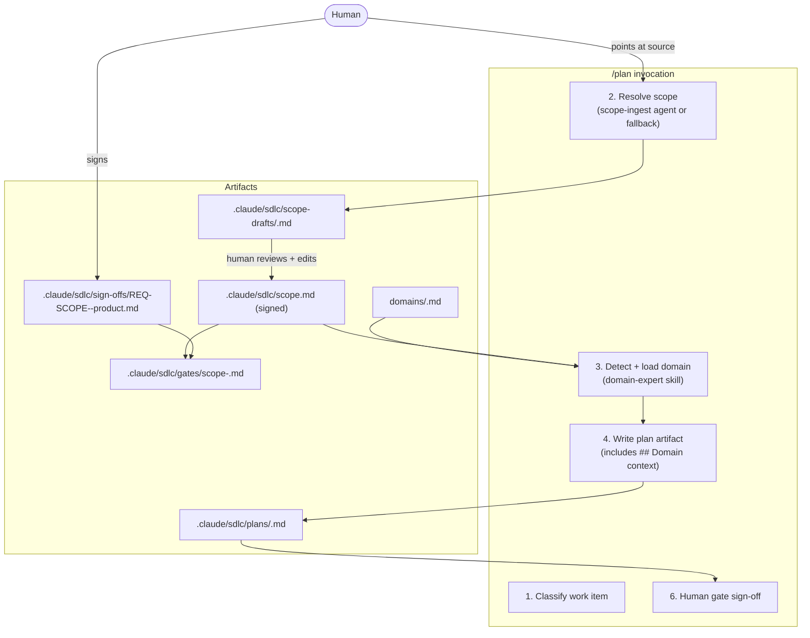

# RFC: Scope Ingest and Domain-Expert Skill

**Status:** Draft

**Author:** Charlton Ho
**Target:** `lantisprime/claude-sdlc`
**Date:** 2026-04-25
**Promoted from:** `docs/rfcs/notes/plan-phase-scope-ingest-discussion.md` (discussion note preserved as historical record)

**Related:**
- `docs/rfcs/multi-team-approval.md` (accepted 2026-04-19) — sign-off conventions; all conflicts resolved, see §5
- `docs/rfcs/guided-entry-session-resume-multi-role.md` (PR #1, draft) — Pending A resolved 2026-04-25; workflow presets and domain files are orthogonal, see §3.2

---

## 1. Problem

`scope.md` today is authored by the human at first `/plan` invocation. Three failure modes:

1. **Format sprawl.** Real-world scope lives in PDFs, Word docs, PPTX briefs, Confluence pages, Notion, Jira epics. The human has to translate any of those into a one-paragraph chat statement or a hand-written markdown file.
2. **Quality uncertainty.** There is no validation that `scope.md` is clear, complete, or aligned with domain-specific regulations. The plan skill reads it and trusts it.
3. **Cognitive load.** Open-ended authoring ("write the scope statement") is higher load than closed-form answering ("answer these four questions"). The plugin's own design philosophy — reduce surprise, reduce friction at the expensive moments — applies to scope too.

`scope.md` is the artifact every downstream phase validates against. Getting it wrong silently widens what the plugin permits for the lifetime of the project.

## 2. Design goals (mapped to core principles)

| Principle | How this RFC respects it |
|---|---|
| 1. Human in the lead | `scope-ingest` drafts; the human validates and signs. The plugin never writes `scope.md` unilaterally. |
| 2. Plan before code | Unchanged — scope sign-off gates the plan artifact, which already gates all edit operations. |
| 3. Surgical edits | `scope-ingest` agent is instructed to write only to `scope-drafts/`. By convention it does not touch `scope.md` directly — enforced through the agent's instructions, not a capability boundary. |
| 4. Work-item traceability | Scope sign-off uses synthetic REQ-ID `REQ-SCOPE-<project-slug>`, traceable across phases. |
| 5. Graceful degradation | No source material → fall back to the existing one-paragraph prompt. Works offline. |
| 6. Stack-agnostic | Domain files and `domains/_index.json` are plain markdown and JSON. No tool-specific logic. |

## 3. Proposed design

### 3.0 Component overview



### 3.1 `scope-ingest` agent

A bounded subprocess with narrow write scope (`scope-drafts/` only). Its job is turning raw source material into a normalized, provenance-traced scope draft. The human reviews the draft, makes any corrections, and signs it.

**Accepted source formats:**
- File paths: `.md`, `.txt`, `.pdf`, `.docx`, `.pptx`
- URLs (auth-walled sources require the human to export and paste content first)
- Ticket references (if Jira/Linear MCP is wired via `env.json`)
- Raw chat text
- An existing `scope.md` (re-validate mode — reports drift; does not rewrite)

**Pipeline:**
1. Parse to plain-text blocks with provenance (source file, page/section, line span)
2. Normalize into a fixed schema: `project_name`, `domain`, `in_scope[]`, `out_of_scope[]`, `success_criteria`, `constraints[]`, `stakeholders`, `assumptions`. Absent fields stay absent — no fabrication.
3. Emit a draft at `.claude/sdlc/scope-drafts/<timestamp>.md` with a per-bullet provenance footer so every extracted claim traces to its source span.
4. Return to the plan skill: draft path + extraction confidence per field.

**Explicit non-goals:** writing `scope.md` directly, signing anything, deciding domain, fabricating fields where source material is thin.

**Why agent, not skill.** Ingesting a 50-page PDF is expensive and isolated; bounding it to a subprocess keeps main-turn tokens sane. Restricting writes to `scope-drafts/` is a convention enforced through the agent's instructions — the agent is given no instruction or need to write `scope.md` directly. This is not a capability boundary: a future change to the agent's instructions would change this behavior. The skill pattern is appropriate for `domain-expert` because that is a lightweight read-and-inject operation; those economics don't apply here.

### 3.2 `domain-expert` skill

A read-and-inject skill. Invoked by `/plan` in v1. Cross-phase reuse (`/analyze`, `/design`) is deferred — see §11.

**Two-source lookup (plugin + project).** The skill resolves domain files from two locations, evaluated in this order:

1. **Project-level `domains/`** — `domains/` at the root of the consuming repo. User-owned; takes precedence over plugin files. Company-specific, proprietary, or regulated-industry knowledge lives here.
2. **Plugin-level `domains/`** — `domains/` at the plugin install root. Broadly applicable seeds maintained by the plugin (payments, auth, and future additions).

Both `_index.json` files are merged at match time; project rules are evaluated before plugin rules. A project-level file with the same `slug` as a plugin file overrides it entirely. Absent project `domains/` → plugin-only lookup. Both absent → `domain: unknown`, proceed without injection.

**New directories:**
```
<plugin-root>/
└── domains/
    ├── _index.json          # plugin-level keyword + stack rules
    ├── _schema.md           # required shape for all domain files
    ├── payments.md          # seed
    └── auth.md              # seed

<consuming-repo>/
└── domains/                 # optional — user-maintained, takes precedence
    ├── _index.json          # merged with plugin rules; project rules evaluated first
    ├── insurance.md         # example user-authored domain file
    └── payments.md          # optional: overrides plugin seed for this project
```

**Domain file shape:**
```
---
slug: payments
last_reviewed: 2026-03-15
owner: <team-or-person>
suggested_roles: []
---
# Payments

## Glossary
## Typical NFRs
## Regulatory concerns
## Common pitfalls
## Stack notes
## Security hotspots
## Scope must address
## Questions plan must answer
```

`last_reviewed` and `owner` are load-bearing — without them, domain files rot silently.

`suggested_roles` is optional. When present, the plan skill surfaces these at plan-time as advisory context ("this domain typically involves compliance sign-off") but does not enforce or override `approvals.roles`. Absent field and empty list are equivalent. This is the advisory bridge agreed in the PR #1 Pending A resolution — workflow presets configure the mechanics; domain files advise on domain-specific role patterns.

**Implementation constraint:** `suggested_roles` content must write only into the `## Domain context` section of the plan artifact as a display-only advisory note. It must never populate the gate file's `## Required sign-offs` block. That block is populated from `approvals.roles` in `config/tools.json`, or from explicit human input at plan-gate time. If `approvals.roles` is absent, the gate file's sign-offs block is empty until the human fills it; `suggested_roles` does not substitute.

**Matching logic (3-tier, in order):**
1. Explicit `domain:` tag in `scope.md` frontmatter → authoritative, no prompt needed
2. Rule match against `domains/_index.json` → confidence `high` / `medium` / `low`
3. No match → `domain: unknown`, proceed without injection

Low-confidence matches require human confirmation at the plan gate before the domain context is written to the plan artifact. No silent assignment.

**Output:** a `## Domain context` section in the plan artifact containing matched domain, confidence level, unanswered items from `Questions plan must answer`, and `Scope must address` items the current scope doesn't cover.

### 3.3 Modified `/plan` flow

Six steps instead of five:

| Step | What happens | Changed? |
|---|---|---|
| 1 | Classify work item | Unchanged |
| 2 | **Resolve scope** — if `scope.md` exists and is signed, read it. Otherwise invoke `scope-ingest` against the source the human points at. No source → prompt for one-paragraph statement (existing fallback). | **New** |
| 3 | **Detect and load domain** — `domain-expert` matches scope + stack, produces gap questions | **New** |
| 4 | Write plan artifact, including `## Domain context` section | Modified (new section) |
| 5 | Record tech stack + compatibility matrix | Unchanged |
| 6 | Human gate — sign-off covers plan + domain confirmation | Unchanged |

The user-facing surface is unchanged: same `/plan` command, same gate ritual.

### 3.4 Cognitive load — honest accounting

**First `/plan` in a new repo (increases slightly):**
1. Point at source material (path, URL, or paste text)
2. Answer gap questions (closed-form, not open-ended)
3. Sign scope — new one-time step
4. Confirm domain match if confidence is not high
5. Sign plan gate — existing

**Subsequent `/plan` runs (roughly unchanged):**
1. Run `/plan "<task>"`
2. Confirm domain match if confidence is not high
3. Sign plan gate

The reduction is load *shifting* from open-ended authoring to closed-form answering. First-time setup costs slightly more in exchange for better scope quality from day one. Gap questions are advisory by default. Questions marked `required: true` produce a warn-level flag — not a hard block — so teams can tune signal level without hard-stopping legitimate work.

### 3.5 Domain file authoring

Domain knowledge already exists somewhere — internal wikis, regulatory guidance PDFs, architecture decision records, Confluence or Notion pages. The authoring flow lets users point at that material or answer guided questions to produce a valid domain file in `domains/` of their consuming repo.

**Trigger.** When `/plan` runs `domain-expert` and no domain match is found, the skill offers: *"No domain file found matching this project. Create one now? [Y/n]"* — entering the authoring flow inline, without a separate command. Users can also trigger it directly by saying "add a domain file for insurance" or "create a domain expert for healthcare."

**Note on the no-new-commands principle.** The authoring flow is surfaced from within `/plan` on miss, and via natural language — no new command to memorize. If `/configure` is extended in a future PR (guided-entry RFC PR 8) to cover domain management, this flow may migrate there. For v1, inline offer on miss is the entry point.

**Two paths:**

#### Path A — Source-driven (file, URL, or pasted text)

Uses the same ingest pipeline as `scope-ingest`:

1. Parse source to plain-text blocks with provenance
2. Map extracted content to schema sections (Glossary, NFRs, Regulatory concerns, etc.)
3. Identify `Scope must address` items and `Questions plan must answer` candidates from the source
4. Emit a draft at `domains/<slug>.md` with a provenance footer on each extracted item
5. Show extraction confidence per section; flag sections where the source was thin
6. Human reviews, trims, and corrects — then the file is active

The provenance footer ("extracted from: `<source>`, §2.3") lets the human see what was inferred vs. what was explicit. It is stripped from the final file on save if the human confirms the section is accurate.

#### Path B — Guided Q&A (no source material)

A structured interview that walks through the schema sections in order. Questions are closed-form where possible; the human is never asked "describe your domain."

**Step 1 — Identity** *(required frontmatter)*

| Question | Config written |
|---|---|
| What slug should identify this domain? (e.g. `insurance`, `healthcare`) | `slug:` |
| Who owns this domain file — team or person responsible for keeping it accurate? | `owner:` |
| Which roles typically sign off on work in this domain? Optional — pick from the 9-role set or leave blank. (security / product / compliance / sre / legal / privacy / architecture / qa / ba) | `suggested_roles:` |

**Step 2 — Regulatory landscape** *(populates `## Regulatory concerns`)*

| Question | Purpose |
|---|---|
| Which compliance frameworks apply to this domain? (e.g. PCI-DSS, GDPR, HIPAA, SOX, ISO 27001, NAIC) — list any that are relevant | Seed the regulatory section |
| For each framework named: what is the most important constraint it places on engineering decisions in this domain? (one sentence per framework) | Keeps entries concrete, not generic |

If none: section is omitted.

**Step 3 — Scope requirements** *(populates `## Scope must address`)*

| Question | Purpose |
|---|---|
| What must a project scope document cover to be considered valid for this domain? List the key areas — these become the gaps the skill checks `scope.md` against. | Core of the section |
| Are there data residency, data classification, or retention requirements that scope must declare? | Common omission in scopes |
| Are there external systems, third-party vendors, or integrations that scope must name? | Dependency surface |

**Step 4 — Gap questions** *(populates `## Questions plan must answer`)*

Two sub-questions, asked separately:

*Required questions (mark `required: true` — produce a warn-level flag when unanswered):*
> "What are the 1–3 questions that, if left unanswered, would make the plan untrustworthy? These will produce visible warnings at plan-gate time."

*Advisory questions (no tag — surfaced but not flagged):*
> "What are 2–5 important questions to surface that don't necessarily void the plan, but help engineers think through the domain?"

Each question is entered as free text. The skill formats them as bullet points in the file. `(required: true)` is appended inline to the required ones.

**Step 5 — Optional sections** *(progressive disclosure)*

The skill asks Y/n for each optional section. For each Y, asks a targeted sub-question rather than "write this section."

| Section | Offer condition | Sub-question asked |
|---|---|---|
| `## Glossary` | Always offered | "List terms in this domain that engineers outside it often misunderstand (term: one-sentence definition)." |
| `## Typical NFRs` | Always offered | "What non-functional requirements apply to almost every project in this domain? (e.g. latency, availability, audit trail)" |
| `## Common pitfalls` | Always offered | "What mistakes recur in this domain and aren't obvious to someone new? List 2–5." |
| `## Stack notes` | Offered if user mentioned specific frameworks in earlier steps | "Are there framework or library considerations specific to this domain that engineers should know?" |
| `## Security hotspots` | Always offered | "Where are security errors most likely to occur in this domain? Be specific — list the surface areas, not generic advice." |

**Step 6 — Review and save**

The skill renders the assembled draft and asks:
> "Here is the draft domain file for `<slug>`. Review it, then confirm to save to `domains/<slug>.md` — or type `edit` to adjust any section before saving."

On save: the file is written to the project-level `domains/<slug>.md`. The skill adds it to `domains/_index.json` if any keywords were mentioned. On next `/plan`, `domain-expert` will find and match it.

**Fallback.** If the user declines the authoring flow at any step, the current `/plan` invocation proceeds with `domain: unknown` — no injection. The offer does not repeat until the next session (suppressed via `.claude/sdlc/hints.jsonl`, same mechanism as PR 10 next-step hints).

## 4. Domain file schema

The `domains/_schema.md` file defines the contract all domain files must follow. Implementers write it before writing the first seed file so the seed validates the schema rather than defines it.

Required frontmatter: `slug`, `last_reviewed`, `owner`.
Optional frontmatter: `suggested_roles`.

Required sections: `## Scope must address`, `## Questions plan must answer`.
Optional sections: `## Glossary`, `## Typical NFRs`, `## Regulatory concerns`, `## Common pitfalls`, `## Stack notes`, `## Security hotspots`.

Sections with no content for a given domain are omitted entirely rather than present-but-empty — empty sections are noise that lowers the signal-to-noise ratio when the plan skill injects domain context.

**Questions can be marked `required`.** A question marked `required: true` (inline tag) produces a warn-level flag in the plan artifact's `## Domain context` section when the plan doesn't address it. Questions without the tag are advisory — surfaced but not flagged. Default: advisory. Per the repo's hook philosophy (`CLAUDE.md`), `exit 2` hard blocks are reserved for severe consequences (no plan at all, unsigned CR, confirmed secret); an unanswered domain question is a gap worth surfacing, not a confirmed catastrophe. The human can proceed after acknowledging the flag. Only mark `required: true` when the gap genuinely voids the plan's correctness, knowing the check is warn-only.

**v1 seed files: `payments.md` and `auth.md`.** Two domains are enough to test the machinery. Start narrow — a seed that says too much becomes noise; a seed that says nothing is useless. Expand based on observed gaps after dry-runs on real past plan artifacts.

## 5. Sign-off alignment with accepted `multi-team-approval.md`

All four conflicts identified in the discussion note are resolved. No named exceptions to the accepted RFC's conventions are needed.

| Conflict | Resolution |
|---|---|
| Sign-off filename convention | Synthetic REQ-ID `REQ-SCOPE-<project-slug>`. File: `sign-offs/REQ-SCOPE-<slug>-product.md`. Follows accepted RFC's `<REQ-ID>-<role>.md` pattern. |
| Signer role | Default role is `product`. Drop tentative label `scope-owner` — not in the 9-role vocabulary. Domain files may declare `suggested_roles` for regulated domains; advisory, not enforced. |
| Transport ladder | Same Tier 0–3 ladder as phase sign-offs. Tier 0 (local, authoritative) only for v1. Teams already using `approvals.share_path` or `approvals.git_repo` for phase sign-offs use the same keys; no new config. |
| Reconciler / `APPROVALS.md` | Scope gate file at `.claude/sdlc/gates/scope-<project>.md` with `## Required sign-offs` block and a `gate_hash` field (sha256 of gate content above `## Required sign-offs`, per accepted RFC §6.5) — same shape as phase gate files per accepted RFC §3.2. Reconciler reads it identically; no new format. |

## 6. Open question — OQ-SCOPE-1

### Pseudo-phase gate vs. new artifact class

Scope currently acts as a **pseudo-phase gate** (same gate file shape as `plan-<slug>.md`, `analyze-<slug>.md`, etc., just at a pre-Plan position). The alternative is treating scope as a **first-class artifact class** with its own schema, its own sign-off template variant, and explicit registry in `env.json`.

| | Pseudo-phase gate | New artifact class |
|---|---|---|
| Implementation cost | Low — reconciler already handles phase gates; no new code path | Higher — new artifact schema, new registry entry, new skill branch |
| Conceptual clarity | Lower — scope isn't really a phase; the "pre-Plan gate" label confuses the 8-phase model | Higher — scope is genuinely different from a phase gate |
| Downstream ripple | Minimal — downstream phases read `scope.md`, not the gate file | Contained — the artifact class is new; existing phases are unaffected |
| `APPROVALS.md` projection | Works today with no changes | Requires reconciler to understand the new class |

**Proposal:** ship v1 as a pseudo-phase gate (low cost, unblocks the rest of the feature). If real usage shows the gate label confusion causes operator errors, promote to a new artifact class in a follow-on amendment. The gate file content and sign-off file format are identical either way — the upgrade is a rename and a registry entry, not a data migration.

**Approval condition:** This RFC must not be signed off until OQ-SCOPE-1 is answered. All gate-related implementation items — `templates/scope-gate.md`, the `plan-gate.sh` modification, and the reconciler's `APPROVALS.md` projection behavior — depend on this answer. Record the decision as an inline amendment here before implementation begins.

**Answer (resolved 2026-04-25): pseudo-phase gate for v1.**

Rationale: the artifact format is identical to phase gate files; the reconciler handles it today with no code changes; the upgrade path to a new artifact class is a rename + `env.json` registry entry with no data migration. The label imprecision ("scope isn't a phase") is real but addressable via the glossary rather than requiring a new code path at this stage.

**New artifact class deferred to v2.** After v1 ships and real usage is observed, evaluate whether the "pre-Plan gate" label causes operator confusion or whether reconciler behavior for scope needs to diverge from phase gate behavior. If either condition holds, promote to a new artifact class in a follow-on RFC amendment. The v2 checklist item is: (a) add `scope_gate` entry to `env.json` artifact registry, (b) rename `gates/scope-<project>.md` convention if needed, (c) add a reconciler branch for the new class. No data migration required — the file content is the same either way.

## 7. Architectural decisions

- **Agent for `scope-ingest`, skill for `domain-expert`.** Agent when expensive isolated work justifies the subprocess cost and restricting write scope via instructions is the right architectural choice. Skill when it is a lightweight read-and-inject operation. Agents cost more tokens per invocation; this is a resource tradeoff, not a cosmetic distinction.
- **No new commands for authoring.** Domain file authoring is triggered inline from `/plan` on a domain miss, and via natural language — no new command to memorize. This preserves the principle that cognitive load lives at the command level while still providing a guided path.
- **Two-source lookup, local-first.** Project-level `domains/` takes precedence over plugin-level. Projects can override plugin seeds for their context without forking the plugin. Same-slug files don't merge content; the local file wins entirely.
- **`scope.md` is a derived, validated artifact — not an authoring target.** This lets the plugin accept any source format: the human points at material, the agent derives, the human validates and signs.
- **Gap report, not draft.** A draft invites rubber-stamping. A gap report forces targeted answers. The load reduction happens here, not in automation.
- **Provenance footer required.** Every scope bullet traces to its source span. Without this, fabrication in the normalization step is undetectable at sign-off.

## 8. Failure modes to guard against

- **Domain files too generic.** "Payments" covers too much → gap questions become noise → humans ignore. Start narrow; expand based on observed gaps from dry-runs.
- **Over-aggressive ingestion.** Fabricating scope from thin sources → subtly wrong signed scope → every downstream phase drifts. Mitigation: per-bullet provenance, source-next-to-extracted-bullet view before signing.
- **Onerous first-time setup.** If scope ingest + domain validation makes greenfield setup painful, teams skip the plugin. Mitigation: minimum-viable one-paragraph scope remains acceptable; all gap questions are warn-only (even those marked `required: true`), so the domain expert adds signal without blocking work.
- **Stale domain files.** `last_reviewed` + `owner` required; treat as living documentation. A domain file without an owner silently becomes the worst kind of documentation.
- **Wrong domain match.** Wrong checklist → wrong gaps → misleading scope. Low-confidence matches require human confirmation; no silent assignment.

## 9. What we will measure

Following the existing `token-tracker.sh` pattern — JSONL lines appended to a history file.

- Source type distribution (file path / URL / ticket ref / raw text / fallback one-paragraph)
- Extraction confidence per field, per run — tracks whether domain file quality improves over time
- Number of gap questions answered vs. deferred per plan
- Scope drift detected by re-validate mode (how often does the source update between plans?)
- Domain match confidence distribution — how often do users override low-confidence matches?

No improvement percentages committed here. Baseline first, interpret later.

## 10. Alignment with design principles

| Principle | How this RFC preserves it |
|---|---|
| Human in the lead | `scope-ingest` drafts; human signs. `domain-expert` reports gaps; human confirms. No auto-advancement. |
| Plan before code | `plan-gate.sh` is unchanged. Scope sign-off gates the plan artifact; plan artifact gates edit operations. |
| Surgical edits | `scope-ingest` agent is instructed to write only to `scope-drafts/` (convention, not a capability boundary). `domain-expert` reads and injects; writes nothing. |
| Work-item traceability | `REQ-SCOPE-<slug>` is a stable, traceable identifier across phases. |
| Graceful degradation | No source → one-paragraph fallback. Missing domain match → proceed without injection. Missing transport → Tier 0 local. |
| Stack-agnostic | Domain files are plain markdown + JSON. No tool-specific logic anywhere. |

## 11. Non-goals

- Adding a `/scope` or `/domain` command — authoring is triggered inline from `/plan` on domain miss; no new command to memorize
- Auto-writing `scope.md` without human review and sign-off
- Multi-domain matching in v1 (top-1 match; human can override)
- Scope regeneration policy when source document updates (observe v1 behavior first)
- Domain file curation process and review cadence (decide after seeing how stale files manifest in practice)
- Appeal paths, rollback, or retrospective scope audits
- Wiring `domain-expert` into `/analyze` and `/design` (v1 only: invoked from `/plan`; cross-phase reuse deferred until v1 usage validates the skill's gap question quality)

## 12. Alternatives considered

**A separate `/scope` command.** Rejected — adds a command users must memorize. The plugin's anti-patterns section explicitly flags this. Both capabilities hang off `/plan` internally.

**LLM-generated scope without provenance.** Rejected — fabrication at scope produces the worst possible downstream drift because `scope.md` gates every subsequent phase. Provenance-traced gap report is the only honest alternative.

**Domain files as part of the workflow preset (Pending A, unified option).** Rejected 2026-04-25 — workflow presets configure sign-off mechanics; domain files encode domain knowledge. Different purposes, different owners, different evolution cadence. Advisory `suggested_roles` bridge is the narrowest connection that recovers the useful part of unification without merging stewardship.

**Domain file matching via full-text semantic search.** Over-engineered for v1 — keyword + stack rules in `_index.json` are transparent, debuggable, and correctable. Semantic search adds a model dependency for a matching problem that is mostly "does the scope mention payments / auth / healthcare?" Upgrade path is clear if keyword rules prove insufficient.

## 13. Backward compatibility

- Existing repos with a hand-written `scope.md` are not affected — Step 2 reads the existing file and proceeds. `scope-ingest` is only invoked when `scope.md` is absent or unsigned.
- Existing `/plan` invocations without domain files proceed with `domain: unknown` — no injection, no disruption.
- `domains/` directory is additive; absent directory means no domain detection (same as `domain: unknown`).
- Scope gate file is a new artifact — existing repos have no `gates/scope-<project>.md`. First `/plan` after install creates it. No migration.
- Repos with an existing unsigned `scope.md` and established phase sign-offs using role names that differ from what `suggested_roles` in a newly-added domain file would recommend will see reconciler warn-level output noting the mismatch. This is the expected behavior — the reconciler surfaces the signal; the human decides whether to update the gate file's `## Required sign-offs` block or proceed as-is.

## 14. Implementation checklist

Sequencing follows the principle: validate the schema before building consumers; build the skill before the agent; wire them into `/plan` last.

- [x] ~~Resolve OQ-SCOPE-1~~ — resolved 2026-04-25: pseudo-phase gate for v1 (see §6)
- [x] ~~Write `domains/_schema.md`~~ — done 2026-04-25
- [x] ~~Write `domains/payments.md` seed file~~ — done 2026-04-25
- [x] ~~Write `domains/auth.md` seed file~~ — done 2026-04-25
- [x] ~~Write `domains/_index.json` with keyword + stack rules for payments and auth~~ — done 2026-04-25
- [ ] Build `domain-expert` skill — two-source lookup (project + plugin `domains/`), merges `_index.json` files (project rules first), matches against scope + stack, injects `## Domain context` into plan artifact; on miss, offers inline authoring flow (§3.5)
- [ ] Build domain file authoring flow (§3.5) — Path A (source-driven ingest) and Path B (guided Q&A, 6 steps); writes to project `domains/<slug>.md`; updates project `_index.json` with any named keywords
- [ ] Dry-run `domain-expert` + authoring flow against 3–5 past plan artifacts to validate gap question quality and Q&A UX
- [ ] Build `scope-ingest` agent — markdown + plain text parsers first; PDF in a follow-up; DOCX/PPTX/URL as a separate scoped change
- [ ] Add `scope-drafts/` to the artifact tree in `.claude/sdlc/`
- [ ] Modify `skills/plan/SKILL.md` — wire in Step 2 (scope-ingest invocation) and Step 3 (domain-expert injection)
- [ ] Write scope gate file template (`templates/scope-gate.md`) with `## Required sign-offs` block and `gate_hash` field (sha256 of content above `## Required sign-offs`, per accepted RFC §6.5)
- [ ] Add scope gate check to `hooks/plan-gate.sh`
- [ ] Dry-run end-to-end on one real project: source → draft → sign → plan → domain inject → gate
- [ ] Documentation pass: README "Scope setup" section + "Adding domain files" guide; `docs/SDLC.md` Phase 1 update; `docs/GLOSSARY.md` entries for new terms (scope draft, provenance footer, domain context, gap questions, scope gate, domain miss, two-source lookup)

---

*End of RFC.*
